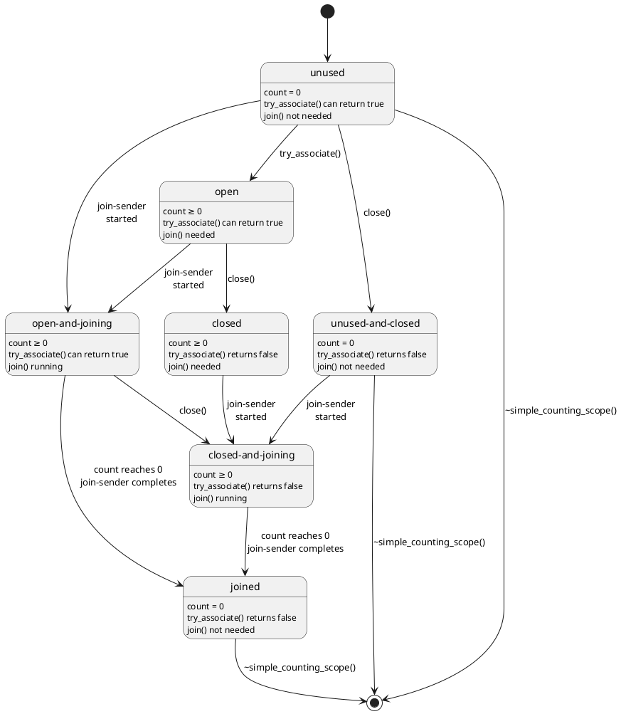

Changes
=======

## R11

- Rename `async_scope_token` to `scope_token` and `nest` to `associate`.

## R10

- Incorporate significant feedback from Mark Hoemmen, Tomasz Kamiński, and Dietmar Kühl to the wording for `nest`.
- Address Jens Maurer's feedback from the mailing list: replace [methods]{.rm} with [member functions]{.add}, add
  exposition-only to member variable names, add exception specification to _`get-state`_ and _`start`_.
- Replace "is [boolean]" with "returns [boolean]" for consistency.
- Confirmed that _`nest-data`_ needs a deduction guide to get the required behaviour; its `Sender` type parameter may
  be either a object type or an lvalue reference type depending on the value category of the sender passed to the
  `nest` CPO, and this fact is only properly deduced with the provided deduction guide. See [this simplified
  example](https://godbolt.org/z/xh9nd48d3) for more detail.
- Update `@_impls-for_@<nest_t>::@_get-state_@` to have a computed `noexcept` clause; other sender algorithms (such as
  `let_value`) may have to add `std::exception_ptr` to their `set_error` completions if _`get-state`_ throws, which
  means that _`get-state`_ should be declared to be `noexcept` when it does not throw so that such algorithms can avoid
  unnecessary `set_error` completions.
- Update the `async_scope_token` concept to require that `t.disassociate()` be `noexcept` instead of having a semantic
  requirement that `disassociate` "not exit with an exception"; `disassociate` must be `noexcept` for it to be possible
  to correctly calculate `@_impls-for_@<nest_t>::@_get-state_@`'s `noexcept` clause.
- Update `simple_counting_scope::try_associate` and `counting_scope::try_associate` to both be `noexcept`;
  `@_impls-for_@<nest_t>::@_get-state_@`'s `noexcept` clause depends on whether the given token's `try_associate` is
  `noexcept` when the given sender is an lvalue so the proposed concrete scope types should correctly advertise that
  their `try_associate` member functions will never throw.
- Be consistent about trailing underscores in member names.
- Update `empty_env` to `env<>`.
- Leave some TODOs for a future R11.
- Reword paragraph 4 of [exec.spawn.future] to better describe the variant of decayed tuples that capture the result of
  the spawned operation.

## R9

- Apply feedback received from LWG during the Hagenberg meeting.
- Update the language used in `simple_counting_scope::join` and `counting_scope::join` to explicitly specify the
  behavior of completion as captured in the following polls taken by LEWG:

  POLL: We would like to explicitly specify the behaviour of the completion of join (by possibly doing: if conditions
  are met either complete synchronously inside start or completing asynchronously by explicitly creating a  scheduler,
  join operation should never be completed by scheduling).

  +---+---+---+---+---+
  |SF |F  |N  |A  |SA |
  +==:+==:+==:+==:+==:+
  |4  |5  |0  |0  |0  |
  +---+---+---+---+---+

  Attendance: 20 (IP) +  7 (R)

  Author’s Position: SF

  Outcome: Consensus in favor

  POLL: When the operation completes immediately, schedule instead of completing inline.

  +---+---+---+---+---+
  |SF |F  |N  |A  |SA |
  +==:+==:+==:+==:+==:+
  |0  |0  |0  |8  |3  |
  +---+---+---+---+---+

  Attendance: 20 (IP) +  7 (R)

  Author’s Position: A

  Outcome: Strong consensus against

  POLL: When the operation completes asynchronously, complete inline instead of scheduling.

  +---+---+---+---+---+
  |SF |F  |N  |A  |SA |
  +==:+==:+==:+==:+==:+
  |1  |2  |1  |7  |0  |
  +---+---+---+---+---+

  Attendance: 20 (IP) +  7 (R)

  Author’s Position: A

  Outcome: Consensus against.

- Update wording to reflect LEWG requested changes before forwarding to LWG for review as captured in the poll below:

  POLL: Apply the changes and fixes above on async_scope, and forward the fixed version P3149R9 to LWG for C++26.

  +---+---+---+---+---+
  |SF |F  |N  |A  |SA |
  +==:+==:+==:+==:+==:+
  |7  |5  |0  |0  |0  |
  +---+---+---+---+---+

  Attendance: X (IP) +  X (R)

  Author’s Position: SF

  Outcome: Consensus in favor

## R8

- Replace `~async_scope_association()` with `async_scope_token.disassociate()` to address concerns raised during the
  LEWG meeting in Wrocław as captured in the polls below. The primary concern was the non-regularity of
  `async_scope_association`'s unusual copy constructor; requiring Standard Library implementers to remember to invoke
  `scopeToken.disassociate()` rather than relying on a non-regular RAII handle to do it automatically has more
  consensus.

  POLL: We would like to change the spelling of the copy constructor of async_scope_association.

  +---+---+---+---+---+
  |SF |F  |N  |A  |SA |
  +==:+==:+==:+==:+==:+
  |5  |7  |1  |15 |2  |
  +---+---+---+---+---+

  Attendance: [not recorded]

  \# of Authors: 2

  Authors' position: 2x A

  Outcome: No consensus for change

  SF: We don't have any copy ctor in the whole standard library that fails by silently not performing a copy.

  SA: If we're not going to say this is a valid use of a copy ctor then we're saying this room doesn't believe in RAII.

  POLL: Modify the spelling of the copy constructor of "async_scope_association" concept, without changing the copy
  constructor of "nest".

  +---+---+---+---+---+
  |SF |F  |N  |A  |SA |
  +==:+==:+==:+==:+==:+
  |1  |6  |2  |1  |2  |
  +---+---+---+---+---+

  Attendance: 30 IP + 6 (19 IP)

  \# of Authors: 2

  Author's Position: F + F

  Outcome: Consensus in favor

  SA: I was not permitted to ask questions about the poll
- Update the words of power regarding how various parts of the proposed types interact with the C++ memory model.

## R7

- Add wording to section 8.
- Remove the allocator from the environment in `spawn` and `spawn_future` when the allocator selection algorithm falls
  all the way back to using `std::allocator<>` because there's no other choice.
- Fix the last two typos in the example code.
- Small changes to how `spawn` and `spawn_future` set up the environment for the spawned operation based on feedback
  from Dietmar and Ruslan.

## R6

In revision 4 of this paper, Lewis Baker discovered a problem with using `nest()` as the basis operation for
implementing `spawn()` (and `spawn_future()`) when the `counting_scope` that tracks the spawned work is being used to
protect against out-of-lifetime accesses to the allocator provided to `spawn()`. Revision 5 of this paper raised Lewis's
concerns and presented several solutions. Revision 6 has selected the solution originally presented as "option 4":
define a new set of refcounting basis operations and define `nest()`, `spawn()`, and `spawn_future()` in terms of them.

### The Problem

What follows is a description, taken from revision 5, section 6.5.1, of the problem with using `nest()` as the basis
operation for implementing `spawn()` (a similar problem exists for `spawn_future()` but `spawn()` is simpler to
explain).

When a spawned operation completes, the order of operations was as follows:

1. The spawned operation completes by invoking `set_value()` or `set_stopped()` on a receiver, `rcvr`, provided by
   `spawn()` to the `nest-sender`.
2. `rcvr` destroys the `nest-sender`'s _`operation-state`_ by invoking its destructor.
3. `rcvr` deallocates the storage previously allocated for the just-destroyed _`operation-state`_ using a copy of the
   allocator that was chosen when `spawn()` was invoked. Assume this allocator was passed to `spawn()` in the optional
   environment argument.

Note that in step 2, above, the destruction of the `nest-sender`'s _`operation-state`_ has the side effect of
decrementing the associated `counting_scope`'s count of outstanding operations. If the scope has a `join-sender` waiting
and this decrement brings the count to zero, the code waiting on the `join-sender` to complete may start to destroy the
allocator while step 3 is busy using it.

### Some Solutions

Revision 5 presented the following possible solutions:

1. Do nothing; declare that `counting_scope` can't be used to protect memory allocators.
2. Remove allocator support from `spawn()` and `spawn_future()` and require allocation with `::operator new`.
3. Make `spawn()` and `spawn_future()` basis operations of `async_scope_token`s (alongside `nest()`) so that the
   decrement in step 2 can be deferred until after step 3 completes.
4. Define a new set of refcounting basis operations and define `nest()`, `spawn()`, and `spawn_future()` in terms of
   them.
5. Treat `nest-sender`s as RAII handles to "scope references" and change how `spawn()` is defined to defer the
   decrement. (There are a few implementation possibilities here.)
6. Give `async_scope_token`s a new basis operation that can wrap an allocator in a new allocator wrapper that increments
   the scope's refcount in `allocate()` and decrements it in `deallocate()`.

### LEWG Discussion in St Louis

The authors opened the discussion by recommending option 6. By the end of the discussion, the authors' expressed
preferences were: "4 & 6 are better than 5; 5 is better than 3." The biggest concern with option 4 was the time required
to rework the paper in terms of the new basis operation.

The room took the following two straw polls:

1. In P3149R5 strike option 1 from 6.5.2 (option 1 would put the responsibility to coordinate the lifetime of the memory
   resource on the end user)

   +---+---+---+---+---+
   |SF |F  |N  |A  |SA |
   +==:+==:+==:+==:+==:+
   |10 |2  |3  |1  |1  |
   +---+---+---+---+---+

   Attendance: 21 in-person + 10 remote

   \# of Authors: 2

   Authors' position: 2x SF

   Outcome: Consensus in favor

   SA: I'm SA because I don't think async scope needs to protect memory allocations or resources, it's fine for this not
   to be a capability and I think adding this capability will add complexity, and that'll mean it doesn't make C++26.
2. In P3149R5 strike option 2 from 6.5.2 (option 2 would prevent spawn from supporting allocators)

   +---+---+---+---+---+
   |SF |F  |N  |A  |SA |
   +==:+==:+==:+==:+==:+
   |8  |4  |2  |2  |0  |
   +---+---+---+---+---+

   Attendance: 21 in-person + 10 remote

   \# of Authors: 2

   Authors' position: 2x SF

   Outcome: Consensus in favor

   WA: As someone who was weakly against I'm not ready to rule out this possibility yet.

Ultimately, the authors chose option 4, leading to revision 6 of the paper changing from this:

```cpp
template <class Token, class Sender>
concept async_scope_token =
    copyable<Token> &&
    is_nothrow_move_constructible_v<Token> &&
    is_nothrow_move_assignable_v<Token> &&
    is_nothrow_copy_constructible_v<Token> &&
    is_nothrow_copy_assignable_v<Token> &&
    sender<Sender> &&
    requires(Token token, Sender&& snd) {
      { token.nest(std::forward<Sender>(snd)) } -> sender;
    };
```

with `execution::nest()` forwarding to the `nest()` member function on the provided token and `spawn()` and
`spawn_future()` being expressed in terms of `nest()`, to this:

```cpp
template <class Assoc>
concept async_scope_association =
    semiregular<Assoc> &&
    requires(const Assoc& assoc) {
        { static_cast<bool>(assoc) } noexcept;
    };

template <class Token>
concept async_scope_token =
    copyable<Token> &&
    requires(Token token) {
        { token.try_associate() } -> async_scope_association;
    };
```

with `nest()`, `spawn()`, and `spawn_future()` all being expressed in terms of the `async_scope_token` concept.

## R5
- Clarify that the _`nest-sender`_'s operation state must destroy its child operation state before decrementing the
  scope's reference count.
- Add naming discussion.
- Discuss a memory allocator lifetime concern raised by Lewis Baker and several options for resolving it.

## R4
- Permit caller of `spawn_future()` to provide a stop token in the optional environment argument.
- Remove `[[nodiscard]]`.
- Make `simple_counting_scope::token::token()` and `counting_scope::token::token()` explicit and exposition-only.
- Remove redundant `concept async_scope`.
- Remove last vestiges of `let_async_scope`.
- Add some wording to a new [Specification](#specification) section

## R3
- Update slide code to be exception safe
- Split the async scope concept into a scope and token; update `counting_scope` to match
- Rename `counting_scope` to `simple_counting_scope` and give the name `counting_scope` to a scope with a stop source
- Add example for recursively spawned work using `let_async_scope` and `counting_scope`

## R2
- Update `counting_scope::nest()` to explain when the scope's count of outstanding senders is decremented and remove
  `counting_scope::joined()`, `counting_scope::join_started()`, and `counting_scope::use_count()` on advice of SG1 straw
  poll:

  > forward P3149R1 to LEWG for inclusion in C++26 after P2300 is included in C++26, with notes:
  >
  > 1. the point of refcount decrement to be moved after the child operation state is destroyed
  > 2. a future paper should explore the design for cancellation of scopes
  > 3. observers (joined, join_started, use_count) can be removed
  >
  > +---+---+---+---+---+
  > |SF |F  |N  |A  |SA |
  > +==:+==:+==:+==:+==:+
  > |10 |14 |2  |0  |1  |
  > +---+---+---+---+---+
  > Consensus
  >
  > SA: we are moving something without wide implementation experience, the version with experience has cancellation of
  > scopes

- Add a fourth state to `counting_scope` so that it can be used as a data-member safely

## R1

- Add implementation experience
- Incorporate pre-meeting feedback from Eric Niebler

## R0

- First revision

Introduction
============

[@P2300R7] lays the groundwork for writing structured concurrent programs in C++ but it leaves three important scenarios
under- or unaddressed:

1. progressively structuring an existing, unstructured concurrent program;
2. starting a dynamic number of parallel tasks without "losing track" of them; and
3. opting in to eager execution of sender-shaped work when appropriate.

This paper describes the utilities needed to address the above scenarios within the following constraints:

- _No detached work by default;_ as specified in [@P2300R7], the `start_detached` and `ensure_started` algorithms invite
  users to start concurrent work with no built-in way to know when that work has finished.
  - Such so-called "detached work" is undesirable; without a way to know when detached work is done, it is difficult
    know when it is safe to destroy any resources referred to by the work. Ad hoc solutions to this shutdown problem
    add unnecessary complexity that can be avoided by ensuring all concurrent work is "attached".
  - [@P2300R7]'s introduction of structured concurrency to C++ will make async programming with C++ much easier but
    experienced C++ programmers typically believe that async C++ is "just hard" and that starting async work *means*
    starting detached work (even if they are not thinking about the distinction between attached and detached work) so
    adapting to a post-[@P2300R7] world will require unlearning many deprecated patterns. It is thus useful as a
    teaching aid to remove the unnecessary temptation of falling back on old habits.
- _No dependencies besides [@P2300R7];_ it will be important for the success of [@P2300R7] that existing code bases
  can migrate from unstructured concurrency to structured concurrency in an incremental way so tools for progressively
  structuring code should not take on risk in the form of unnecessary dependencies.

The proposed solution comes in the following parts:

- `template <class Token> concept async_scope_token`{.cpp};
- `sender auto nest(sender auto&& snd, async_scope_token auto token)`{.cpp};
- `void spawn(sender auto&& snd, async_scope_token auto token, auto&& env)`{.cpp};
- `sender auto spawn_future(sender auto&& snd, async_scope_token auto token, auto&& env)`{.cpp};
- Proposed in [@P3296R2]: `sender auto let_async_scope(callable auto&& senderFactory)`{.cpp};
- `class simple_counting_scope`{.cpp}; and
- `class counting_scope`{.cpp}.

## Implementation experience

The general concept of an async scope to manage work has been deployed broadly at Meta. Code written with Folly's
coroutine library, [@follycoro], uses [@follyasyncscope] to safely launch awaitables. Most code written with Unifex, an
implementation of an earlier version of the _Sender/Receiver_ model proposed in [@P2300R7], uses [@asyncscopeunifexv1],
although experience with the v1 design led to the creation of [@asyncscopeunifexv2], which has a smaller interface and
a cleaner definition of responsibility.

As an early adopter of Unifex, [@rsys] (Meta’s cross-platform voip client library) became the entry point for structured
concurrency in mobile code at Meta. We originally built rsys with an unstructured asynchrony model built around posting
callbacks to threads in order to optimize for binary size. However, this came at the expense of developer velocity due
to the increasing cost of debugging deadlocks and crashes resulting from race conditions.

We decided to adopt Unifex and refactor towards a more structured architecture to address these problems
systematically. Converting an unstructured production codebase to a structured one is such a large project that it
needs to be done in phases. As we began to convert callbacks to senders/tasks, we quickly realized that we needed a safe
place to start structured asynchronous work in an unstructured environment. We addressed this need with
`unifex::v1::async_scope` paired with an executor to address a recurring pattern:

:::cmptable
### Before
```cpp
// Abstraction for thread that has the ability
// to execute units of work.
class Executor {
public:
    virtual void add(Func function) noexcept = 0;
};

// Example class
class Foo {
    std::shared_ptr<Executor> exec_;

public:
    void doSomething() {
        auto asyncWork = [&]() {
            // do something
        };
        exec_->add(asyncWork);
    }
};
```

### After
```cpp
// Utility class for executing async work on an
// async_scope and on the provided executor
class ExecutorAsyncScopePair {
    unifex::v1::async_scope scope_;
    ExecutorScheduler exec_;

public:
    void add(Func func) {
        scope_.detached_spawn_call_on(exec_, func);
    }

    auto cleanup() {
        return scope_.cleanup();
    }
};

// Example class
class Foo {
    std::shared_ptr<ExecutorAsyncScopePair> exec_;

public:
    ~Foo() {
        sync_wait(exec_->cleanup());
    }

    void doSomething() {
        auto asyncWork = [&]() {
            // do something
        };

        exec_->add(asyncWork);
    }
};
```
::::

This broadly worked but we discovered that the above design coupled with the v1 API allowed for too many redundancies
and conflated too many responsibilities (scoping async work, associating work with a stop source, and transferring
scoped work to a new scheduler).

We learned that making each component own a distinct responsibility will minimize the confusion and increase the
structured concurrency adoption rate. The above example was an intuitive use of async_scope because the concept of a
“scoped executor” was familiar to many engineers and is a popular async pattern in other programming languages.
However, the above design abstracted away some of the APIs in async_scope that explicitly asked for a scheduler, which
would have helped challenge the assumption engineers made about async_scope being an instance of a “scoped executor”.

Cancellation was an unfamiliar topic for engineers within the context of asynchronous programming. The
`v1::async_scope` provided both `cleanup()` and `complete()` to give engineers the freedom to decide between canceling
work or waiting for work to finish. The different nuances on when this should happen and how it happens ended up being
an obstacle that engineers didn’t want to deal with.

Over time, we also found redundancies in the way `v1::async_scope` and other algorithms were implemented and identified
other use cases that could benefit from a different kind of async scope. This motivated us to create `v2::async_scope`
which only has one responsibility (scope), and `nest` which helped us improve maintainability and flexibility of
Unifex.

The unstructured nature of `cleanup()`/`complete()` in a partially structured codebase introduced deadlocks when
engineers nested the `cleanup()`/`complete()` sender in the scope being joined. This risk of deadlock remains with
`v2::async_scope::join()` however, we do think this risk can be managed and is worth the tradeoff in exchange for a
more coherent architecture that has fewer crashes. For example, we have experienced a significant reduction in these
types of deadlocks once engineers understood that `join()` is a destructor-like operation that needs to be run only by
the scope’s owner. Since there is no language support to manage async lifetimes automatically, this insight was key in
preventing these types of deadlocks. Although this breakthrough was a result of strong guidance from experts, we
believe that the simpler design of `v2::async_scope` would make this a little easier.

We strongly believe that async_scope was necessary for making structured concurrency possible within rsys, and we
believe that the improvements we made with `v2::async_scope` will make the adoption of P2300 more accessible.


Motivation
==========

## Motivating example

Let us assume the following code:

```cpp
namespace ex = std::execution;

struct work_context;
struct work_item;
void do_work(work_context&, work_item*);
std::vector<work_item*> get_work_items();

int main() {
    static_thread_pool my_pool{8};
    work_context ctx; // create a global context for the application

    std::vector<work_item*> items = get_work_items();
    for (auto item : items) {
        // Spawn some work dynamically
        ex::sender auto snd = ex::transfer_just(my_pool.get_scheduler(), item) |
                              ex::then([&](work_item* item) { do_work(ctx, item); });
        ex::start_detached(std::move(snd));
    }
    // `ctx` and `my_pool` are destroyed
}
```

In this example we are creating parallel work based on the given input vector. All the work will be spawned on the local
`static_thread_pool` object, and will use a shared `work_context` object.

Because the number of work items is dynamic, one is forced to use `start_detached()` from [@P2300R7] (or something
equivalent) to dynamically spawn work. [@P2300R7] doesn't provide any facilities to spawn dynamic work and return a
sender (i.e., something like `when_all` but with a dynamic number of input senders).

Using `start_detached()` here follows the _fire-and-forget_ style, meaning that we have no control over, or awareness
of, the completion of the async work that is being spawned.

At the end of the function, we are destroying the `work_context` and the `static_thread_pool`. But at that point, we
don't know whether all the spawned async work has completed. If any of the async work is incomplete, this might lead to
crashes.

[@P2300R7] doesn't give us out-of-the-box facilities to use in solving these types of problems.

This paper proposes the `counting_scope` and [@P3296R2]'s `let_async_scope` facilities that would help us avoid the
invalid behavior. With `counting_scope`, one might write safe code this way:

```cpp
namespace ex = std::execution;

struct work_context;
struct work_item;
void do_work(work_context&, work_item*);
std::vector<work_item*> get_work_items();

int main() {
    static_thread_pool my_pool{8};
    work_context ctx;         // create a global context for the application
    ex::counting_scope scope; // create this *after* the resources it protects

    // make sure we always join
    unifex::scope_guard join = [&]() noexcept {
        // wait for all nested work to finish
        this_thread::sync_wait(scope.join()); // NEW!
    };

    std::vector<work_item*> items = get_work_items();
    for (auto item : items) {
        // Spawn some work dynamically
        ex::sender auto snd = ex::transfer_just(my_pool.get_scheduler(), item) |
                              ex::then([&](work_item* item) { do_work(ctx, item); });

        // start `snd` as before, but associate the spawned work with `scope` so that it can
        // be awaited before destroying the resources referenced by the work (i.e. `my_pool`
        // and `ctx`)
        ex::spawn(std::move(snd), scope.get_token()); // NEW!
    }

    // `ctx` and `my_pool` are destroyed *after* they are no longer referenced
}
```

With [@P3296R2]'s `let_async_scope`, one might write safe code this way:
```cpp
namespace ex = std::execution;

struct work_context;
struct work_item;
void do_work(work_context&, work_item*);
std::vector<work_item*> get_work_items();

int main() {
    static_thread_pool my_pool{8};
    work_context ctx; // create a global context for the application

    this_thread::sync_wait(
            ex::let_async_scope(ex::just(get_work_items()), [&](auto scope, auto& items) {
                for (auto item : items) {
                    // Spawn some work dynamically
                    ex::sender auto snd = ex::transfer_just(my_pool.get_scheduler(), item) |
                                          ex::then([&](work_item* item) { do_work(ctx, item); });

                    // start `snd` as before, but associate the spawned work with `scope` so that it
                    // can be awaited before destroying the resources referenced by the work (i.e.
                    // `my_pool` and `ctx`)
                    ex::spawn(std::move(snd), scope); // NEW!
                }
                return just();
            }));

    // `ctx` and `my_pool` are destroyed *after* they are no longer referenced
}
```

Simplifying the above into something that fits in a Tony Table to highlight the differences gives us:

::: cmptable

### Before
```cpp
namespace ex = std::execution;

struct context;
ex::sender auto work(const context&);

int main() {
  context ctx;

  ex::sender auto snd = work(ctx);

  // fire and forget
  ex::start_detached(std::move(snd));

  // `ctx` is destroyed, perhaps before
  // `snd` is done
}
```

### With `counting_scope`
```cpp
namespace ex = std::execution;

struct context;
ex::sender auto work(const context&);

int main() {
  context ctx;
  ex::counting_scope scope;

  ex::sender auto snd = work(ctx);

  try {
      // fire, but don't forget
      ex::spawn(std::move(snd), scope.get_token());
  } catch (...) {
      // do something to handle exception
  }

  // wait for all work nested within scope
  // to finish
  this_thread::sync_wait(scope.join());

  // `ctx` is destroyed once nothing
  // references it
}
```

### With `let_async_scope`
```cpp
namespace ex = std::execution;

struct context;
ex::sender auto work(const context&);

int main() {
  context ctx;
  this_thread::sync_wait(ex::just()
      | ex::let_async_scope([&](auto scope) {
        ex::sender auto snd = work(ctx);

        // fire, but don't forget
        ex::spawn(std::move(snd), scope.get_token());
      }));

  // `ctx` is destroyed once nothing
  // references it
}
```

:::

Please see below for more examples.

## `counting_scope` and `let_async_scope` are a step forward towards Structured Concurrency

Structured Programming [@Dahl72] transformed the software world by making it easier to reason about the code, and build
large software from simpler constructs. We want to achieve the same effect on concurrent programming by ensuring that
we _structure_ our concurrent code. [@P2300R7] makes a big step in that direction, but, by itself, it doesn't fully
realize the principles of Structured Programming. More specifically, it doesn't always ensure that we can apply the
_single entry, single exit point_ principle.

The `start_detached` sender algorithm fails this principle by behaving like a `GOTO` instruction. By calling
`start_detached` we essentially continue in two places: in the same function, and on different thread that executes the
given work. Moreover, the lifetime of the work started by `start_detached` cannot be bound to the local context. This
will prevent local reasoning, which will make the program harder to understand.

To properly structure our concurrency, we need an abstraction that ensures that all async work that is spawned has a
defined, observable, and controllable lifetime. This is the goal of `counting_scope` and `let_async_scope`.

Examples of use
===============

## Spawning work from within a task

Use `let_async_scope` in combination with a `system_context` from [@P2079R2] to spawn work from within a task:
```cpp
namespace ex = std::execution;

int main() {
    ex::system_context ctx;
    int result = 0;

    ex::scheduler auto sch = ctx.scheduler();

    ex::sender auto val = ex::just() | ex::let_async_scope([sch](ex::async_scope_token auto scope) {
        int val = 13;

        auto print_sender = ex::just() | ex::then([val]() noexcept {
            std::cout << "Hello world! Have an int with value: " << val << "\n";
        });

        // spawn the print sender on sch
        //
        // NOTE: if spawn throws, let_async_scope will capture the exception
        //       and propagate it through its set_error completion
        ex::spawn(ex::on(sch, std::move(print_sender)), scope);

        return ex::just(val);
    }) | ex::then([&result](auto val) { result = val });

    this_thread::sync_wait(ex::on(sch, std::move(val)));

    std::cout << "Result: " << result << "\n";
}

// 'let_async_scope' ensures that, if all work is completed successfully, the result will be 13
// `sync_wait` will throw whatever exception is thrown by the callable passed to `let_async_scope`
```

## Starting work nested within a framework

In this example we use the `counting_scope` within a class to start work when the object receives a message and to wait
for that work to complete before closing.

```cpp
namespace ex = std::execution;

struct my_window {
    class close_message {};

    ex::sender auto some_work(int message);

    ex::sender auto some_work(close_message message);

    void onMessage(int i) {
        ++count;
        ex::spawn(ex::on(sch, some_work(i)), scope);
    }

    void onClickClose() {
        ++count;
        ex::spawn(ex::on(sch, some_work(close_message{})), scope);
    }

    my_window(ex::system_scheduler sch, ex::counting_scope::token scope)
        : sch(sch)
        , scope(scope) {
        // register this window with the windowing framework somehow so that
        // it starts receiving calls to onClickClose() and onMessage()
    }

    ex::system_scheduler sch;
    ex::counting_scope::token scope;
    int count{0};
};

int main() {
    // keep track of all spawned work
    ex::counting_scope scope;
    ex::system_context ctx;
    try {
        my_window window{ctx.get_scheduler(), scope.get_token()};
    } catch (...) {
        // do something with exception
    }
    // wait for all work nested within scope to finish
    this_thread::sync_wait(scope.join());
    // all resources are now safe to destroy
    return window.count;
}
```

## Starting parallel work

In this example we use `let_async_scope` to construct an algorithm that performs parallel work. Here `foo`
launches 100 tasks that concurrently run on some scheduler provided to `foo`, through its connected receiver, and then
the tasks are asynchronously joined. This structure emulates how we might build a parallel algorithm where each
`some_work` might be operating on a fragment of data.
```cpp
namespace ex = std::execution;

ex::sender auto some_work(int work_index);

ex::sender auto foo(ex::scheduler auto sch) {
    return ex::just() | ex::let_async_scope([sch](ex::async_scope_token auto scope) {
        return ex::schedule(sch) | ex::then([] { std::cout << "Before tasks launch\n"; }) |
               ex::then([=] {
                   // Create parallel work
                   for (int i = 0; i < 100; ++i) {
                       // NOTE: if spawn() throws, the exception will be propagated as the
                       //       result of let_async_scope through its set_error completion
                       ex::spawn(ex::on(sch, some_work(i)), scope);
                   }
               });
    }) | ex::then([] { std::cout << "After tasks complete successfully\n"; });
}
```

## Listener loop in an HTTP server

This example shows how one can write the listener loop in an HTTP server, with the help of coroutines. The HTTP server
will continuously accept new connection and start work to handle the requests coming on the new connections. While the
listening activity is bound in the scope of the loop, the lifetime of handling requests may exceed the scope of the
loop. We use `counting_scope` to limit the lifetime of the request handling without blocking the acceptance of new
requests.

```cpp
namespace ex = std::execution;

task<size_t> listener(int port, io_context& ctx, static_thread_pool& pool) {
    size_t count{0};
    listening_socket listen_sock{port};

    co_await ex::let_async_scope(ex::just(), [&](ex::async_scope_token auto scope) -> task<void> {
        while (!ctx.is_stopped()) {
            // Accept a new connection
            connection conn = co_await async_accept(ctx, listen_sock);
            count++;

            // Create work to handle the connection in the scope of `work_scope`
            conn_data data{std::move(conn), ctx, pool};
            ex::sender auto snd = ex::just(std::move(data)) |
                                  ex::let_value([](auto& data) { return handle_connection(data); });

            ex::spawn(std::move(snd), scope);
        }
    });

    // At this point, all the request handling is complete
    co_return count;
}
```

[@libunifex] has a very similar example HTTP server at [@iouringserver] that compiles and runs on Linux-based machines
with `io_uring` support.

## Pluggable functionality through composition

This example is based on real code in rsys, but it reduces the real code to slideware and ports it from Unifex to the
proposed `std::execution` equivalents. The central abstraction in rsys is a `Call`, but each integration of rsys has
different needs so the set of features supported by a `Call` varies with the build configuration. We support this
configurability by exposing the equivalent of the following member function on the `Call` class:
```cpp
template <typename Feature>
Handle<Feature> Call::get();
```
and it's used like this in app-layer code:
```cpp
unifex::task<void> maybeToggleCamera(Call& call) {
    Handle<Camera> camera = call.get<Camera>();

    if (camera) {
        co_await camera->toggle();
    }
}
```

A `Handle<Feature>` is effectively a part-owner of the `Call` it came from.

The team that maintains rsys and the teams that use rsys are, unsurprisingly, different teams so rsys has to be designed
to solve organizational problems as well as technical problems. One relevant design decision the rsys team made is that
it is safe to keep using a `Handle<Feature>` after the end of its `Call`'s lifetime; this choice adds some complexity to
the design of `Call` and its various features but it also simplifies the support relationship between the rsys team and
its many partner teams because it eliminates many crash-at-shutdown bugs.
```cpp
namespace rsys {

class Call {
public:
    unifex::nothrow_task<void> destroy() noexcept {
        // first, close the scope to new work and wait for existing work to finish
        scope_->close();
        co_await scope_->join();

        // other clean-up tasks here
    }

    template <typename Feature>
    Handle<Feature> get() noexcept;

private:
    // an async scope shared between a call and its features
    std::shared_ptr<std::execution::counting_scope> scope_;
    // each call has its own set of threads
    ExecutionContext context_;

    // the set of features this call supports
    FeatureBag features_;
};

class Camera {
public:
    std::execution::sender auto toggle() {
        namespace ex = std::execution;

        return ex::just() | ex::let_value([this]() {
            // this callable is only invoked if the Call's scope is in
            // the open or unused state when nest() is invoked, making
            // it safe to assume here that:
            //
            //  - scheduler_ is not a dangling reference to the call's
            //    execution context
            //  - Call::destroy() has not progressed past starting the
            //    join-sender so all the resources owned by the call
            //    are still valid
            //
            // if the nest() attempt fails because the join-sender has
            // started (or even if the Call has been completely destroyed)
            // then the sender returned from toggle() will safely do
            // nothing before completing with set_stopped()

            return ex::schedule(scheduler_) | ex::then([this]() {
                // toggle the camera
            });
        }) | ex::nest(callScope_->get_token());
    }

private:
    // a copy of this camera's Call's scope_ member
    std::shared_ptr<ex::counting_scope> callScope_;
    // a scheduler that refers to this camera's Call's ExecutionContext
    Scheduler scheduler_;
};

} // namespace rsys
```

## Recursively spawning work until completion
Below are three ways you could recursively spawn work on a scope using `let_async_scope` or `counting_scope`.

### `let_async_scope` with `spawn()`
```cpp
struct tree {
    std::unique_ptr<tree> left;
    std::unique_ptr<tree> right;
    int data;
};

auto process(ex::scheduler auto sch, auto scope, tree& t) noexcept {
    return ex::schedule(sch) | then([sch, &]() {
        if (t.left)
            ex::spawn(process(sch, scope, t.left.get()), scope);
        if (t.right)
            ex::spawn(process(sch, scope, t.right.get()), scope);
        do_stuff(t.data);
    }) | ex::let_error([](auto& e) {
        // log error
        return just();
    });
}

int main() {
    ex::scheduler sch;
    tree t = make_tree();
    // let_async_scope will ensure all new work will be spawned on the
    // scope and will not be joined until all work is finished.
    // NOTE: Exceptions will not be surfaced to let_async_scope; exceptions
    // will be handled by let_error instead.
    this_thread::sync_wait(ex::just() | ex::let_async_scope([&, sch](auto scope) {
        return process(sch, scope, t);
    }));
}
```

### `let_async_scope` with `spawn_future()`
```cpp
struct tree {
    std::unique_ptr<tree> left;
    std::unique_ptr<tree> right;
    int data;
};

auto process(ex::scheduler auto sch, auto scope, tree& t) {
    return ex::schedule(sch) | ex::let_value([sch, &]() {
        unifex::any_sender_of<> leftFut = ex::just();
        unifex::any_sender_of<> rightFut = ex::just();
        if (t.left) {
            leftFut = ex::spawn_future(process(sch, scope, t.left.get()), scope);
        }

        if (t.right) {
            rightFut = ex::spawn_future(process(sch, scope, t.right.get()), scope);
        }

        do_stuff(t.data);
        return ex::when_all(leftFut, rightFut) | ex::then([](auto&&...) noexcept {});
    });
}

int main() {
    ex::scheduler sch;
    tree t = make_tree();
    // let_async_scope will ensure all new work will be spawned on the
    // scope and will not be joined until all work is finished
    // NOTE: Exceptions will be surfaced to let_async_scope which will
    // call set_error with the exception_ptr
    this_thread::sync_wait(ex::just() | ex::let_async_scope([&, sch](auto scope) {
        return process(sch, scope, t);
    }));
}
```

### `counting_scope`
```cpp
struct tree {
    std::unique_ptr<tree> left;
    std::unique_ptr<tree> right;
    int data;
};

auto process(ex::counting_scope_token scope, ex::scheduler auto sch, tree& t) noexcept {
    return ex::schedule(sch) | ex::then([sch, &]() noexcept {
        if (t.left)
            ex::spawn(process(scope, sch, t.left.get()), scope);

        if (t.right)
            ex::spawn(process(scope, sch, t.right.get()), scope);

        do_stuff(t.data);
    }) | ex::let_error([](auto& e) {
        // log error
        return just();
    });
}

int main() {
    ex::scheduler sch;
    tree t = make_tree();
    ex::counting_scope scope;
    ex::spawn(process(scope.get_token(), sch, t), scope.get_token());
    this_thread::sync_wait(scope.join());
}
```

Async Scope, usage guide
========================

An async scope is a type that implements a "bookkeeping policy" for senders that have been associated with the scope.
Depending on the policy, different guarantees can be provided in terms of the lifetimes of the scope and any associated
senders. The `counting_scope` described in this paper defines a policy that has proven useful while progressively
adding structure to existing, unstructured code at Meta, but other useful policies are possible. By defining `nest()`,
`spawn()`, and `spawn_future()` in terms of the more fundamental async scope token interface, and leaving the
implementation of the abstract interface to concrete token types, this paper's design leaves the set of policies open to
extension by user code or future standards.

An async scope token's implementation of the `async_scope_token` concept:

 - must allow an arbitrary sender to be wrapped without eagerly starting the sender;
 - must not add new value or error completions when wrapping a sender;
 - may fail to associate a new sender by returning `false` from `try_associate()`;
 - may fail to associate a new sender by eagerly throwing an exception from either `try_associate()` or `wrap()`;

More on these items can be found below in the sections below.

## Definitions

```cpp
namespace std::execution {

struct @_spawn-receiver_@ { // @_exposition only_@
    void set_value() && noexcept;
    void set_stopped() && noexcept;
};

template <class Completions>
struct @_spawn-future-receiver_@ { // @_exposition only_@
    template <class... T>
    void set_value(T&&... t) && noexcept;

    template <class E>
    void set_error(E&& e) && noexcept;

    void set_stopped() && noexcept;
};

template <class Token>
concept async_scope_token =
    copyable<Token> &&
    requires(Token token) {
        { token.try_associate() } -> same_as<bool>;
        { token.disassociate() } -> same_as<void>;
    };

template <async_scope_token Token, sender Sender>
using @@_wrapped-sender-from_@@ = decay_t<decltype(declval<Token&>().wrap(declval<Sender>()))>; // @@_exposition only_@@

struct nest_t { @_unspecified_@ };
struct spawn_t { @_unspecified_@ };
struct spawn_future_t { @_unspecified_@ };

inline constexpr nest_t nest{};
inline constexpr spawn_t spawn{};
inline constexpr spawn_future_t spawn_future{};

class simple_counting_scope {
    struct token {
        template <sender Sender>
        Sender&& wrap(Sender&& snd) const noexcept;

        bool try_associate() const;

        void disassociate() const;

    private:
        simple_counting_scope* @_scope_@; // @@_exposition only_@@
    };

    simple_counting_scope() noexcept;
    ~simple_counting_scope();

    // simple_counting_scope is immovable and uncopyable
    simple_counting_scope(simple_counting_scope&&) = delete;

    token get_token() noexcept;

    void close() noexcept;

    sender auto join() noexcept;
};

class counting_scope {
    struct token {
        template <sender Sender>
        sender auto wrap(Sender&& snd) const;

        bool try_associate() const;

        void disassociate() const;

    private:
        counting_scope* @_scope_@; // @@_exposition only_@@
    };

    counting_scope() noexcept;
    ~counting_scope();

    // counting_scope is immovable and uncopyable
    counting_scope(counting_scope&&) = delete;

    token get_token() noexcept;

    void close() noexcept;

    void request_stop() noexcept;

    sender auto join() noexcept;
};

} // namespace std::execution
```

## `execution::async_scope_token`

```cpp
template <class Token>
concept async_scope_token =
    copyable<Token> &&
    requires(Token token) {
        { token.try_associate() } -> same_as<bool>;
        { token.disassociate() } -> same_as<void>;
    };
```

An async scope token is a non-owning handle to an async scope that behaves like a reference-to-async-scope; tokens are
no-throw copyable and movable, and it is undefined behaviour to invoke any member function on a token that has outlived
its scope.

The `try_associate()` member function on a token attempts to create a new association with the scope; `try_associate()`
returns `true` when the association is successful, and it may either return `false` or throw an exception to indicate
failure.  Returning `false` will generally lead to algorithms that operate on tokens behaving as if provided a sender
that completes immediately with `set_stopped()`, leading to rejected work being discarded as a "no-op". Throwing an
exception will generally lead to that exception escaping from the calling algorithm.

The `disassociate()` member function removes a previously-established assocation with the scope. `disassociate()` must
be called exactly once for every call to `try_associate()` that returns `true`; it is undefined behaviour to do
otherwise.

Tokens also have a `wrap()` member function that takes and returns a sender. The `wrap()` member function gives the
token an opportunity to modify the input sender's behaviour in a scope-specific way. The proposed `counting_scope` uses
this opportunity to associate the input sender with a stop token that the scope can use to request stop on all
outstanding operations associated within the scope.

In order to provide the Strong Exception Guarantee, the algorithms proposed in this paper invoke `token.wrap(snd)`
before invoking `token.try_associate()`. Other algorithms written in terms of `async_scope_token` should do the same.

_Note_: Wrapping the sender before creating an association means that, when `try_associate()` returns `false`, the work
to wrap the sender must be discarded. We could, instead, try to create the association first and only wrap the sender
when successful; this would be more efficient but would limit us to providing the Basic Exception Guarantee.

## `execution::nest`

```cpp
struct nest_t { @_unspecified_@ };

inline constexpr nest_t nest{};
```

`nest` is a CPO with the following signature:
```cpp
sender auto nest(sender auto&&, async_scope_token auto) noexcept(...);
```

When successful, `nest()` creates an association with the given token's scope and returns an "associated" nest-sender
that behaves the same as its input sender, with the following additional effects:

- the association ends when the nest-sender is destroyed or, if it is connected, when the resulting operation state is
  destroyed; and
- whatever effects are added by the token's `wrap()` member function.

When unsuccessful, `nest()` will either return an "unassociated" nest-sender or it will allow any thrown exceptions to
escape.

When `nest()` returns an associated nest-sender:

 - connecting and starting the associated nest-sender connects and starts the given sender; and
 - the associated nest-sender has exactly the same completions as the input sender.

When `nest()` returns an unassociated nest-sender:

 - the input sender is discarded and will never be connected or started; and
 - the unassociated nest-sender will only complete with `set_stopped()`.

Given an `async_scope_token`, `token`, and a sender, `snd`, `nest(snd, token)` is expression-equivalent to
`@_make-sender_@(nest, @_nest-data_@(snd, token))`, where _`nest-data`_ is an exposition-only class whose constructor
performs the following operations in the following order:

1. store the result of `token.wrap(snd)` in a member variable
2. invoke `token.try_associate()`
   a. if the result is `false` then destroy the previously stored result of `token.wrap(snd)`; the nest-sender under
      construction is unassociated.
   b. otherwise, the nest-sender under construction is associated.

Any exceptions thrown during the evaluation of the constructor are allowed to escape; nevertheless, `nest()` provides
the Strong Exception Guarantee.

An associated nest-sender has many properties of an RAII handle:

- constructing an instance acquires a "resource" (the association with the scope)
- destructing an instance releases the same resource
- moving an instance into another transfers ownership of the resource from the source to the destination
- etc.

Copying a nest-sender is possible if the sender it is wrapping is copyable but the copying process is a bit unusual
because of the `async_scope_token` it contains. If the sender, `snd`, provided to `nest()` is copyable then the
resulting nest-sender is also copyable, with the following rules:

- copying an unassociated nest-sender invariably produces a new unassociated nest-sender; and
- copying an associated nest-sender requires copying the _`nest-data`_ it contains and the _`nest-data`_
  copy-constructor proceeds as follows:
  1. copy the token from the source _`nest-data`_ to the destination; and
  2. if `token.try_associate()` returns `true`, copy the sender from the source _`nest-data`_ to the destination
     - if the sender is copied in step 2 then the new nest-sender is associated; otherwise, it's unassociated

_Note_: copying an associated nest-sender may produce an unassociated nest-sender however this observable difference is
not a salient property of the nest-sender. A nest-sender is similar to a stateful `std::function<T()>` for some `T`; it
is expected that invoking a copy of such an object may produce a different result than invoking the original.

When a nest-sender has a copy constructor, it provides the Strong Exception Guarantee.

When connecting an unassociated nest-sender, the resulting _`operation-state`_ completes immediately with
`set_stopped()` when started.

When connecting an associated nest-sender, there are four possible outcomes:

1. the nest-sender is rvalue connected, which infallibly moves the sender's association from the sender to the
   _`operation-state`_
2. the nest-sender is lvalue connected, in which case the new _`operation-state`_ needs its own association with the
   nest-sender's scope, which requires calling `try_associate()` again and it may:
   a. succeed by returning `true`;
   b. fail by returning `false`, in which case the _`operation-state`_ behaves as if it were constructed from an
      unassociated nest-sender; or
   c. fail by throwing an exception, in which case the exception escapes from the call to connect.

An _`operation-state`_ with its own association must invoke `token.disassociate()` as the last step of the
_`operation-state`_'s destructor.

Note: the timing of when an associated _`operation-state`_ ends its association with the scope is chosen to avoid
exposing user code to dangling references. Scopes are expected to serve as mechanisms for signaling when it is safe to
destroy shared resources being protected by the scope. Ending any given association with a scope may lead to that scope
signaling that the protected resources can be destroyed so a nest-sender's _`operation-state`_ must not permit that
signal to be sent until the _`operation-state`_ is definitely finished accessing the shared resources, which is at the
end of the _`operation-state`_'s destructor.

A call to `nest()` does not start the given sender and is not expected to incur allocations.

Regardless of whether the returned sender is associated or unassociated, it is multi-shot if the input sender is
multi-shot and single-shot otherwise.

## `execution::spawn`

```cpp
template <class Env>
struct @@_spawn-receiver_@@ { // @@_exposition only_@@
    void set_value() noexcept;
    void set_stopped() noexcept;
};

struct spawn_t { @_unspecified_@ };

inline constexpr spawn_t spawn{};
```

`spawn` is a CPO with the following signature:
```cpp
template <sender Sender, async_scope_token Token, class Env = env<>>
void spawn(Sender&& snd, Token token, Env env = {});
```

`spawn` attempts to associate the given sender with the given scope token's scope. On success, the given sender is
eagerly started.  On failure, either the sender is discarded and no further work happens or `spawn()` throws.

Starting the given sender without waiting for it to finish requires a dynamic allocation of the sender's
_`operation-state`_. The following algorithm determines which _Allocator_ to use for this allocation:

 - If `get_allocator(env)` is valid and returns an _Allocator_ then choose that _Allocator_.
 - Otherwise, if `get_allocator(get_env(token.wrap(snd)))` is valid and returns an _Allocator_ then choose that
   _Allocator_.
 - Otherwise, choose `std::allocator<void>`.

`spawn()` proceeds with the following steps in the following order:

1. an environment, `senv`, is chosen:
   - if `get_allocator(env)` is valid then `senv` is `env`;
   - otherwise, if `get_allocator(get_env(token.wrap(snd)))` is valid then `senv` is the expression
     `@_JOIN-ENV_@(env, prop(get_allocator, alloc))`, where `alloc` is the chosen allocator;
   - otherwise, `senv` is `env`.
2. the type of the object to dynamically allocate is computed, say `op_t`; `op_t` contains
   - an _`operation-state`_;
   - an allocator of the chosen type; and
   - a copy of `token`.
3. an `op_t` is dynamically allocated by the _Allocator_ chosen as described above
4. the fields of the `op_t` are initialized in the following order:
   a. the _`operation-state`_ within the allocated `op_t` is initialized with the result of
      `connect(write_env(token.wrap(std::forward<Sender>(snd)), @@_spawn-receiver_@@{...}, senv))`;
   b. the allocator is initialized with a copy of the allocator used to allocate the `op_t`; and
   c. the token is initialized with a copy of `token`.
5. if `token.try_associate()` returns `true` then the _`operation-state`_ is started; otherwise, the `op_t` is destroyed
   and deallocated.

Any exceptions thrown during the execution of `spawn()` are allowed to escape; nevertheless, `spawn()` provides the
Strong Exception Guarantee.

Upon completion of the _`operation-state`_, the _`spawn-receiver`_ performs the following steps:

1. move the allocator and token from the `op_t` into local variables;
2. destroy the _`operation-state`_;
3. use the local copy of the allocator to deallocate the `op_t`;
4. destroy the local copy of the allocator; and
5. invoke `token.disassociate()` on the local copy of the token.

Performing step 5 last ensures that all possible references to resources protected by the scope, including possibly the
allocator, are no longer in use before dissociating from the scope.

This is similar to `start_detached()` from [@P2300R7], but the scope may observe and participate in the lifetime of the
work described by the sender. The `simple_counting_scope` and `counting_scope` described in this paper use this
opportunity to keep a count of spawned senders that haven't finished, and to prevent new senders from being spawned
once the scope has been closed.

The given sender must complete with `set_value()` or `set_stopped()` and may not complete with an error; the user must
explicitly handle the errors that might appear as part of the _`sender-expression`_ passed to `spawn()`.

User expectations will be that `spawn()` is asynchronous and so, to uphold the principle of least surprise, `spawn()`
should only be given non-blocking senders. Using `spawn()` with a sender generated by `on(sched, @_blocking-sender_@)`
is a very useful pattern in this context.

_NOTE:_ A query for non-blocking start will allow `spawn()` to be constrained to require non-blocking start.

Usage example:
```cpp
...
for (int i = 0; i < 100; i++)
    spawn(on(sched, some_work(i)), scope.get_token());
```

## `execution::spawn_future`

```cpp
template <class Completions>
struct @_spawn-future-receiver_@ { // @_exposition only_@
    template <class... T>
    void set_value(T&&... t) && noexcept;

    template <class E>
    void set_error(E&& e) && noexcept;

    void set_stopped() && noexcept;
};

struct spawn_future_t { @_unspecified_@ };

inline constexpr spawn_future_t spawn_future{};
```

`spawn_future` is a CPO with the following signature:
```cpp
template <sender Sender, async_scope_token Token, class Env = env<>>
sender auto spawn_future(Sender&& snd, Token token, Env env = {});
```

`spawn_future` attempts to associate the given sender with the given scope token's scope. On success, the given sender
is eagerly started and `spawn_future` returns a sender that provides access to the result of the given sender. On
failure, either `spawn_future` returns a sender that unconditionally completes with `set_stopped()` or it throws.

Similar to `spawn()`, starting the given sender involves a dynamic allocation of some state. `spawn_future()` chooses
an _Allocator_ for this allocation in the same way `spawn()` does: use the result of `get_allocator(env)` if that is a
valid expression, otherwise use the result of `get_allocator(get_env(token.wrap(snd)))` if that is a valid expression,
otherwise use a `std::allocator<void>`.

Compared to `spawn()`, the dynamically allocated state is more complicated because it must contain storage for the
result of the given sender, however it eventually completes, and synchronization facilities for resolving the race
between the given sender's production of its result and the returned sender's consumption or abandonment of that result.

Unlike `spawn()`, `spawn_future()` returns a sender rather than `void`. The returned sender, `fs`, is a handle to the
spawned work that can be used to consume or abandon the result of that work. The completion signatures of `fs` include
`set_stopped()` and all the completion signatures of the spawned sender. When `fs` is connected and started, it waits
for the spawned sender to complete and then completes itself with the spawned sender's result.

`spawn_future(snd, token, env)` proceeds with the following steps in the following order:

1. An allocator, `alloc`, is chosen as described above.
2. A stop token, `stoken`, is created such that it receives stop requests sent by the returned future _and_ any stop
   requests received by the stop token returned from `get_stop_token(env)`;
3. An environment, `senv`, is chosen as follows:
   - if `alloc` is `get_allocator(env)` then `senv` is `@_JOIN-ENV_@(prop(get_stop_token, stoken), env)`;
   - otherwise, if `alloc` is `get_allocator(get_env(token.wrap(snd)))` then `senv` is
     `@_JOIN-ENV_@(@_JOIN-ENV_@(prop(get_allocator, alloc), prop(get_stop_token, stoken)), env)`;
   - otherwise, `senv` is `@_JOIN-ENV_@(prop(get_stop_token, stoken), env)`.
4. Storage for the spawned sender's state is dynamically allocated using `alloc`; the address of this storage is known
   as `op`.
5. The state for the spawned sender is constructed in the allocated storage
   - A subset of this state is an _`operation-state`_ created with the following expression:
     ```cpp
     connect(
         write_env(token.wrap(snd), senv),
         @_spawn-future-receiver_@<@_completion-signatures-of_@<Sender>>{op});
     ```
   - After the last field in the dynamically allocated state is initialized,
     - If `token.try_associate()` returns `true` then the _`operation-state`_ within the allocated state is started.
     - Otherwise the dynamically-allocated state is marked as having completed with `set_stopped()`.
6. A sender is returned that, when connected and started, will complete with the result of the eagerly-started work.

Any exceptions thrown during the execution of `spawn_future()` are allowed to escape; nevertheless, `spawn_future()`
provides the Strong Exception Guarantee.

Given a sender returned from `spawn_future()`, `fs`, if `fs` is destroyed without being connected, or if it _is_
connected and the resulting _`operation-state`_, `fsop`, is destroyed without being started, then the eagerly-started
work is "abandoned".

Abandoning the eagerly-started work means:

- a stop request is sent to the running _`operation-state`_;
- any result produced by the running _`operation-state`_ is discarded when the operation completes; and
- after the operation completes, the dynamically-allocated state is "cleaned up".

Cleaning up the dynamically-allocated state means doing the following, in order:

1. the allocator and token in the state are moved into local variables;
2. the state is destroyed;
3. the dynamic allocation is deallocated with the local copy of the allocator;
4. the local copy of the allocator is destroyed; and
3. `token.disassociate()` is invoked on the local copy of the token.

When `fsop` is started, if `fsop` receives a stop request from its receiver before the eagerly-started work has
completed then an attempt is made to abandon the eagerly-started work. Note that it's possible for the eagerly-started
work to complete while `fsop` is requesting stop; once the stop request has been delivered, either `fsop` completes with
the result of the eagerly-started work if it's ready, or it completes with `set_stopped()` without waiting for the
eagerly-started work to complete.

When `fsop` is started and does not receive a stop request from its receiver, `fsop` completes after the eagerly-started
work completes with the same completion. Once `fsop` completes, it cleans up the dynamically-allocated state.

`spawn_future` is similar to `ensure_started()` from [@P2300R7], but the scope may observe and participate in the
lifetime of the work described by the sender. The `simple_counting_scope` and `counting_scope` described in this paper
use this opportunity to keep a count of given senders that haven't finished, and to prevent new senders from being
started once the scope has been closed.

Unlike `spawn()`, the sender given to `spawn_future()` is not constrained on a given shape. It may send different types
of values, and it can complete with errors.

Usage example:
```cpp
...
sender auto snd = spawn_future(on(sched, key_work()), token) | then(continue_fun);
for (int i = 0; i < 10; i++)
    spawn(on(sched, other_work(i)), token);
return when_all(scope.join(), std::move(snd));
```

## `execution::simple_counting_scope`

```cpp
class simple_counting_scope {
    struct token {
        template <sender Sender>
        Sender&& wrap(Sender&& snd) const noexcept;

        bool try_associate() const;

        void disassociate() const;

    private:
        simple_counting_scope* @_scope_@; // @@_exposition only_@@
    };

    simple_counting_scope() noexcept;
    ~simple_counting_scope();

    // simple_counting_scope is immovable and uncopyable
    simple_counting_scope(simple_counting_scope&&) = delete;

    token get_token() noexcept;

    void close() noexcept;

    sender auto join() noexcept;
};
```

A `simple_counting_scope` maintains a count of outstanding operations and goes through several states durings its
lifetime:

- unused
- open
- closed
- open-and-joining
- closed-and-joining
- unused-and-closed
- joined

The following diagram illustrates the `simple_counting_scope`'s state machine:



_Note: a scope is "open" if its current state is unused, open, or open-and-joining; a scope is "closed" if its current
state is closed, unused-and-closed, closed-and-joining, or joined._

Instances start in the unused state after being constructed. This is the only time the scope's state can be set to
unused. When the `simple_counting_scope` destructor starts, the scope must be in the unused, unused-and-closed, or
joined state; otherwise, the destructor invokes `std::terminate()`. Permitting destruction when the scope is in the
unused or unused-and-closed state ensures that instances of `simple_counting_scope` can be used safely as data-members
while preserving structured functionality.

Connecting and starting a join-sender returned from `join()` moves the scope to either the open-and-joining or
closed-and-joining state. Merely calling `join()` or connecting the join-sender does not change the scope's state---the
_`operation-state`_ must be started to effect the state change. A started join-sender completes when the scope's count
of outstanding operations reaches zero, at which point the scope transitions to the joined state.

Calling `close()` on a `simple_counting_scope` moves the scope to the closed, unused-and-closed, or closed-and-joining
state, and causes all future calls to `try_associate()` to return `false`.

Associating work with a `simple_counting_scope` can be done through `simple_counting_scope`'s token, which provides
three member functions: `wrap(sender auto&& s`), `try_associate()`, and `disassociate()`.

- `wrap(sender auto&& s)` takes in a sender and returns it unmodified.
- `try_associate()` attempts to create a new association with the `simple_counting_scope` and will return `true` when
  successful, or `false`. The requirements for `try_associate()`'s success are outlined below:
  1. While a scope is in the unused, open, or open-and-joining state, calls to `token.try_associate()` succeeds by
     incrementing the scope's count of oustanding operations before returning `true`.
  2. While a scope is in the closed, unused-and-closed, closed-and-joining, or joined state, calls to
     `token.try_associate()` will return `false` and _will not_ increment the scope's count of outstanding operations.

When a token's `try_associate()` returns `true`, the caller is responsible for undoing the association by invoking
`disassociate()`, which will decrement the scope's count of oustanding operations.

- When a scope is in the open-and-joining or closed-and-joining state and a call to `disassociate()` undoes the final
  scope association, the scope moves to the joined state and the outstanding join-sender completes.

The state transitions of a `simple_counting_scope` mean that it can be used to protect asynchronous work from
use-after-free errors. Given a resource, `res`, and a `simple_counting_scope`, `scope`, obeying the following policy is
enough to ensure that there are no attempts to use `res` after its lifetime ends:

- all senders that refer to `res` are associated with `scope`; and
- `scope` is destroyed (and therefore in the joined, unused, or unused-and-closed state) before `res` is destroyed.

It is safe to destroy a scope in the unused or unusued-and-closed state because there can't be any work referring to the
resources protected by the scope.

A `simple_counting_scope` is uncopyable and immovable so its copy and move operators are explicitly deleted.
`simple_counting_scope` could be made movable but it would cost an allocation so this is not proposed.

### `simple_counting_scope::simple_counting_scope`

```cpp
simple_counting_scope() noexcept;
```

Initializes a `simple_counting_scope` in the unused state with the count of outstanding operations set to zero.

### `simple_counting_scope::~simple_counting_scope`

```cpp
~simple_counting_scope();
```

Checks that the `simple_counting_scope` is in the joined, unused, or unused-and-closed state and invokes
`std::terminate()` if not.

### `simple_counting_scope::get_token`

```cpp
simple_counting_scope::token get_token() noexcept;
```

Returns a `simple_counting_scope::token` with _`scope`_ set to `this`.

### `simple_counting_scope::close`

```cpp
void close() noexcept;
```

Moves the scope to the closed, unused-and-closed, or closed-and-joining state. After a call to `close()`, all future
calls to `try_associate()` return `false`.

### `simple_counting_scope::join`

```cpp
sender auto join() noexcept;
```

Returns a join-sender. When the join-sender is connected to a receiver, `r`, it produces an _`operation-state`_, `o`.
When `o` is started, the scope moves to either the open-and-joining or closed-and-joining state. `o` completes with
`set_value()` when the scope moves to the joined state, which happens when the scope's count of outstanding operations
drops to zero. `o` will complete synchronously inline if it happens to observe that the count of outstanding operations
is already zero when started; otherwise, `o` completes on the execution context associated with the scheduler in its
receiver's environment by asking its receiver, `r`, for a scheduler, `sch`, with `get_scheduler(get_env(r))` and then
starting the sender returned from `schedule(sch)`. This requirement to complete on the receiver's scheduler restricts
which receivers a join-sender may be connected to in exchange for determinism; the alternative would have the
join-sender completing on the execution context of whichever nested operation happens to be the last one to complete.

### `simple_counting_scope::token::wrap`

```cpp
template <sender Sender>
Sender&& wrap(Sender&& s) const noexcept;
```

Returns the argument unmodified.

### `simple_counting_scope::token::try_associate`

```cpp
bool try_associate() const;
```

The following atomic state change is attempted on the token's scope:

- increment the scope's count of outstanding operations; and
- move the scope to the open state if it was in the unused state.

The atomic state change succeeds and the member function returns `true` if the scope is observed to be in the unused,
open, or open-and-joining state; otherwise the scope's state is left unchanged and the member function returns `false`.

### `simple_counting_scope::token::disassociate`

```cpp
void disassociate() const;
```

Decrements the associated scope's count of outstanding operations and, when the scope is in the open-and-joining or
closed-and-joing state, moves the scope to the joined state and signals the outstanding join-sender to complete.

## `execution::counting_scope`

```cpp
class counting_scope {
    struct token {
        template <sender Sender>
        sender auto wrap(Sender&& snd);

        bool try_associate() const;

        void disassociate() const;

    private:
        counting_scope* scope; // @@_exposition only_@@
    };

    counting_scope() noexcept;
    ~counting_scope();

    // counting_scope is immovable and uncopyable
    counting_scope(counting_scope&&) = delete;

    token get_token() noexcept;

    void close() noexcept;

    void request_stop() noexcept;

    sender auto join() noexcept;
};
```

A `counting_scope` behaves like a `simple_counting_scope` augmented with a stop source; the `wrap` member function on a
`counting_scope`'s `token` returns a sender that, when connected and started, produces an _`operation-state`_ that
receives stop requests from both its receiver and from the `counting_scope`. This extension of `simple_counting_scope`
allows a `counting_scope` to request stop on all of its outstanding operations by requesting stop on its stop source.

Assuming an exposition-only _`stop-when(sender auto&&, stoppable_token auto)`_ (explained below), `counting_scope`
behaves as if it were implemented like so:

```cpp
class counting_scope {
    struct token {
        template <sender S>
        sender auto wrap(S&& snd) const
                noexcept(std::is_nothrow_constructible_v<std::remove_cvref_t<S>, S>) {
            return @@_stop-when_@@(std::forward<S>(snd), scope_->source_.get_token());
        }

    private:
        friend counting_scope;

        explicit token(counting_scope* scope) noexcept
            : scope_(scope) {}

        counting_scope* scope_;
    };

    token get_token() noexcept { return token{this}; }

    void close() noexcept { return scope_.close(); }

    void request_stop() noexcept { source_.request_stop(); }

    sender auto join() noexcept { return scope_.join(); }

private:
    simple_counting_scope scope_;
    inplace_stop_source source_;
};
```

_`stop-when(sender auto&& snd, stoppable_token auto stoken)`_ is an exposition-only sender algorithm that maps its input
sender, `snd`, to an output sender, `osnd`, such that, when `osnd` is connected to a receiver, `r`, the resulting
_`operation-state`_ behaves the same as connecting the original sender, `snd`, to `r`, except that `snd` will receive a
stop request when either the token returned from `get_stop_token(get_env(r))` receives a stop request or when `stoken`
receives a stop request.

Other than the use of _`stop-when()`_ in `counting_scope::token::wrap()` and the addition of `request_stop()` to the
interface, `counting_scope` has the same behavior and lifecycle as `simple_counting_scope`.

### `counting_scope::counting_scope`

```cpp
counting_scope() noexcept;
```

Initializes a `counting_scope` in the unused state with the count of outstanding operations set to zero.

### `counting_scope::~counting_scope`

```cpp
~counting_scope();
```

Checks that the `counting_scope` is in the joined, unused, or unused-and-closed state and invokes `std::terminate()` if
not.

### `counting_scope::get_token`

```cpp
counting_scope::token get_token() noexcept;
```

Returns a `counting_scope::token` with _`scope`_ set to `this`.

### `counting_scope::close`

```cpp
void close() noexcept;
```

Moves the scope to the closed, unused-and-closed, or closed-and-joining state. After a call to `close()`, all future
calls to `try_associate()` return disengaged associations.

### `counting_scope::request_stop`

```cpp
void request_stop() noexcept;
```

Requests stop on the scope's internal stop source. Since all senders associated with the scope have been given stop
tokens from this internal stop source, the effect is to send stop requests to all outstanding (and future) nested
operations.

### `counting_scope::join`

```cpp
struct @@_join-sender_@@; // @@_exposition only_@@

@@_join-sender_@@ join() noexcept;
```

Returns a join-sender that behaves the same as the result of `simple_counting_scope::join()`. Connecting and starting
the join-sender moves the scope to the open-and-joining or closed-and-joining state; the join-sender completes when the
scope's count of outstanding operations drops to zero, at which point the scope moves to the joined state.

### `counting_scope::token::wrap`

```cpp
template <sender Sender>
sender auto wrap(Sender&& snd);
```

Returns a sender, `osnd`, that behaves in all ways the same as the input sender, `snd`, except that, when `osnd` is
connected to a receiver, the resulting _`operation-state`_ receives stop requests from _both_ the connected receiver
_and_ the stop source in the token's `counting_scope`.

### `counting_scope::token::try_associate`

```cpp
bool try_associate() const;
```

Returns `true` if the token's scope is open, and `false` if it's closed. `try_associate()`
behaves as if its `counting_scope` owns a `simple_counting_scope`, `scope`, and the result is equivalent to the result
of invoking `scope.get_token().try_associate()`.

## When to use `counting_scope` vs [@P3296R2]'s `let_async_scope`

Although `counting_scope` and `let_async_scope` have overlapping use-cases, we specifically designed the two
facilities to address separate problems. In short, `counting_scope` is best used in an unstructured context and
`let_async_scope` is best used in a structured context.

We define "unstructured context" as:

- a place where using `sync_wait` would be inappropriate,
- and you can't "solve by induction" (i.e you're not in an async context where you can start the sender by "awaiting"
  it)

`counting_scope` should be used when you have a sender you want to start in an unstructured context. In this case,
`spawn(sender, scope.get_token())` would be the preferred way of starting asynchronous work. `scope.join()` needs to be
called before the owning object's destruction in order to ensure that the object's lifetime lives at least until all
asynchronous work completes. Note that exception safety needs to be handled explicitly in the use of `counting_scope`.

`let_async_scope` returns a sender, and therefore can only be started in one of 3 ways:

1. `sync_wait`
2. `spawn` on a `counting_scope`
3. `co_await`

`let_async_scope` will manage the scope for you, ensuring that the managed scope is always joined before
`let_async_scope` completes.  The algorithm frees the user from having to manage the coupling between the lifetimes
of the managed scope and the resource(s) it protects with the limitation that the nested work must be fully structured.
This behavior is a feature, since the scope being managed by `let_async_scope` is intended to live only until the
sender completes. This also means that `let_async_scope` will be exception safe by default.

Design considerations
=====================

## Shape of the given sender

### Constraints on `set_value()`

It makes sense for `spawn_future()` and `nest()` to accept senders with any type of completion signatures. The caller
gets back a sender that can be chained with other senders, and it doesn't make sense to restrict the shape of this
sender.

The same reasoning doesn't necessarily follow for `spawn()` as it returns `void` and the result of the spawned sender
is dropped. There are two main alternatives:

- do not constrain the shape of the input sender (i.e., dropping the results of the computation)
- constrain the shape of the input sender

The current proposal goes with the second alternative. The main reason is to make it more difficult and explicit to
silently drop results. The caller can always transform the input sender before passing it to `spawn()` to drop the
values manually.

> **Chosen:** `spawn()` accepts only senders that advertise `set_value()` (without any parameters) in the completion
> signatures.

### Handling errors in `spawn()`

The current proposal does not accept senders that can complete with error given to `spawn()`. This will prevent
accidental error scenarios that will terminate the application. The user must deal with all possible errors before
passing the sender to `spawn()`. i.e., error handling must be explicit.

Another alternative considered was to call `std::terminate()` when the sender completes with error.

Another alternative is to silently drop the errors when receiving them. This is considered bad practice, as it will
often lead to first spotting bugs in production.

> **Chosen:** `spawn()` accepts only senders that do not call `set_error()`. Explicit error handling is preferred over
> stopping the application, and over silently ignoring the error.

### Handling stop signals in `spawn()`

Similar to the error case, we have the alternative of allowing or forbidding `set_stopped()` as a completion signal.
Because the goal of `counting_scope` is to track the lifetime of the work started through it, it shouldn't matter
whether that the work completed with success or by being stopped. As it is assumed that sending the stop signal is the
result of an explicit choice, it makes sense to allow senders that can terminate with `set_stopped()`.

The alternative would require transforming the sender before passing it to spawn, something like
`spawn(std::move(snd) | let_stopped(just), s.get_token())`. This is considered boilerplate and not helpful, as the
stopped scenarios should be implicit, and not require handling.

> **Chosen:** `spawn()` accepts senders that complete with `set_stopped()`.

### No shape restrictions for the senders passed to `spawn_future()` and `nest()`

Similarly to `spawn()`, we can constrain `spawn_future()` and `nest()` to accept only a limited set of senders. But,
because we can attach continuations for these senders, we would be limiting the functionality that can be expressed.
For example, the continuation can handle different types of values and errors.

> **Chosen:** `spawn_future()` and `nest()` accept senders with any completion signatures.

## P2300's `start_detached()`

The `spawn()` algorithm in this paper can be used as a replacement for `start_detached` proposed in [@P2300R7].
Essentially it does the same thing, but it also provides the given scope the opportunity to apply its bookkeeping policy
to the given sender, which, in the case of `counting_scope`, ensures the program can wait for spawned work to complete
before destroying any resources references by that work.

## P2300's `ensure_started()`

The `spawn_future()` algorithm in this paper can be used as a replacement for `ensure_started` proposed in [@P2300R7].
Essentially it does the same thing, but it also provides the given scope the opportunity to apply its bookkeeping policy
to the given sender, which, in the case of `counting_scope`, ensures the program can wait for spawned work to complete
before destroying any resources references by that work.

## Supporting the pipe operator

This paper doesn't support the pipe operator to be used in conjunction with `spawn()` and `spawn_future()`.  One might
think that it is useful to write code like the following:

```cpp
std::move(snd1) | spawn(s); // returns void
sender auto snd3 = std::move(snd2) | spawn_future(s) | then(...);
```

In [@P2300R7] sender consumers do not have support for the pipe operator. As `spawn()` works similarly to
`start_detached()` from [@P2300R7], which is a sender consumer, if we follow the same rationale, it makes sense not to
support the pipe operator for `spawn()`.

On the other hand, `spawn_future()` is not a sender consumer, thus we might have considered adding pipe operator to it.

On the third hand, Unifex supports the pipe operator for both of its equivalent algorithms (`unifex::spawn_detached()`
and `unifex::spawn_future()`) and Unifex users have not been confused by this choice.

To keep consistency with `spawn()` this paper doesn't support pipe operator for `spawn_future()`.


Naming
======

As is often true, naming is a difficult task. We feel more confident about having arrived at a reasonably good naming
_scheme_ than good _names_:

- There is some consensus that the default standard "scope" should be the one this paper calls `counting_scope` because
  it provides all of the obviously-useful features of a scope, while `simple_counting_scope` is the more spare type that
  only provides scoping facilities. Therefore, `counting_scope` should get the "nice" name, while
  `simple_counting_scope` should get a more cumbersome name that conveys fewer features in exchange for a smaller object
  size and fewer atomic operations.
- Most people seem to hate the name `counting_scope` because the "counting" is an implementation detail, there are
  arguments about whether it's really "scoping" anything, and the name doesn't really tell you what the type is _for_.
  The leading suggestion for a better name is to pick one that conveys that the type "groups together" or "keeps track
  of" "tasks", "senders", or "operations". Examples of this scheme include `task_pool`, `sender_group`, and
  `task_arena`. We like the suggested pattern but seek LEWG's feedback on:
  - Should we choose `task` or `sender` to desribe the thing being "grouped"? `task` feels friendlier, but might risk
    conveying that not all sender types are supported.
  - What word should we use to describe the "grouping"?
    - `pool` often means a pre-allocated group of resources that can be borrowed from and returned to, which isn't
      appropriate.
    - `group` is either the most generic word for a group of things, or an unrelated mathematical object.
    - `arena` is used outside computing to mean a place where competitions happen, and within computing to refer to a
      memory allocation strategy.
    - Something else?
- The name-part `token` was selected by analogy to `stop_token`, but it feels like a loose analogy. Perhaps `handle`
  or `ref` (short for `reference`) would be better. `ref` is nice for being short and accurate.
- The likely use of the `async_scope_token` concept will be to constrain algorithms that accept a sender and a token
  with code like the following:
  ```cpp
  template <sender Sender, async_scope_token Token>
  void foo(Sender, Token);
  ```
  We propose the token concept should be named `async_` `<new name of counting_scope>` `<new word for token>`.
  Assuming we choose `task_pool` and `ref`, that would produce `async_task_pool_ref`, which would look like this:
  ```cpp
  template <sender Sender, async_task_pool_ref Ref>
  void foo(Sender, Ref);
  ```
- The `simple` prefix does not convey much about how `simple_counting_scope` is "simple". Suggestions for alternatives
  include:
  - `fast` by analogy to the `fast`-prefixed standard integer types, which are so-named because they're expected to be
    efficient.
  - `non_cancellable` to speak to what's "missing" relative to `counting_scope`, however, `simple_counting_scope` does
    not change the cancellability of senders nested within it and we worry that this suggestion might convey that
    senders nested within a `non_cancellable` scope might somehow _lose_ cancellability.

## `async_scope_token`

This is a concept that is satisfied by types that support associating senders with scopes. It is primarily useful for
constraining the arguments to scope-related algorithms like the proposed `nest()`, `spawn()`, and `spawn_future()` to
give useful error messages for invalid invocations.

alternatives: `task_pool_ref`, `task_pool_token`, `task_group_ref`, `sender_group_ref`, `task_group_token`,
`sender_group_token`, don't name it and leave it as _`exposition-only`_

## `nest()`

This provides a way to build a sender that is associated with a "scope", which is a type that implements and enforces
some bookkeeping policy regarding the senders nested within it. `nest()` does not allocate state, call connect, or call
start.

It would be good for the name to indicate that it is a simple operation (insert, add, embed, extend might communicate
allocation, which `nest()` does not do).

alternatives: `wrap()`, `attach()`, `track()`, `add()`, `associate()`

## `spawn()`

This provides a way to start a sender that produces `void` and to associate the resulting async work with an async scope
that can implement a bookkeeping policy that may help ensure the async work is complete before destroying any resources
it is using. This allocates, connects, and starts the given sender.

It would be good for the name to indicate that it is an expensive operation.

alternatives: `connect_and_start()`, `spawn_detached()`, `fire_and_remember()`

## `spawn_future()`

This provides a way to start work and later ask for the result. This will allocate, connect, and start the given sender,
while resolving the race (using synchronization primitives) between the completion of the given sender and the start of
the returned sender. Since the type of the receiver supplied to the result sender is not known when the given sender
starts, the receiver will be type-erased when it is connected.

It would be good for the name to be ugly, to indicate that it is a more expensive operation than `spawn()`.

alternatives: `spawn_with_result()`

## `simple_counting_scope`

A `simple_counting_scope` represents the root of a set of nested lifetimes.

One mental model for this is a semaphore. It tracks a count of lifetimes and fires an event when the count reaches 0.

Another mental model for this is block syntax. `{}` represents the root of a set of lifetimes of locals and temporaries
and nested blocks.

Another mental model for this is a container. This is the least accurate model. This container is a value that does not
contain values. This container contains a set of active senders (an active sender is not a value, it is an operation).

alternatives: `simple_async_scope`, `simple_task_pool`, `fast_task_pool`, `non_cancellable_task_pool`,
`simple_task_group`, `simple_sender_group`

## `counting_scope`
Has all of the same behavior as `simple_counting_scope`, with the added functionality of cancellation; work nested in
this scope can be asked to cancel _en masse_ from the scope.

alternatives: `async_scope`, `task_pool`, `task_group`, `sender_group`

### `counting_scope::join()`

This member function returns a sender that, when started, waits for the scope's count of outstanding senders to drop to
zero before completing. It is somewhat analogous to `std::thread::join()` but does not block.

`join()` must be invoked, and the returned sender must be connected, started, and completed, before the scope may be
destroyed so it may be useful to convey some of this importance in the name, although `std::thread` has similar
requirements for its `join()`.

`join()` is the biggest wart in this design; the need to manually manage the end of a scope's lifetime stands out as
less-than-ideal in C++, and there is some real risk that users will write deadlocks with `join()` so perhaps `join()`
should have a name that conveys danger.

alternatives: `complete()`, `close()`

Specification
============

## Header `<version>` synopsis [version.syn]{.sref}

To the `<version>` synopsis [version.syn]{.sref}, add the following:

```c++
#define __cpp_lib_coroutine                         201902L // also in <coroutine>
@[`#define __cpp_lib_counting_scope                    2025XXL // also in <execution>`]{.add}@
#define __cpp_lib_debugging                         202403L // freestanding, also in <debugging>
```

## Header `<execution>` synopsis [execution.syn]{.sref}

To the `<execution>` synopsis [execution.syn]{.sref}, make the following additions:

> ```
> ...
> namespace std::execution {
>   ...
>   struct stopped_as_error_t { unspecified };
>
> ```

::: add
> ```c++
>   struct nest_t { @_unspecified_@ };
>   struct spawn_future_t { @_unspecified_@ };
> ```
:::

> ```
>   inline constexpr starts_on_t starts_on{};
>   ...
>   inline constexpr stopped_as_error_t stopped_as_error{};
> ```

::: add
> ```c++
>   inline constexpr nest_t nest{};
>   inline constexpr spawn_future_t spawn_future{};
> ```
:::

> ```
>   ...
> }
>
> namespace std::this_thread {
>   // [exec.consumers], consumers
>   struct sync_wait_t { unspecified };
>   struct sync_wait_with_variant_t { unspecified };
>
>   inline constexpr sync_wait_t sync_wait{};
>   inline constexpr sync_wait_with_variant_t sync_wait_with_variant{};
> }
>
> namespace std::execution {
> ```

::: add
> ```c++
>   // [exec.consumers], consumers
>   struct spawn_t { @_unspecified_@ };
>
>   inline constexpr spawn_t spawn{};
> ```
:::

> ```
>   // [exec.as.awaitable]
>   ...
>     struct with_awaitable_senders;
> ```

::: add
> ```c++
>   // [exec.scope]
>   // [exec.scope.concepts], scope concepts
>   template <class Token>
>     concept async_scope_token = @_see below_@;
>
>   // [exec.scope.simple.counting]
>   class simple_counting_scope;
>
>   // [exec.scope.counting]
>   class counting_scope;
> ```
:::

> ```
> }
> ```

## `execution::nest`

Add the following as a new subsection at the end of [exec.adapt]{.sref}:

::: add
__`std::execution::nest` [exec.nest]__

[1]{.pnum} `nest` tries to associate a sender with an async scope such that the scope can track the lifetime of any
async operations created with the sender.

[2]{.pnum} Let _`nest-data`_ be the following exposition-only class template:
```cpp
namespace std::execution {

template <async_scope_token Token, sender Sender>
struct @_nest-data_@ {               // @_exposition only_@
    using @_wrap-sender_@ =          // @_exposition only_@
        remove_cvref_t<decltype(declval<Token&>().wrap(declval<Sender>()))>;

    explicit @_nest-data_@(Token t, Sender&& s)
        : @_token_@(t),
          @_sndr_@(t.wrap(std::forward<Sender>(s))) {
        if (!@_token_@.try_associate())
            @_sndr_@.reset();
    }

    @_nest-data_@(const @_nest-data_@& other)
        noexcept(is_nothrow_copy_constructible_v<@_wrap-sender_@> &&
                 noexcept(other.@_token_@.try_associate()));

    @_nest-data_@(@_nest-data_@&& other) noexcept(is_nothrow_move_constructible_v<@_wrap-sender_@>);

    ~@_nest-data_@();

    optional<pair<Token, @_wrap-sender_@>> release() && noexcept(is_nothrow_move_constructible_v<@_wrap-sender_@>);

private:
    Token @_token_@;                 // @_exposition only_@
    optional<@_wrap-sender_@> @_sndr_@;  // @_exposition only_@
};

template <async_scope_token Token, sender Sender>
@_nest-data_@(Token, Sender&&) -> @_nest-data_@<Token, Sender>;

}
```

[3]{.pnum} If `@_sndr_@` is an engaged optional, then an association was successfully made and is owned by the _`nest-data`_.

```c++
@_nest-data_@(const @_nest-data_@& other)
    noexcept(is_nothrow_copy_constructible_v<@_wrap-sender_@> &&
             noexcept(other.@_token_@.try_associate()));
```

[4]{.pnum} _Constraints:_ `copy_constructible<@_wrap-sender_@>` returns `true`.

[5]{.pnum} _Effects:_ Copy constructs _`token`_ with `other.@_token_@` and:

- [5.1]{.pnum} If `other.@_sndr_@.has_value()` returns `false` then value-initializes _`sndr`_.
- [5.2]{.pnum} Otherwise, `@_token_@.try_associate()` is invoked.
   - [5.2.1]{.pnum} If `@_token_@.try_associate()` throws an exception then no further effect and the exception is
     propagated.
   - [5.2.2]{.pnum} Otherwise if `@_token_@.try_associate()` returns `true` then copy constructs _`sndr`_ with
     `other.@_sndr_@`; if the copy constructor throws an exception then `@_token_@.disassociate()` is invoked before
     the exception is propagated.
   - [5.2.3]{.pnum} Otherwise _`sndr`_ is value-initialized.

```c++
@_nest-data_@(@_nest-data_@&& other) noexcept(is_nothrow_move_constructible_v<@_wrap-sender_@>);
```

[6]{.pnum} _Effects:_ Move constructs _`token`_ with `other.@_token_@` and move constructs _`sndr`_ with
`other.@_sndr_@`.

[7]{.pnum} _Postconditions:_ If no exceptions are thrown then `other.@_sndr_@.has_value()` returns `false`; otherwise,
`other.@_sndr_@.has_value()` is unchanged.

```c++
~@_nest-data_@();
```

[8]{.pnum} _Effects:_ If `@_sndr_@.has_value()` returns `false` then no effect; otherwise, invokes `@_sndr_@.reset()`
before invoking `@_token_@.disassociate()`.

```c++
optional<pair<Token, @_wrap-sender_@>> release() && noexcept(is_nothrow_move_constructible_v<@_wrap-sender_@>);
```

[9]{.pnum} _Effects:_ If `@_sndr_@.has_value()` returns `false` then returns a disengaged `optional`; otherwise
returns an engaged `optional` containing a `pair<Token, @_wrap-sender_@>` as if by:

```c++
return optional{pair{std::move(@_token_@), std::move(*@_sndr_@)}};
```

[10]{.pnum} _Postconditions:_ _`sndr`_ is disengaged.

[11]{.pnum} The name `nest` denotes a pipeable sender adaptor object. For subexpressions `sndr` and `token`, if
`decltype((sndr))` does not satisfy `sender`, or `decltype((token))` does not satisfy `async_scope_token`, then
`nest(sndr, token)` is ill-formed.

[12]{.pnum} Otherwise, the expression `nest(sndr, token)` is expression-equivalent to:

```
transform_sender(@_get-domain-early_@(sndr), @_make-sender_@(nest, @_nest-data_@(token, sndr)))
```

except that `sndr` is evaluated only once.

[13]{.pnum} The exposition-only class template _`impls-for`_ ([exec.snd.general]{.sref}) is specialized for `nest_t` as
follows:

```cpp
namespace std::execution {

template <>
struct @_impls-for_@<nest_t> : @_default-impls_@ {
    static constexpr auto @_get-state_@ = @_see below_@;

    static constexpr auto @_start_@ = @_see below_@;

    template<class Sndr, class... Env>
    static consteval void @_check-types_@() {
        using nest_data_t = decltype(declval<Sndr>().template get<1>());
        using child_type_t = typename nest_data_t::@_wrap-sender_@;
        (void)get_completion_signatures<child_type_t, @_FWD-ENV-T_@(Env)...>();
    }
};

}
```

[14]{.pnum} The member `@_impls-for_@<nest_t>::@_get-state_@` is initialized with a callable object equivalent to the
following lambda:
```cpp
[]<class Sndr, class Rcvr>(Sndr&& sndr, Rcvr& rcvr) noexcept(/* @_see below_@ */) {
    auto [_, data] = std::forward<Sndr>(sndr);

    auto dataParts = std::move(data).release();

    using scope_token = decltype(dataParts->first);
    using wrap_sender = decltype(dataParts->second);
    using op_t = decltype(connect(std::move(dataParts->second), std::move(rcvr)));

    struct op_state {
        bool @_associated_@ = false;   // @_exposition only_@
        union {
            Rcvr* @_rcvr_@;            // @_exposition only_@
            struct {
                scope_token @_token_@; // @_exposition only_@
                op_t @_op_@;           // @_exposition only_@
            };
        };

        explicit op_state(Rcvr& r) noexcept
            : @_rcvr_@(addressof(r)) {}

        explicit op_state(scope_token tkn, wrap_sender&& sndr, Rcvr& r) try
            : @_associated_@(true),
              @_token_@(std::move(tkn)),
              @_op_@(connect(std::move(sndr), std::move(r))) {
        }
        catch (...) {
            @_token_@.disassociate();
            throw;
        }

        op_state(op_state&&) = delete;

        ~op_state() {
            if (@_associated_@) {
                @_op_@.~op_t();
                @_token_@.disassociate();
                @_token_@.~scope_token();
            }
        }

        void @_run_@() noexcept {    // @_exposition only_@
            if (@_associated_@)
                start(@_op_@);
            else
                set_stopped(std::move(*@_rcvr_@));
        }
    };

    if (dataParts)
        return op_state{std::move(dataParts->first), std::move(dataParts->second), rcvr};
    else
        return op_state{rcvr};
}
```

[15]{.pnum} The expression in the `noexcept` clause of `@_impls-for_@<nest_t>::@_get-state_@` is

```cpp
    is_nothrow_constructible_v<remove_cvref_t<Sndr>, Sndr> &&
    is_nothrow_move_constructible_v<@_wrap-sender_@> &&
    is_nothrow_move_constructible_v<scope_token> &&
    @_nothrow-callable_@<connect_t, @_wrap-sender_@, Rcvr>
```

where _`wrap-sender`_ is the type `remove_cvref_t<decltype(@_default-impls_@::@_get-state_@(std::move(sndr), rcvr))>::@_wrap-sender_@.`

[16]{.pnum} The member `@_impls-for_@<nest_t>::@_start_@` is initialized with a callable object equivalent to the
following lambda:
```cpp
[](auto& state, auto&) noexcept -> void {
    state.@_run_@();
}
```

[17]{.pnum} The evaluation of `nest(sndr, token)` may cause side effects observable via `token`'s associated async scope
object.

:::

## Exposition-only `execution::@_stop-when_@`

Add the following as a new subsection immediately after __[exec.nest]__:

::: add
__Exposition-only `execution::@_stop-when_@` [exec.stop.when]__

[1]{.pnum} _`stop-when`_ fuses an additional stop token, `token`, into a sender so that, once connected to a receiver,
`r`, the resulting operation state receives stop requests from both `token` and the token returned from
`get_stop_token(get_env(r))`.

[2]{.pnum} The name _`stop-when`_ denotes an exposition-only sender adaptor. For subexpressions `sndr` and `token`, if
`decltype((sndr))` does not satisfy `sender`, or `decltype((token))` does not satisfy `stoppable_token`, then
`@_stop-when_@(sndr, token)` is ill-formed.

[3]{.pnum} Otherwise, if `decltype((token))` models `unstoppable_token` then `@_stop-when_@(sndr, token)` is
expression-equivalent to `sndr`.

[4]{.pnum} Otherwise, the expression `@_stop-when_@(sndr, token)` produces a sender, `osndr`, such that, when `osnd` is
connected to a receiver, `r`, the resulting _`operation-state`_, `opstate`, behaves the same as connecting the original
sender, `sndr`, to `r`, except that `opstate` will receive a stop request when either the token returned from
`get_stop_token(get_env(r))` receives a stop request or when `token` receives a stop request.

:::

## `execution::spawn_future`

Add the following as a new subsection immediately after __[exec.stop.when]__:

::: add
__`std::execution::spawn_future` [exec.spawn.future]__

TODO: define "_`future-sender`_ type" for this section to mean the sender that is returned

[1]{.pnum} `spawn_future` attempts to associate the given input sender with the given token's async scope and, on
success, eagerly starts the input sender; the return value is a sender that, when connected and started, completes with
either the result of the eagerly-started input sender or with `set_stopped` if the input sender was not started.

[2]{.pnum} The name `spawn_future` denotes a customization point object. The expression `spawn_future(sndr, token)` is
expression-equivalent to `spawn_future(sndr, token, env<>{})`. For subexpressions `sndr`, `token`, and `env`, let `Sndr`
be `decltype((sndr))`, let `Token` be `decltype((token))`, and let `Env` be `decltype((env))`. If
`sender<Sndr>`, `async_scope_token<Token>`, or `@_queryable_@<Env>` returns `false`, the expression
`spawn_future(sndr, token, env)` is ill-formed.

[3]{.pnum} Let _`spawn-future-state-base`_ be the exposition-only class template defined below:

```cpp
namespace std::execution {

template <class Completions>
struct @_spawn-future-state-base_@;           // @_exposition only_@

template <class... Sigs>
struct @_spawn-future-state-base_@<completion_signatures<Sigs...>> { // @_exposition only_@
    using @_variant_t_@ = @_see below_@;          // @_exposition only_@
    @_variant_t_@ @_result_@;                     // @_exposition only_@
    virtual void @_complete_@() noexcept = 0; // @_exposition only_@
};

}
```

[4]{.pnum} Let `Sigs` be the pack of arguments to the `completion_signatures` specialization provided as a parameter to
the _`spawn-future-state-base`_ class template. Let _`as-tuple`_ be an alias template that transforms a completion
signature `Tag(Args...)` into the tuple specialization `@_decayed-tuple_@<Tag, Args...>`.

- [4.1]{.pnum} If `is_nothrow_constructible_v<decay_t<Arg>, Arg>` is `true` for every type `Arg` in every parameter pack
  `Args` in every completion signature `Tag(Args...)` in `Sigs` then _`variant_t`_ denotes the type
  `variant<monostate, @_as-tuple_@<Sigs>...>`, except with duplicates removed.
- [4.2]{.pnum} Otherwise _`variant_t`_ denotes the type
  `variant<monostate, tuple<set_error_t, exception_ptr>, @_as-tuple_@<Sigs>...>`, except with duplicates removed.

[5]{.pnum} Let _`spawn-future-receiver`_ be an exposition-only class template defined below:

```cpp
namespace std::execution {

template <class Completions>
struct @_spawn-future-receiver_@ {                   // @_exposition only_@
    using receiver_concept = receiver_t;

    @_spawn-future-state-base_@<Completions>* @_state_@; // @_exposition only_@

    template <class... T>
    void set_value(T&&... t) && noexcept {
        @_set-complete_@<set_value_t>(std::forward<T>(t)...);
    }

    template <class E>
    void set_error(E&& e) && noexcept {
        @_set-complete_@<set_error_t>(std::forward<E>(e));
    }

    void set_stopped() && noexcept {
        @_set-complete_@<set_stopped_t>();
    }

private:
    template <class CPO, class... T>
    void @_set-complete_@(T&&... t) noexcept {       // @_exposition only_@
        constexpr bool nothrow = (is_nothrow_constructible_v<decay_t<T>, T> && ...);

        try {
            @_state_@->@_result_@.template emplace<@_decayed-tuple_@<CPO, T...>>(CPO{}, std::forward<T>(t)...);
        }
        catch (...) {
            if constexpr (!nothrow) {
                using tuple_t = @_decayed-tuple_@<set_error_t, exception_ptr>;
                @_state_@->@_result_@.template emplace<tuple_t>(set_error_t{}, current_exception());
            }
        }
        @_state_@->@_complete_@();
    }
};

}
```

[6]{.pnum} For the expression `spawn_future(sndr, token, env)` let `newSender` be the expression `token.wrap(sndr)`
and let `alloc` and `senv` be defined as follows:

- if the expression `get_allocator(env)` is well defined, then `alloc` is the result of `get_allocator(env)` and `senv`
  is the expression `env`;
- otherwise, if the expression `get_allocator(get_env(newSender))` is well-defined, then `alloc` is the result of
  `get_allocator(get_env(newSender))` and `senv` is the expression `@_JOIN-ENV_@(prop(get_allocator, alloc), env)`;
- otherwise, `alloc` is `std::allocator<void>{}` and `senv` is the expression `env`.

[7]{.pnum} Let `ssource_t` be an unspecified type that models _`stoppable-source`_ and let `ssource` be an lvalue of
type `ssource_t`. Let `stoken_t` be `decltype(ssource.get_token())`. Let _`future-spawned-sender`_ be the following
alias template:

```cpp
template <sender Sender, class Env>
using @_future-spawned-sender_@ = // @_exposition only_@
    decltype(write_env(@_stop-when_@(declval<Sender>(), declval<stoken_t>()), declval<Env>()));
```

[8]{.pnum} Let _`spawn-future-state`_ be the exposition-only
class template defined below:

```cpp
namespace std::execution {

template <class Alloc, async_scope_token Token, sender Sender, class Env>
struct @_spawn-future-state_@                                                // @_exposition only_@
    : @_spawn-future-state-base_@<completion_signatures_of_t<@_future-spawned-sender_@<Sender, Env>>> {
    using @_sigs-t_@ =                                                       // @_exposition only_@
        completion_signatures_of_t<@_future-spawned-sender_@<Sender, Env>>;
    using @_receiver-t_@ =                                                   // @_exposition only_@
        @_spawn-future-receiver_@<@_sigs-t_@>;
    using @_op-t_@ =                                                         // @_exposition only_@
        connect_result_t<@_future-spawned-sender_@<Sender, Env>, @_receiver-t_@>;

    @_spawn-future-state_@(Alloc alloc, Sender&& sndr, Token token, Env env) // @_exposition only_@
        : @_alloc_@(std::move(alloc)),
          @_op_@(connect(
              write_env(@_stop-when_@(std::forward<Sender>(sndr), @_ssource_@.get_token()), std::move(env)),
              @_receiver-t_@{this})),
          @_token_@(std::move(token)) {}

    void @_run_@();                                                          // @_exposition only_@
    void @_complete_@() noexcept override;                                   // @_exposition only_@
    void @_consume_@(receiver auto& rcvr) noexcept;                          // @_exposition only_@
    void @_abandon_@() noexcept;                                             // @_exposition only_@

private:
    using @_alloc-t_@ =                                                      // @_exposition only_@
        typename allocator_traits<Alloc>::template rebind_alloc<@_spawn-future-state_@>;

    @_alloc-t_@ @_alloc_@;                                                       // @_exposition only_@
    ssource_t @_ssource_@;                                                   // @_exposition only_@
    @_op-t_@ @_op_@;                                                             // @_exposition only_@
    Token @_token_@;                                                         // @_exposition only_@
    bool @_associated_@ = false;                                             // @_exposition only_@

    void @_destroy_@() noexcept;                                             // @_exposition only_@
};

}
```

`void @_run_@();`

[9]{.pnum} _Effects_: Equivalent to:
```cpp
    if (@_associated_@ = @_token_@.try_associate())
        start(@_op_@);
    else
        set_stopped(@_receiver-t_@{this});
```

`void @_complete_@() noexcept;`

[10]{.pnum} _Effects_:

- No effects if the invocation of _`complete`_ happens-before an invocation of _`consume`_ or _`abandon`_;
- otherwise, if an invocation of _`consume`_ happened-before this invocation of _`complete`_ then there is a receiver,
  `rcvr`, registered and that receiver is completed as if by `@_consume_@(rcvr)`;
- otherwise, an invocation of _`abandon`_ happened-before this invocation of _`complete`_ and `@_destroy_@()`
  is invoked.

`void @_consume_@(receiver auto& rcvr) noexcept;`

[11]{.pnum} _Effects_:

- If the invocation of _`consume`_ happens-before an invocation of _`complete`_ then `rcvr` is registered to be
  completed when _`complete`_ is invoked;
- otherwise, `rcvr` is completed as if by:
  ```cpp
  std::move(this->@_result_@).visit([&rcvr](auto&& tuplish) noexcept {
     if constexpr (!same_as<remove_reference_t<decltype(tuplish)>, monostate>) {
         apply([&rcvr](auto cpo, auto&&... vals) {
             cpo(std::move(rcvr), std::move(vals)...);
         }, std::move(tuplish));
     }
  });
  ```

`void @_abandon_@() noexcept;`

[12]{.pnum} _Effects_:

- If the invocation of _`abandon`_ happens-before an invocation of _`complete`_ then equivalent to:
  ```cpp
  @_ssource_@.request_stop();
  ```

- otherwise `@_destroy_@()` is invoked.

`void @_destroy_@() noexcept;`

[13]{.pnum} _Effects_: Equivalent to:
```cpp
    auto token = std::move(this->@_token_@);
    auto associated = this->@_associated_@;

    {
        auto alloc = std::move(this->@_alloc_@);

        allocator_traits<@_alloc-t_@>::destroy(alloc, this);
        allocator_traits<@_alloc-t_@>::deallocate(alloc, this, 1);
    }

    if (associated)
        token.disassociate();
```

[14]{.pnum} The exposition-only class template _`impls-for`_ ([exec.snd.general]) is specialized for `spawn_future_t` as
follows:
```cpp
namespace std::execution {

template <>
struct @_impls-for_@<spawn_future_t> : @_default-impls_@ {
    static constexpr auto @_start_@ = @_see below_@;

    // TODO: add @_check-types_@
};

}
```

[15]{.pnum} The member `@_impls-fors_@<spawn_future_t>::@_start_@` is initialized with a callable object equivalent to
the following lambda:
```cpp
[](auto& state, auto& rcvr) noexcept -> void {
    state->@_consume_@(rcvr);
}
```

[16]{.pnum} Then the expression `spawn_future(sndr, token, env)` is expression-equivalent to the following:
```cpp
    // TODO: consider rewriting this in prose

    auto makeSender = [&] -> decltype(auto) {
        return token.wrap(std::forward<Sender>(sndr));
    };

    using @_sender-t_@ = decltype(makeSender());

    using @_state-t_@ = @_spawn-future-state_@<decltype(alloc), Token, @_sender-t_@, decltype(senv)>;
    using @_alloc-t_@ = typename allocator_traits<decltype(alloc)>::template rebind_alloc<@_state-t_@>;
    using @_traits-t_@ = allocator_traits<@_alloc-t_@>;

    @_alloc-t_@ stateAlloc{alloc};
    auto* op = @_traits-t_@::allocate(stateAlloc, 1);

    try {
        @_traits-t_@::construct(stateAlloc, op, alloc, makeSender(), token, senv);
    }
    catch(...) {
        @_traits-t_@::deallocate(stateAlloc, op, 1);
        throw;
    }

    try {
        op->@_run_@();
    }
    catch(...) {
        @_traits-t_@::destroy(stateAlloc, op);
        @_traits-t_@::deallocate(stateAlloc, op, 1);
        throw;
    }

    struct deleter {
        void operator()(@_state-t_@ p) noexcept {
             if (p)
                 p->@_abandon_@();
        }
    };

    return @_make-sender_@(spawn_future, unique_ptr<@_state-t_@, deleter>{op});
```

:::

## `execution::spawn`

Add the following as a new subsection at the end of [exec.consumers]{.sref}:

::: add
__`std::execution::spawn` [exec.spawn]__

[1]{.pnum} `spawn` attempts to associate the given input sender with the given token's async scope and, on success,
eagerly starts the input sender.

[2]{.pnum} The name `spawn` denotes a customization point object. For subexpressions `sndr`, `token`, and `env`, let
`Sndr` be `decltype((sndr))`, let `Token` be `decltype((token))`, and let `Env` be `decltype((env))`. If `sender<Sndr>`
or `async_scope_token<Token>` returns `false`, the expression `spawn(sndr, token, env)` is ill-formed.

[3]{.pnum} Let _`spawn-state-base`_ be an exposition only class defined below:

```cpp
namespace std::execution {

struct @_spawn-state-base_@ { // exposition-only
    virtual void @_complete_@() = 0; // exposition-only
};

}
```

[4]{.pnum} Let _`spawn-receiver`_ be an exposition only class defined below:

```cpp
namespace std::execution {

struct @_spawn-receiver_@ { // exposition-only
    using receiver_concept = receiver_t;

    @_spawn-state-base_@* state; // exposition-only
    void set_value() && noexcept { state->@_complete_@(); }
    void set_stopped() && noexcept { state->@_complete_@(); }
};

}
```

[5]{.pnum} For the expression `spawn(sndr, token, env)` let _`new-sender`_ be the expression `token.wrap(sndr)` and let
`alloc` and `senv` be defined as follows:

- if the expression `get_allocator(env)` is well defined, then `alloc` is the result of `get_allocator(env)` and `senv`
  is the expression `env`,
- otherwise if the expression `get_allocator(get_env(@_new-sender_@))` is well-defined, then `alloc` is the result of
  `get_allocator(get_env(@_new-sender_@))` and `senv` is the expression
  `@_JOIN-ENV_@(env, prop(get_allocator, alloc))`
- otherwise `alloc` is `std::allocator<void>{}` and `senv` is the expression `env`

[6]{.pnum} Let _`spawn-state`_ be an exposition only class template defined
below:

```cpp
namespace std::execution {

template <class Alloc, async_scope_token Token, sender Sender>
struct @_spawn-state_@ : @_spawn-state-base_@ {
    using @_op-t_@ = decltype(connect(declval<Sender>(), @_spawn-receiver_@{nullptr}));

    @_spawn-state_@(Alloc alloc, Sender&& sndr, Token token); // see below
    void @_run_@(); // see below
    void @_complete_@() override; // see below

private:
    using @_alloc-t_@ = typename allocator_traits<Alloc>::template rebind_alloc<@_spawn-state_@>;

    @_alloc-t_@ alloc;
    @_op-t_@ op;
    Token @_token_@;

    void @_destroy_@() noexcept; // see below
};

}
```

`@_spawn-state_@(Alloc alloc, Sender&& sndr, Token token);`

[7]{.pnum} _Effects_: Equivalent to:

```cpp
    this->alloc = alloc;
    this->op = connect(std::move(sndr), @_spawn-receiver_@{this});
    this->@_token_@ = token;
```

`void @_run_@();`

[9]{.pnum} _Effects_: Equivalent to:

```cpp
    if (@_token_@.try_associate())
        start(op);
    else
        @_destroy_@();
```

`void @_complete_@() override;`

[10]{.pnum} _Effects_: Equivalent to:

```cpp
    auto token = std::move(this->@_token_@);

    @_destroy_@();

    token.disassociate();
```

`void @_destroy_@() noexcept;`

[11]{.pnum} _Effects_: Equivalent to:

```cpp
    auto alloc = std::move(this->alloc);

    allocator_traits<@_alloc-t_@>::destroy(alloc, this);
    allocator_traits<@_alloc-t_@>::deallocate(alloc, this, 1);
```

[12]{.pnum} Then the expression `spawn(sndr, token)` is expression-equivalent to `spawn(sndr, token, env<>{})` and
the expression `spawn(sndr, token, env)` is expression-equivalent to the following:
```
    auto makeSender = [&] {
        return write_env(@_token_@.wrap(std::forward<Sender>(sndr)), senv);
    };

    using @_sender-t_@ = decltype(makeSender());

    using @_state-t_@ = @_spawn-state_@<decltype(alloc), Token, @_sender-t_@>;
    using @_alloc-t_@ = typename allocator_traits<decltype(alloc)>::template rebind_alloc<@_state-t_@>;
    using @_traits-t_@ = allocator_traits<@_alloc-t_@>;

    @_alloc-t_@ stateAlloc{alloc};
    auto* op = @_traits-t_@::allocate(stateAlloc, 1);

    try {
        @_traits-t_@::construct(stateAlloc, op, alloc, makeSender(), @_token_@);
    }
    catch(...) {
        @_traits-t_@::deallocate(stateAlloc, op, 1);
        throw;
    }

    try {
        op->@_run_@();
    }
    catch(...) {
        @_traits-t_@::destroy(stateAlloc, op);
        @_traits-t_@::deallocate(stateAlloc, op, 1);
        throw;
    }
```
:::

## Async scope utilities

Add the following as a  new subsection immediately after [exec.coro.util]{.sref}:

::: add
__Async scope utilities [exec.scope]__
:::

## Async scope concepts

Add the following as the first subsection of __[exec.scope]__:

::: add
__Scope concepts [exec.scope.concepts]__

[1]{.pnum} The `async_scope_token` concept defines the requirements on a type `Token` that can be used
to create associations between senders and an async scope.

[2]{.pnum} Let _`test-sender`_ and _`test-env`_ be unspecified types such that
`sender_in<@_test-sender_@, @_test-env_@>` returns `true`.

```cpp
namespace std::execution {

template <class Token>
concept async_scope_token =
    copyable<Token> &&
    requires(Token token) {
        { token.try_associate() } -> same_as<bool>;
        { token.disassociate() } noexcept -> same_as<void>;
        { token.wrap(declval<@_test-sender_@>()) } -> sender_in<@_test-env_@>;
    };

}
```

[3]{.pnum} `async_scope_token<Token>` is modeled only if `Token`'s copy operations, move operations, and `disassociate`
member function does not exit with an exception.

[4]{.pnum} Let `token` be an expression, and let `Token` be `decltype((token))`. `Token` models `async_scope_token` only
if, for all expressions `sndr` whose type models `sender`, `token.wrap(sndr)` is a valid expression whose type models
`sender` and whose advertised completion signatures are the same as those advertised by `sndr`.

:::

## `execution::simple_counting_scope` and `execution::counting_scope`

Add the following new section immediately after __[exec.scope.concepts]__:

::: add
__Simple Counting Scope [exec.scope.simple.counting]__

__General [exec.scope.simple.counting.general]__

```
class simple_counting_scope {
public:
    // [exec.simple.counting.token], token
    struct token {
        template <sender Sender>
        Sender&& wrap(Sender&& snd) const noexcept;
        bool try_associate() const noexcept;
        void disassociate() const noexcept;

    private:
        simple_counting_scope* @_scope_@; // @_exposition only_@
    };

    struct @_join-t_@; // @_exposition only_@

    enum @_state-type_@ { // @_exposition only_@
        @_unused_@, // @_exposition only_@
        @_open_@, // @_exposition only_@
        @_close_@, // @_exposition only_@
        @_open-and-joining_@, // @_exposition only_@
        @_closed-and-joining_@, // @_exposition only_@
        @_unused-and-closed_@, // @_exposition only_@
        @_joined_@, // @_exposition only_@
    };

    // [exec.simple.counting.ctor], constructor and destructor
    simple_counting_scope() noexcept;
    simple_counting_scope(simple_counting_scope&&) = delete;
    ~simple_counting_scope();

    // [exec.simple.counting.mem], members
    token get_token() noexcept;
    void close() noexcept;
    auto join() noexcept;

private:
    size_t @_count_@; // @_exposition only_@
    @_state-type_@ @_state_@; // @_exposition only_@
};
```

[1]{.pnum} A `simple_counting_scope` maintains a count of outstanding operations.  Let `s` be an object of type
`simple_counting_scope`, `t` be an object of type `simple_counting_scope::token` obtained from `s.get_token()`, let `j`
be a sender obtained from `s.join()`, and let `o` be an operation state obtained from connecting `j` to a receiver.
During its life-time `s` goes through different states which govern what operations are allowed and the result of these
operations:

- [1.1]{.pnum} `@_unused_@`: a newly constructed object starts in the `@_unused_@` state.
- [1.2]{.pnum} `@_open_@`: when `t.try_associate()` is called while `s` is in `@_unused_@` state, `s` moves to the
  `@_open_@` state.
- [1.3]{.pnum} `@_open-and-joining_@`: when the operation state `o` is started while the `s` is in `@_unused_@` or
  `@_open_@` state, `s` moves to the `@_open-and-joining_@` state.
- [1.4]{.pnum} `@_closed_@`: when `s.close()` is called while `s` is in `open` state, `s` moves to the `@_closed_@`
  state.
- [1.5]{.pnum} `@_unused-and-closed_@`: when `s.close()` is called while `s` is in `@_unused_@` state, `s` moves to the
  `@_unused-and-closed_@` state.
- [1.6]{.pnum} `@_closed-and-joining_@`: when `s.close()` is called while `s` is in `@_open-and-joining_@` state or the
  operation state `o` is started while `s` is in `@_closed_@` or `@_unused-and-closed_@` state, `s` moves to the
  `@_closed-and-joining_@` state.
- [1.7]{.pnum} `@_joined_@`: when the count of associated objects drops to zero while `s` is in `@_open-and-joining_@`
  or `@_closed-and-joining_@` state, `s` moves to the `@_joined_@` state.

[2]{.pnum} Calls to member functions `get_token`, `close`, and `join` do not introduce data races.

__Constructor and Destructor [exec.simple.counting.ctor]__

`simple_counting_scope() noexcept;`

[1]{.pnum} _Postcondtions:_ `@_count_@` is `0` and `@_state_@` is `@_unused_@`

`~simple_counting_scope();`

[2]{.pnum} _Effects:_ If `@_state_@` is not one of `@_joined_@`, `@_unused_@`, or `@_unused-and-closed_@`, invokes
`terminate` ([except.terminate]{.sref}). Otherwise, has no effects.

__Members [exec.simple.counting.mem]__

`token get_token() noexcept;`

[1]{.pnum} _Returns:_ An object `t` of type `simple_counting_scope::token` such that `t.@_scope_@ == this` returns `true`.

`void close() noexcept;`

[2]{.pnum} _Effects:_ If `@_state_@` is

- [2.1]{.pnum} `@_unused_@` changes `@_state_@` to `@_unused-and-closed_@`;
- [2.2]{.pnum} `@_open_@` changes `@_state_@` to `@_closed_@`;
- [2.3]{.pnum} `@_open-and-joining_@` changes `@_state_@` to `@_closed-and-joining_@`;

[3]{.pnum} Any call to `t.try_associate()` for a `token` object `t` referring to a `simple_counting_scope` object `s`
which happens after a call to `s.close()` returns `false`.

`sender auto join() noexcept;`

[4]{.pnum} _Returns:_ `@_make-sender_@(@_join-t_@, this)`

[5]{.pnum} The exposition-only class template `@_impls-for_@` ([exec.snd.general]{.sref}) is specialized for
`@_join-t_@` as follows:

```
template <>
struct @_impls-for_@<@_join-t_@>: @_default-impls_@ {
    template <class Receiver>
    struct @_state_@ {  // @_exposition only_@
        simple_counting_scope* @_scope_@; // @_exposition only_@
        remove_cvref_t<Receiver>& @_receiver_@; // @_exposition only_@
        using @_op_t_@ = decltype(connect(schedule(get_scheduler(get_env(receiver))), receiver)); // @_exposition only_@
        @_op_t_@ @_op_@; // @_exposition only_@

        @_state_@(simple_counting_scope* scope, Receiver& receiver) // @_exposition only_@
          : @_scope_@(scope),
            @_receiver_@(receiver),
            @_op_@(connect(schedule(get_scheduler(get_env(receiver))), receiver)) {}

        void @_complete_@() noexcept { // @_exposition only_@
            start(@_op_@);
        }

        void @_complete-inline_@() noexcept { // @_exposition only_@
            set_value(std::move(@_receiver_@));
        }
    };

    // TODO: review why this is noexcept(false)
    static constexpr auto @_get-state_@ =
        []<class Receiver>(auto&& sender, Receiver& receiver) noexcept(false) {
            auto[_, self] = sender;
            return @_state_@<Receiver>(self, receiver);
        };

    static constexpr auto @_start_@ =
        [](auto& s, auto&) noexcept { @_see-below_@; };

    // TODO: add @_check-types_@
};
```

[7]{.pnum} In the function object used to initialize `@_impls-for_@<@_join-t_@>::@_start_@` let state be
`s.@_scope_@->@_state_@`. If state is

- [7.1]{.pnum} `@_unused_@`, `@_unused-and-closed_@`, or `@_joined_@`, `s.@_complete-inline_@()` is invoked and changes
  the state of `*s.@_scope_@` to `@_joined_@`;
- [7.2]{.pnum} `@_open_@`, changes the state of `*s.@_scope_@` to `@_open-and-joining_@`;
- [7.3]{.pnum} `@_closed_@`, changes the state of `*s.@_scope_@` to `@_closed-and-joining_@`;

[8]{.pnum} If `s.@_complete-inline_@()` was not invoked, registers s with `*s.@_scope_@` to have `s.@_complete_@()`
invoked when `s.@_scope_@->@_count_@` becomes zero.

__Token [exec.simple.counting.token]__

`template <sender Sender>` \
`Sender&& wrap(Sender&& snd) const noexcept;`

[1]{.pnum} _Returns:_ `std::forward<Sender>(snd);`

`bool try_associate() const;`

[2]{.pnum} _Effects:_ A invocation of this member function has the following atomic effect:

- [2.1]{.pnum} If `@_scope_@->@_state_@` is not one of `@_unused_@`, `@_open_@`, or `@_open-and-joining_@` the operation
  has no effect;
- [2.2]{.pnum} otherwise increment `@_scope_@->@_count_@` and if `@_scope_@->@_state_@ == @_unused_@` change this value
  to `@_open_@`.

[3]{.pnum} _Returns:_ `true` if `@_scope_@->@_count_@` was incremented, `false` otherwise.

`void disassociate() const;`

[4]{.pnum} _Effects_: Decrements `@_scope_@->@_count_@`. If `@_scope_@->@_count_@` is zero after decrementing and
`@_scope_@->@_state_@` is `@_open-and-joining_@` or `@_closed-and-joining_@`, changes the state of `*@_scope_@` to
`@_joined_@` and calls `@_complete_@()` on all objects registered with `*@_scope_@`.

[5]{.pnum} [_Note:_ Calling `@_complete_@()` on any registered object may cause `*@_scope_@` to get destroyed.
_-- end note_]

__Counting Scope [exec.counting.scope]__

__General [exec.counting.general]__

```
class counting_scope {
public:
    // [exec.counting.token], token
    struct token {
        template <sender Sender>
        sender auto wrap(Sender&& snd) const noexcept;
        bool try_associate() const noexcept;
        void disassociate() const noexcept;

    private:
        counting_scope* @_scope_@; // @_exposition only_@
    };

    struct @_join-t_@; // @_exposition only_@

    enum @_state-type_@ { // @_exposition only_@
        @_unused_@, // @_exposition only_@
        @_open_@, // @_exposition only_@
        @_close_@, // @_exposition only_@
        @_open-and-joining_@, // @_exposition only_@
        @_closed-and-joining_@, // @_exposition only_@
        @_unused-and-closed_@, // @_exposition only_@
        @_joined_@, // @_exposition only_@
    };

    // [exec.counting.ctor], constructor and destructor
    counting_scope() noexcept;
    counting_scope(counting_scope&&) = delete;
    ~counting_scope();

    // [exec.counting.mem], members
    token get_token() noexcept;
    void close() noexcept;
    auto join() noexcept;
    void request_stop() noexcept;

private:
    size_t @_count_@; // @_exposition only_@
    @_state-type_@ @_state_@; // @_exposition only_@
    inplace_stop_source @_s_source_@ // @_exposition only_@
};
```

[1]{.pnum} A `counting_scope` maintains a count of outstanding operations.  Let `s` be an object of type
`counting_scope`, `t` be an object of type `counting_scope::token` obtained from `s.get_token()`, let `j` be a sender
obtained from `s.join()`, and let `o` be an operation state obtained from connecting `j` to a receiver.  During its
life-time `s` goes through different states which govern what operations are allowed and the result of these operations:

- [1.1]{.pnum} `@_unused_@`: a newly constructed object starts in the `@_unused_@` state.
- [1.2]{.pnum} `@_open_@`: when `t.try_associate()` is called while `s` is in `@_unused_@` state, `s` moves to the
  `@_open_@` state.
- [1.3]{.pnum} `@_open-and-joining_@`: when the operation state `o` is started while the `s` is in `@_unused_@` or
  `@_open_@` state, `s` moves to the `@_open-and-joining_@` state.
- [1.4]{.pnum} `@_closed_@`: when `s.close()` is called while `s` is in `open` state, `s` moves to the `@_closed_@`
  state.
- [1.5]{.pnum} `@_unused-and-closed_@`: when `s.close()` is called while `s` is in `@_unused_@` state, `s` moves to the
  `@_unused-and-closed_@` state.
- [1.6]{.pnum} `@_closed-and-joining_@`: when `s.close()` is called while `s` is in `@_open-and-joining_@` state or the
  operation state `o` is started while `s` is in `@_closed_@` or `@_unused-and-closed_@` state, `s` moves to the
  `@_closed-and-joining_@` state.
- [1.7]{.pnum} `@_joined_@`: when the count of associated objects drops to zero while `s` is in `@_open-and-joining_@`
  or `@_closed-and-joining_@` state, `s` moves to the `@_joined_@` state.

[2]{.pnum} Calls to member functions `get_token`, `close`, `join`, and `request_stop` do not introduce data races.

__Constructor and Destructor [exec.counting.ctor]__

`counting_scope() noexcept;`

[1]{.pnum} _Postcondtions:_ `@_count_@` is `0` and `@_state_@` is `@_unused_@`

`~counting_scope();`

[2]{.pnum} _Effects:_ If `@_state_@` is not one of `@_joined_@`, `@_unused_@`, or `@_unused-and-closed_@`, invokes
`terminate` ([except.terminate]{.sref}). Otherwise, has no effects.

__Members [exec.counting.mem]__

`token get_token() noexcept;`

[1]{.pnum} _Returns:_ An object `t` of type `counting_scope::token` such that `t.@_scope_@ == this` returns `true`.

`void close() noexcept;`

[2]{.pnum} _Effects:_ If `@_state_@` is

- [2.1]{.pnum} `@_unused_@` changes `@_state_@` to `@_unused-and-closed_@`;
- [2.2]{.pnum} `@_open_@` changes `@_state_@` to `@_closed_@`;
- [2.3]{.pnum} `@_open-and-joining_@` changes `@_state_@` to `@_closed-and-joining_@`;

[3]{.pnum} Any call to `t.try_associate()` for a `token` object `t` referring to a `counting_scope` object `s` which
happens after a call to `s.close()` returns `false`.

`sender auto join() noexcept;`

[4]{.pnum} _Returns:_ `@_make-sender_@(@_join-t_@, this)`

[5]{.pnum} The exposition-only class template `@_impls-for_@` ([exec.snd.general]{.sref}) is specialized for
`@_join-t_@` as follows:

```
template <>
struct @_impls-for_@<@_join-t_@>: @_default-impls_@ {
    template <class Receiver>
    struct @_state_@ {  // @_exposition only_@
        counting_scope* @_scope_@; // @_exposition only_@
        remove_cvref_t<Receiver>& @_receiver_@; // @_exposition only_@
        using @_op_t_@ = decltype(connect(schedule(get_scheduler(get_env(receiver))), receiver)); // @_exposition only_@
        @_op_t_@ @_op_@; // @_exposition only_@

        @_state_@(counting_scope* scope, Receiver& receiver) // @_exposition only_@
          : @_scope_@(scope),
            @_receiver_@(receiver),
            @_op_@(connect(schedule(get_scheduler(get_env(receiver))), receiver)) {}

        void @_complete_@() noexcept { // @_exposition only_@
            start(@_op_@);
        }

        void @_complete-inline_@() noexcept { // @_exposition only_@
            set_value(std::move(@_receiver_@));
        }
    };

    // TODO: review why this is noexcept(false)
    static constexpr auto @_get-state_@ =
        []<class Receiver>(auto&& sender, Receiver& receiver) noexcept(false) {
            auto[_, self] = sender;
            return @_state_@<Receiver>(self, receiver);
        };

    static constexpr auto @_start_@ =
        [](auto& s, auto&) noexcept { @_see-below_@; };
};
```

[7]{.pnum} In the function object used to initialize `@_impls-for_@<@_join-t_@>::@_start_@` let state be
`s.@_scope_@->@_state_@`. If state is

- [7.1]{.pnum} `@_unused_@`, `@_unused-and-closed_@`, or `@_joined_@`, `s.@_complete-inline_@()` is invoked and changes
  the state of `*s.@_scope_@` to `@_joined_@`;
- [7.2]{.pnum} `@_open_@`, changes the state of `*s.@_scope_@` to `@_open-and-joining_@`;
- [7.3]{.pnum} `@_closed_@`, changes the state of `*s.@_scope_@` to `@_closed-and-joining_@`;

[8]{.pnum} If `s.@_complete-inline_@()` was not invoked, registers s with `*s.@_scope_@` to have `s.@_complete_@()`
invoked when `s.@_scope_@->@_count_@` becomes zero.

`void request_stop() noexcept`

[9]{.pnum} _Effects_: Calls `@_s_source_@.request_stop()`

__Token [exec.counting.token]__

`template <sender Sender>` \
`sender auto wrap(Sender&& snd) const noexcept;`

[1]{.pnum} _Returns:_ `@_stop-when_@(std::forward<Sender>(snd), @_scope_@->@_s_source_@.get_token())`.

`bool try_associate() const;`

[2]{.pnum} _Effects:_ A invocation of this member function has the following atomic effect:

- [2.1]{.pnum} If `@_scope_@->@_state_@` is not one of `@_unused_@`, `@_open_@`, or `@_open-and-joining_@` the operation
  has no effect;
- [2.2]{.pnum} otherwise increment `@_scope_@->@_count_@` and if `@_scope_@->@_state_@ == @_unused_@` change this value
  to `@_open_@`.

[3]{.pnum} _Returns:_ `true` if `@_scope_@->@_count_@` was incremented, `false` otherwise.

`void disassociate() const;`

[4]{.pnum} _Effects_: If `@_scope_@->@_count_@` is zero after decrementing and `@_scope_@->@_state_@` is
`@_open-and-joining_@` or `@_closed-and-joining_@`, changes the state of `*@_scope_@` to `@_joined_@` and calls
`@_complete_@()` on all objects registered with `*@_scope_@`.

[5]{.pnum} [_Note:_ Calling `@_complete_@()` on any registered object may cause `*@_scope_@` to get destroyed.
_-- end note_]

:::

Acknowledgements
================

Thanks to Daisy Hollman, Nico Josuttis, Zach Laine, Jonathan Müller, and David Sankel for fruitful discussions about
regularity.

Thanks to Lewis Baker, Robert Leahy, Dmitry Prokoptsev, Anthony Williams, and everyone else who contributed to
discussions leading to this paper.

Thanks to Andrew Royes for unwavering support for the development and deployment of Unifex at Meta and for recognizing
the importance of contributing this paper to the C++ Standard.

Thanks to Eric Niebler for the encouragement and support it took to get this paper published.

---
references:
  - id: Dahl72
    citation-label: Dahl72
    type: book
    title: "Structured Programming"
    author:
      - family: Dahl
        given: O.-J.
      - family: Dijkstra
        given: E. W.
      - family: Hoare
        given: C. A. R.
    publisher: Academic Press Ltd., 1972
  - id: follyasyncscope
    citation-label: "`folly::coro::AsyncScope`"
    type: header
    title: "folly::coro::AsyncScope"
    url: https://github.com/facebook/folly/blob/main/folly/experimental/coro/AsyncScope.h
    company: Meta Platforms, Inc
  - id: follycoro
    citation-label: "`folly::coro`"
    type: repository
    title: "folly::coro"
    url: https://github.com/facebook/folly/tree/main/folly/experimental/coro
    company: Meta Platforms, Inc
  - id: asyncscopeunifexv1
    citation-label: "`unifex::v1::async_scope`"
    type: header
    title: "unifex::v1::async_scope"
    url: https://github.com/facebookexperimental/libunifex/blob/main/include/unifex/v1/async_scope.hpp
    company: Meta Platforms, Inc
  - id: asyncscopeunifexv2
    citation-label: "`unifex::v2::async_scope`"
    type: header
    title: "unifex::v2::async_scope"
    url: https://github.com/facebookexperimental/libunifex/blob/main/include/unifex/v2/async_scope.hpp
    company: Meta Platforms, Inc
  - id: letvwthunifex
    citation-label: letvwthunifex
    type: documentation
    title: "let_value_with"
    url: https://github.com/facebookexperimental/libunifex/blob/main/doc/api_reference.md#let_value_withinvocable-state_factory-invocable-func---sender
    company: Meta Platforms, Inc
  - id: libunifex
    citation-label: libunifex
    type: repository
    title: "libunifex"
    url: https://github.com/facebookexperimental/libunifex/
    company: Meta Platforms, Inc
  - id: iouringserver
    citation-label: "io_uring HTTP server"
    type: sourcefile
    title: "io_uring HTTP server"
    url: https://github.com/facebookexperimental/libunifex/blob/main/examples/linux/http_server_io_uring_test.cpp
    company: Meta Platforms, Inc
  - id: asyncscopestdexec
    citation-label: asyncscopestdexec
    type: header
    title: "async_scope"
    url: https://github.com/NVIDIA/stdexec/blob/main/include/exec/async_scope.hpp
    company: NVIDIA Corporation
  - id: rsys
    citation-label: rsys
    type: webpage
    title: "A smaller, faster video calling library for our apps"
    url: https://engineering.fb.com/2020/12/21/video-engineering/rsys/
    company: Meta Platforms, Inc
  - id: P3296R2
    citation-label: P3296R2
    title: "let_async_scope"
    author:
      - family: Williams
        given: Anthony
    url: https://wg21.link/p3296r2

---
