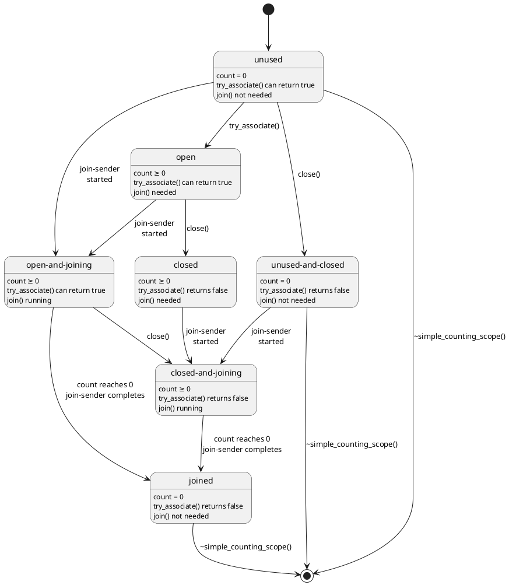

Changes
=======

## R6
- Change the scope token's basis operations from `nest()` to `try_associate()` and `dissociate()`

## R5
- Clarify that the _`nest-sender`_'s operation state must destroy its child operation state before decrementing the
  scope's reference count.
- Add naming discussion.
- Discuss a memory allocator lifetime concern raised by Lewis Baker and several options for resolving it.

## R4
- Permit caller of `spawn_future()` to provide a stop token in the optional environment argument.
- Remove `[[nodiscard]]`.
- Make `simple_counting_scope::token::token()` and `counting_scope::token::token()` explicit and exposition-only.
- Remove redundant `concept async_scope`.
- Remove last vestiges of `let_with_async_scope`.
- Add some wording to a new [Specification](#specification) section

## R3
- Update slide code to be exception safe
- Split the async scope concept into a scope and token; update `counting_scope` to match
- Rename `counting_scope` to `simple_counting_scope` and give the name `counting_scope` to a scope with a stop source
- Add example for recursively spawned work using `let_with_async_scope` and `counting_scope`

## R2
- Update `counting_scope::nest()` to explain when the scope's count of outstanding senders is decremented and remove
  `counting_scope::joined()`, `counting_scope::join_started()`, and `counting_scope::use_count()` on advice of SG1 straw
  poll:

  > forward P3149R1 to LEWG for inclusion in C++26 after P2300 is included in C++26, with notes:
  >
  > 1. the point of refcount decrement to be moved after the child operation state is destroyed
  > 2. a future paper should explore the design for cancellation of scopes
  > 3. observers (joined, join_started, use_count) can be removed
  >
  > +---+---+---+---+---+
  > |SF |F  |N  |A  |SA |
  > +==:+==:+==:+==:+==:+
  > |10 |14 |2  |0  |1  |
  > +---+---+---+---+---+
  > Consensus
  >
  > SA: we are moving something without wide implementation experience, the version with experience has cancellation of
  > scopes

- Add a fourth state to `counting_scope` so that it can be used as a data-member safely

## R1

- Add implementation experience
- Incorporate pre-meeting feedback from Eric Niebler

## R0

- First revision

Introduction
============

[@P2300R7] lays the groundwork for writing structured concurrent programs in C++ but it leaves three important scenarios
under- or unaddressed:

1. progressively structuring an existing, unstructured concurrent program;
2. starting a dynamic number of parallel tasks without "losing track" of them; and
3. opting in to eager execution of sender-shaped work when appropriate.

This paper describes the utilities needed to address the above scenarios within the following constraints:

- _No detached work by default;_ as specified in [@P2300R7], the `start_detached` and `ensure_started` algorithms invite
  users to start concurrent work with no built-in way to know when that work has finished.
  - Such so-called "detached work" is undesirable; without a way to know when detached work is done, it is difficult
    know when it is safe to destroy any resources referred to by the work. Ad hoc solutions to this shutdown problem
    add unnecessary complexity that can be avoided by ensuring all concurrent work is "attached".
  - [@P2300R7]'s introduction of structured concurrency to C++ will make async programming with C++ much easier but
    experienced C++ programmers typically believe that async C++ is "just hard" and that starting async work *means*
    starting detached work (even if they are not thinking about the distinction between attached and detached work) so
    adapting to a post-[@P2300R7] world will require unlearning many deprecated patterns. It is thus useful as a
    teaching aid to remove the unnecessary temptation of falling back on old habits.
- _No dependencies besides [@P2300R7];_ it will be important for the success of [@P2300R7] that existing code bases
  can migrate from unstructured concurrency to structured concurrency in an incremental way so tools for progressively
  structuring code should not take on risk in the form of unnecessary dependencies.

The proposed solution comes in the following parts:

- `template <class Token, class Sender> concept async_scope_token`{.cpp};
- `sender auto nest(sender auto&& snd, async_scope_token auto token)`{.cpp};
- `void spawn(sender auto&& snd, async_scope_token auto token, auto&& env)`{.cpp};
- `sender auto spawn_future(sender auto&& snd, async_scope_token auto token, auto&& env)`{.cpp};
- Proposed in [@P3296R0]: `sender auto let_with_async_scope(callable auto&& senderFactory)`{.cpp};
- `struct simple_counting_scope`{.cpp}; and
- `struct counting_scope`{.cpp}.

## Implementation experience

The general concept of an async scope to manage work has been deployed broadly at Meta. Code written with Folly's
coroutine library, [@follycoro], uses [@follyasyncscope] to safely launch awaitables. Most code written with Unifex, an
implementation of an earlier version of the _Sender/Receiver_ model proposed in [@P2300R7], uses [@asyncscopeunifexv1],
although experience with the v1 design led to the creation of [@asyncscopeunifexv2], which has a smaller interface and
a cleaner definition of responsibility.

As an early adopter of Unifex, [@rsys] (Meta’s cross-platform voip client library) became the entry point for structured
concurrency in mobile code at Meta. We originally built rsys with an unstructured asynchrony model built around posting
callbacks to threads in order to optimize for binary size. However, this came at the expense of developer velocity due
to the increasing cost of debugging deadlocks and crashes resulting from race conditions.

We decided to adopt Unifex and refactor towards a more structured architecture to address these problems
systematically. Converting an unstructured production codebase to a structured one is such a large project that it
needs to be done in phases. As we began to convert callbacks to senders/tasks, we quickly realized that we needed a safe
place to start structured asynchronous work in an unstructured environment. We addressed this need with
`unifex::v1::async_scope` paired with an executor to address a recurring pattern:

:::cmptable
### Before
```cpp
// Abstraction for thread that has the ability
// to execute units of work.
class Executor {
 public:
  virtual void add(Func function) noexcept = 0;
};

// Example class
class Foo {
  std::shared_ptr<Executor> exec_;

 public:
  void doSomething() {
     auto asyncWork = [&]() {
       // do something
     };
     exec_->add(asyncWork);
  }
};
```

### After
```cpp
// Utility class for executing async work on an
// async_scope and on the provided executor
class ExecutorAsyncScopePair {
  unifex::v1::async_scope scope_;
  ExecutorScheduler exec_

 public:
  void add(Func func) {
    scope_.detached_spawn_call_on(
      exec_, func);
  }

  auto cleanup() {
    return scope_.cleanup();
  }
};

// Example class
class Foo {
 std::shared_ptr<ExecutorAsyncScopePair> exec_;

 public:
  ~Foo() {
    sync_wait(exec_->cleanup());
  }

  void doSomething() {
    auto asyncWork = [&]() {
      // do something
    };


   exec_->add(asyncWork);
  }
};
```
::::

This broadly worked but we discovered that the above design coupled with the v1 API allowed for too many redundancies
and conflated too many responsibilities (scoping async work, associating work with a stop source, and transferring
scoped work to a new scheduler).

We learned that making each component own a distinct responsibility will minimize the confusion and increase the
structured concurrency adoption rate. The above example was an intuitive use of async_scope because the concept of a
“scoped executor” was familiar to many engineers and is a popular async pattern in other programming languages.
However, the above design abstracted away some of the APIs in async_scope that explicitly asked for a scheduler, which
would have helped challenge the assumption engineers made about async_scope being an instance of a “scoped executor”.

Cancellation was an unfamiliar topic for engineers within the context of asynchronous programming. The
`v1::async_scope` provided both `cleanup()` and `complete()` to give engineers the freedom to decide between canceling
work or waiting for work to finish. The different nuances on when this should happen and how it happens ended up being
an obstacle that engineers didn’t want to deal with.

Over time, we also found redundancies in the way `v1::async_scope` and other algorithms were implemented and identified
other use cases that could benefit from a different kind of async scope. This motivated us to create `v2::async_scope`
which only has one responsibility (scope), and `nest` which helped us improve maintainability and flexibility of
Unifex.

The unstructured nature of `cleanup()`/`complete()` in a partially structured codebase introduced deadlocks when
engineers nested the `cleanup()`/`complete()` sender in the scope being joined. This risk of deadlock remains with
`v2::async_scope::join()` however, we do think this risk can be managed and is worth the tradeoff in exchange for a
more coherent architecture that has fewer crashes. For example, we have experienced a significant reduction in these
types of deadlocks once engineers understood that `join()` is a destructor-like operation that needs to be run only by
the scope’s owner. Since there is no language support to manage async lifetimes automatically, this insight was key in
preventing these types of deadlocks. Although this breakthrough was a result of strong guidance from experts, we
believe that the simpler design of `v2::async_scope` would make this a little easier.

We strongly believe that async_scope was necessary for making structured concurrency possible within rsys, and we
believe that the improvements we made with `v2::async_scope` will make the adoption of P2300 more accessible.


Motivation
==========

## Motivating example

Let us assume the following code:

```cpp
namespace ex = std::execution;

struct work_context;
struct work_item;
void do_work(work_context&, work_item*);
std::vector<work_item*> get_work_items();

int main() {
    static_thread_pool my_pool{8};
    work_context ctx; // create a global context for the application

    std::vector<work_item*> items = get_work_items();
    for (auto item : items) {
        // Spawn some work dynamically
        ex::sender auto snd = ex::transfer_just(my_pool.get_scheduler(), item) |
                              ex::then([&](work_item* item) { do_work(ctx, item); });
        ex::start_detached(std::move(snd));
    }
    // `ctx` and `my_pool` are destroyed
}
```

In this example we are creating parallel work based on the given input vector. All the work will be spawned on the local
`static_thread_pool` object, and will use a shared `work_context` object.

Because the number of work items is dynamic, one is forced to use `start_detached()` from [@P2300R7] (or something
equivalent) to dynamically spawn work. [@P2300R7] doesn't provide any facilities to spawn dynamic work and return a
sender (i.e., something like `when_all` but with a dynamic number of input senders).

Using `start_detached()` here follows the _fire-and-forget_ style, meaning that we have no control over, or awareness
of, the completion of the async work that is being spawned.

At the end of the function, we are destroying the `work_context` and the `static_thread_pool`. But at that point, we
don't know whether all the spawned async work has completed. If any of the async work is incomplete, this might lead to
crashes.

[@P2300R7] doesn't give us out-of-the-box facilities to use in solving these types of problems.

This paper proposes the `counting_scope` and [@P3296R0]'s `let_with_async_scope` facilities that would help us avoid the
invalid behavior. With `counting_scope`, one might write safe code this way:

```cpp
namespace ex = std::execution;

struct work_context;
struct work_item;
void do_work(work_context&, work_item*);
std::vector<work_item*> get_work_items();

int main() {
    static_thread_pool my_pool{8};
    work_context ctx;         // create a global context for the application
    ex::counting_scope scope; // create this *after* the resources it protects

    // make sure we always join
    unifex::scope_guard join = [&]() noexcept {
      // wait for all nested work to finish
      this_thread::sync_wait(scope.join()); // NEW!
    };

    std::vector<work_item*> items = get_work_items();
    for (auto item : items) {
      // Spawn some work dynamically
      ex::sender auto snd = ex::transfer_just(my_pool.get_scheduler(), item) |
                            ex::then([&](work_item* item) { do_work(ctx, item); });

      // start `snd` as before, but associate the spawned work with `scope` so that it can
      // be awaited before destroying the resources referenced by the work (i.e. `my_pool`
      // and `ctx`)
      ex::spawn(std::move(snd), scope.get_token()); // NEW!
    }

    // `ctx` and `my_pool` are destroyed *after* they are no longer referenced
}
```

With [@P3296R0]'s `let_with_async_scope`, one might write safe code this way:
```cpp
namespace ex = std::execution;

struct work_context;
struct work_item;
void do_work(work_context&, work_item*);
std::vector<work_item*> get_work_items();

int main() {
  static_thread_pool my_pool{8};
  work_context ctx;         // create a global context for the application

  this_thread::sync_wait(ex::let_with_async_scope(ex::just(get_work_items()), [&](auto scope) {
    for (auto item : items) {
      // Spawn some work dynamically
      ex::sender auto snd = ex::transfer_just(my_pool.get_scheduler(), item) |
                            ex::then([&](work_item* item) { do_work(ctx, item); });

      // start `snd` as before, but associate the spawned work with `scope` so that it can
      // be awaited before destroying the resources referenced by the work (i.e. `my_pool`
      // and `ctx`)
      ex::spawn(std::move(snd), scope); // NEW!
    }
    return just();
  }));

  // `ctx` and `my_pool` are destroyed *after* they are no longer referenced
}
```

Simplifying the above into something that fits in a Tony Table to highlight the differences gives us:

::: cmptable

### Before
```cpp
namespace ex = std::execution;

struct context;
ex::sender auto work(const context&);

int main() {
  context ctx;

  ex::sender auto snd = work(ctx);

  // fire and forget
  ex::start_detached(std::move(snd));

  // `ctx` is destroyed, perhaps before
  // `snd` is done
}
```

### With `counting_scope`
```cpp
namespace ex = std::execution;

struct context;
ex::sender auto work(const context&);

int main() {
  context ctx;
  ex::counting_scope scope;

  ex::sender auto snd = work(ctx);

  try { 
      // fire, but don't forget
      ex::spawn(std::move(snd), scope.get_token());
  } catch (...) {
      // do something to handle exception
  }

  // wait for all work nested within scope
  // to finish
  this_thread::sync_wait(scope.join());

  // `ctx` is destroyed once nothing
  // references it
}
```

### With `let_with_async_scope`
```cpp
namespace ex = std::execution;

struct context;
ex::sender auto work(const context&);

int main() {
  context ctx;
  this_thread::sync_wait(ex::just()
      | ex::let_with_async_scope([&](auto scope) {
        ex::sender auto snd = work(ctx);

        // fire, but don't forget
        ex::spawn(std::move(snd), scope.get_token());
      }));

  // `ctx` is destroyed once nothing
  // references it
}
```

:::

Please see below for more examples.

## `counting_scope` and `let_with_async_scope` are a step forward towards Structured Concurrency

Structured Programming [@Dahl72] transformed the software world by making it easier to reason about the code, and build
large software from simpler constructs. We want to achieve the same effect on concurrent programming by ensuring that
we _structure_ our concurrent code. [@P2300R7] makes a big step in that direction, but, by itself, it doesn't fully
realize the principles of Structured Programming. More specifically, it doesn't always ensure that we can apply the
_single entry, single exit point_ principle.

The `start_detached` sender algorithm fails this principle by behaving like a `GOTO` instruction. By calling
`start_detached` we essentially continue in two places: in the same function, and on different thread that executes the
given work. Moreover, the lifetime of the work started by `start_detached` cannot be bound to the local context. This
will prevent local reasoning, which will make the program harder to understand.

To properly structure our concurrency, we need an abstraction that ensures that all async work that is spawned has a
defined, observable, and controllable lifetime. This is the goal of `counting_scope` and `let_with_async_scope`.

Examples of use
===============

## Spawning work from within a task

Use `let_with_async_scope` in combination with a `system_context` from [@P2079R2] to spawn work from within a task:
```cpp
namespace ex = std::execution;

int main() {
    ex::system_context ctx;
    int result = 0;

    ex::scheduler auto sch = ctx.scheduler();

    ex::sender auto val = ex::just()
        | ex::let_with_async_scope([sch](ex::async_scope_token auto scope) {
          int val = 13;

          auto print_sender = ex::just()
              | ex::then([val]() noexcept {
                std::cout << "Hello world! Have an int with value: " << val << "\n";
              });

          // spawn the print sender on sch
          //
          // NOTE: if spawn throws, let_with_async_scope will capture the exception
          //       and propagate it through its set_error completion
          ex::spawn(ex::on(sch, std::move(print_sender)), scope);

          return ex::just(val);
        }))
        | ex::then([&result](auto val) { result = val });

    this_thread::sync_wait(ex::on(sch, std::move(val)));

    std::cout << "Result: " << result << "\n";
}

// 'let_with_async_scope' ensures that, if all work is completed successfully, the result will be 13
// `sync_wait` will throw whatever exception is thrown by the callable passed to `let_with_async_scope`
```

## Starting work nested within a framework

In this example we use the `counting_scope` within a class to start work when the object receives a message and to wait
for that work to complete before closing.

```cpp
namespace ex = std::execution;

struct my_window {
    class close_message {};

    ex::sender auto some_work(int message);

    ex::sender auto some_work(close_message message);

    void onMessage(int i) {
        ++count;
        ex::spawn(ex::on(sch, some_work(i)), scope);
    }

    void onClickClose() {
        ++count;
        ex::spawn(ex::on(sch, some_work(close_message{})), scope);
    }

    my_window(ex::system_scheduler sch, ex::counting_scope::token scope)
      : sch(sch), scope(scope) {
      // register this window with the windowing framework somehow so that
      // it starts receiving calls to onClickClose() and onMessage()
    }

    ex::system_scheduler sch;
    ex::counting_scope::token scope;
    int count{0};
};

int main() {
    // keep track of all spawned work
    ex::counting_scope scope;
    ex::system_context ctx;
    try {
        my_window window{ctx.get_scheduler(), scope.get_token()};
    } catch (...) {
      // do something with exception
    }
    // wait for all work nested within scope to finish
    this_thread::sync_wait(scope.join());
    // all resources are now safe to destroy
    return window.count;
}
```

## Starting parallel work

In this example we use `let_with_async_scope` to construct an algorithm that performs parallel work. Here `foo`
launches 100 tasks that concurrently run on some scheduler provided to `foo`, through its connected receiver, and then
the tasks are asynchronously joined. This structure emulates how we might build a parallel algorithm where each
`some_work` might be operating on a fragment of data.
```cpp
namespace ex = std::execution;

ex::sender auto some_work(int work_index);

ex::sender auto foo(ex::scheduler auto sch) {
  return ex::just()
      | ex::let_with_async_scope([sch](ex::async_scope_token auto scope) {
        return ex::schedule(sch)
            | ex::then([] {
              std::cout << "Before tasks launch\n";
            })
            | ex::then([=] {
              // Create parallel work
              for (int i = 0; i < 100; ++i) {
                // NOTE: if spawn() throws, the exception will be propagated as the
                //       result of let_with_async_scope through its set_error completion
                ex::spawn(ex::on(sch, some_work(i)), scope);
              }
            });
      })
      | ex::then([] { std::cout << "After tasks complete successfully\n"; });
}
```

## Listener loop in an HTTP server

This example shows how one can write the listener loop in an HTTP server, with the help of coroutines. The HTTP server
will continuously accept new connection and start work to handle the requests coming on the new connections. While the
listening activity is bound in the scope of the loop, the lifetime of handling requests may exceed the scope of the
loop. We use `counting_scope` to limit the lifetime of the request handling without blocking the acceptance of new
requests.

```cpp
namespace ex = std::execution;

task<size_t> listener(int port, io_context& ctx, static_thread_pool& pool) {
    size_t count{0};
    listening_socket listen_sock{port};

    co_await ex::let_with_async_scope(
        ex::just(), [&](ex::async_scope_token auto scope) -> task<void> {
          while (!ctx.is_stopped()) {
            // Accept a new connection
            connection conn = co_await async_accept(ctx, listen_sock);
            count++;

            // Create work to handle the connection in the scope of `work_scope`
            conn_data data{std::move(conn), ctx, pool};
            ex::sender auto snd = ex::just(std::move(data))
                | ex::let_value([](auto& data) {
                  return handle_connection(data);
                });

            ex::spawn(std::move(snd), scope);
          }
        });

    // At this point, all the request handling is complete
    co_return count;
}
```

[@libunifex] has a very similar example HTTP server at [@iouringserver] that compiles and runs on Linux-based machines
with `io_uring` support.

## Pluggable functionality through composition

This example is based on real code in rsys, but it reduces the real code to slideware and ports it from Unifex to the
proposed `std::execution` equivalents. The central abstraction in rsys is a `Call`, but each integration of rsys has
different needs so the set of features supported by a `Call` varies with the build configuration. We support this
configurability by exposing the equivalent of the following method on the `Call` class:
```cpp
template <typename Feature>
Handle<Feature> Call::get();
```
and it's used like this in app-layer code:
```cpp
unifex::task<void> maybeToggleCamera(Call& call) {
  Handle<Camera> camera = call.get<Camera>();

  if (camera) {
    co_await camera->toggle();
  }
}
```

A `Handle<Feature>` is effectively a part-owner of the `Call` it came from.

The team that maintains rsys and the teams that use rsys are, unsurprisingly, different teams so rsys has to be designed
to solve organizational problems as well as technical problems. One relevant design decision the rsys team made is that
it is safe to keep using a `Handle<Feature>` after the end of its `Call`'s lifetime; this choice adds some complexity to
the design of `Call` and its various features but it also simplifies the support relationship between the rsys team and
its many partner teams because it eliminates many crash-at-shutdown bugs.
```cpp
namespace rsys {

class Call {
 public:
  unifex::nothrow_task<void> destroy() noexcept {
    // first, close the scope to new work and wait for existing work to finish
    scope_->close();
    co_await scope_->join();

    // other clean-up tasks here
  }

  template <typename Feature>
  Handle<Feature> get() noexcept;

 private:
  // an async scope shared between a call and its features
  std::shared_ptr<std::execution::counting_scope> scope_;
  // each call has its own set of threads
  ExecutionContext context_;

  // the set of features this call supports
  FeatureBag features_;
};

class Camera {
 public:
  std::execution::sender auto toggle() {
    namespace ex = std::execution;

    return ex::just() | ex::let_value([this]() {
      // this callable is only invoked if the Call's scope is in
      // the open or unused state when nest() is invoked, making
      // it safe to assume here that:
      //
      //  - scheduler_ is not a dangling reference to the call's
      //    execution context
      //  - Call::destroy() has not progressed past starting the
      //    join-sender so all the resources owned by the call
      //    are still valid
      //
      // if the nest() attempt fails because the join-sender has
      // started (or even if the Call has been completely destroyed)
      // then the sender returned from toggle() will safely do
      // nothing before completing with set_stopped()

      return ex::schedule(scheduler_) | ex::then([this]() {
        // toggle the camera
      });
    }) | ex::nest(callScope_->get_token());
  }

 private:
  // a copy of this camera's Call's scope_ member
  std::shared_ptr<ex::counting_scope> callScope_;
  // a scheduler that refers to this camera's Call's ExecutionContext
  Scheduler scheduler_;
};

}
```

## Recursively spawning work until completion
Below are three ways you could recursively spawn work on a scope using `let_with_async_scope` or `counting_scope`.

### `let_with_async_scope` with `spawn()`
```cpp
struct tree {
  std::unique_ptr<tree> left;
  std::unique_ptr<tree> right;
  int data;
};

auto process(ex::scheduler auto sch, auto scope, tree& t) noexcept {
  return ex::schedule(sch) | then([sch, &]() {
    if (t.left)
      ex::spawn(process(sch, scope, t.left.get()), scope);
    if (t.right)
      ex::spawn(process(sch, scope, t.right.get()), scope);
    do_stuff(t.data);
  }) | ex::let_error([](auto& e) {
    // log error
    return just();
  });
}

int main() {
  ex::scheduler sch;
  tree t = make_tree();
  // let_with_async_scope will ensure all new work will be spawned on the
  // scope and will not be joined until all work is finished.
  // NOTE: Exceptions will not be surfaced to let_with_async_scope; exceptions
  // will be handled by let_error instead.
  this_thread::sync_wait(ex::let_with_async_scope([&, sch](auto scope) {
	return process(sch, scope, t);
  }));
}
```

### `let_with_async_scope` with `spawn_future()`
```cpp
struct tree {
  std::unique_ptr<tree> left;
  std::unique_ptr<tree> right;
  int data;
};

auto process(ex::scheduler auto sch, auto scope, tree& t) {
    return ex::schedule(sch) | ex::let_value([sch, &]() {
      unifex::any_sender_of<> leftFut = ex::just();
      unifex::any_sender_of<> rightFut = ex::just();
      if (t.left) {  
         leftFut = ex::spawn_future(
         scope, process(sch, scope, t.left.get()));
      }

      if (t.right) { 
         rightFut = ex::spawn_future(
         scope, process(sch, scope, t.right.get()));
      }

      do_stuff(t.data);
      return ex::when_all(leftFut, rightFut) | ex::then([](auto&&...) noexcept {});
    });
}

int main() {
    ex::scheduler sch;
    tree t = make_tree();
    // let_with_async_scope will ensure all new work will be spawned on the
    // scope and will not be joined until all work is finished
    // NOTE: Exceptions will be surfaced to let_with_async_scope which will
    // call set_error with the exception_ptr
    this_thread::sync_wait(ex::let_with_async_scope([&, sch](auto scope) { 
        return process(sch, scope, t);
    }));
}
```

### `counting_scope`
```cpp
struct tree {
  std::unique_ptr<tree> left;
  std::unique_ptr<tree> right;
  int data;
};

auto process(ex::counting_scope_token scope, ex::scheduler auto sch, tree& t) noexcept {
  return ex::schedule(sch) | ex::then([sch, &]() noexcept {
    if (t.left)
       ex::spawn(process(scope, sch, t.left.get()), scope);

    if (t.right)
       ex::spawn(process(scope, sch, t.right.get()), scope);

     do_stuff(t.data);
   }) | ex::let_error([](auto& e) {
       // log error
       return just();
   });
}

int main() {
  ex::scheduler sch;
  tree t = make_tree();
  ex::counting_scope scope;
  ex::spawn(process(scope.get_token(), sch, t), scope.get_token());
  this_thread::sync_wait(scope.join());
}
```

Async Scope, usage guide
========================

An async scope is a type that implements a "bookkeeping policy" for senders that have been `nest()`ed within the scope.
Depending on the policy, different guarantees can be provided in terms of the lifetimes of the scope and any nested
senders. The `counting_scope` described in this paper defines a policy that has proven useful while progressively
adding structure to existing, unstructured code at Meta, but other useful policies are possible. By defining `spawn()`
and `spawn_future()` in terms of the more fundamental `nest()`, and leaving the definition of `nest()` to the scope,
this paper's design leaves the set of policies open to extension by user code or future standards.

An async scope's implementation of `nest()`:

 - must allow an arbitrary sender to be nested within the scope without eagerly starting the sender;
 - must not return a sender that adds new value or error completions to the completions of the sender being nested;
 - may fail to nest a new sender by returning an "unnested" sender that completes with `set_stopped` when run without
   running the sender that failed to nest;
 - may fail to nest a new sender by eagerly throwing an exception during the call to `nest()`; and
 - is expected to be "cheap" like other sender adaptor objects.

More on these items can be found below in the sections below.

## Definitions

```cpp
namespace { // @@_exposition-only_@@

template <class Env>
struct @@_spawn-env_@@; // @@_exposition-only_@@

template <class Env>
struct @@_spawn-receiver_@@ { // @@_exposition-only_@@
    void set_value() noexcept;
    void set_stopped() noexcept;

    @@_spawn-env_@@<Env> get_env() const noexcept;
};

template <class Env>
struct @@_future-env_@@; // @@_exposition-only_@@

template <@@_valid-completion-signatures_@@ Sigs>
struct @@_future-sender_@@; // @@_exposition-only_@@

template <sender Sender, class Env>
using @@_future-sender-t_@@ = // @@_exposition-only_@@
    @@_future-sender_@@<completion_signatures_of_t<Sender, @@_future-env_@@<Env>>>;

}

template <class Token>
concept async_scope_token =
    copyable<Token> &&
    requires(Token token) {
      { token.try_associate() } -> same_as<bool>;
      { token.dissociate() } -> same_as<void>;
    };

template <class Token, sender Sender>
concept async_scope_token_for =
    async_scope_token<Token> &&
    requires(Token token, Sender&& sender) {
      { token.wrap((Sender&&)sender) } -> sender;
    };

template <sender Sender, async_scope_token_for<Sender> Token>
struct @@_nest-sender_@@ { // @@_exposition-only_@@
  template <sender S2>
    requires same_as<Sender, remove_cvref_t<S2>>
  nest-sender(S2&& sender, Token token);

  ~nest-sender();

private:
  using wrapped_t = decltype(declval<Token>().wrap(declval<Sender>()));

  Token token;
  optional<wrapped_t> sender_;
};

template <sender Sender, async_scope_token Token>
auto nest(Sender&& snd, Token token)
    noexcept(is_nothrow_constructible_v<@@_nest-sender_@@<remove_cvref_t<Sender>>, Sender>)
    -> decltype(@@_nest-sender_@@<remove_cvref_t<Sender>>);

template <sender Sender, async_scope_token Token, class Env = empty_env>
  requires sender_to<Sender, @@_spawn-receiver_@@<Env>>
void spawn(Sender&& snd, Token token, Env env = {});

template <sender Sender, async_scope_token Token, class Env = empty_env>
@@_future-sender-t_@@<Sender, Env> spawn_future(Sender&& snd, Token token, Env env = {});

struct simple_counting_scope {
    simple_counting_scope() noexcept;
    ~simple_counting_scope();

    // simple_counting_scope is immovable and uncopyable
    simple_counting_scope(const simple_counting_scope&) = delete;
    simple_counting_scope(simple_counting_scope&&) = delete;
    simple_counting_scope& operator=(const simple_counting_scope&) = delete;
    simple_counting_scope& operator=(simple_counting_scope&&) = delete;

    struct token {
      bool try_associate() const;

      void dissociate() const;

     private:
      friend simple_counting_scope;

      explicit token(simple_counting_scope* s) noexcept; // @@_exposition-only_@@

      simple_counting_scope* scope; // @@_exposition-only_@@
    };

    token get_token() noexcept;

    void close() noexcept;

    struct @@_join-sender_@@; // @@_exposition-only_@@

    @@_join-sender_@@ join() noexcept;
};

struct counting_scope {
    counting_scope() noexcept;
    ~counting_scope();

    // counting_scope is immovable and uncopyable
    counting_scope(const counting_scope&) = delete;
    counting_scope(counting_scope&&) = delete;
    counting_scope& operator=(const counting_scope&) = delete;
    counting_scope& operator=(counting_scope&&) = delete;

    struct token {
      bool try_associate() const;

      void dissociate() const;

     private:
      friend counting_scope;

      explicit token(counting_scope* s) noexcept; // @@_exposition-only_@@

      counting_scope* scope; // @@_exposition-only_@@
    };

    token get_token() noexcept;

    void close() noexcept;

    void request_stop() noexcept;

    struct @@_join-sender_@@; // @@_exposition-only_@@

    @@_join-sender_@@ join() noexcept;
};
```

## `execution::async_scope_token`

```cpp
template <class Token>
concept async_scope_token =
    copyable<Token> &&
    requires(Token token) {
      { token.try_associate() } -> same_as<bool>;
      { token.dissociate() } -> same_as<void>;
    };
```

An async scope token is a non-owning handle to an [async scope](#executionasync_scope).


// TODO: update this:
The `nest()` method on a token
attempts to associate its input sender with the handle's async scope in a scope-defined way. See
[`execution::nest`](#executionnest) for the semantics of `nest()`.

An async scope token behaves like a pointer-to-async-scope; tokens are no-throw copyable and movable, and it is
undefined behaviour to invoke `nest()` on a token that has outlived its scope.

## `execution::nest`

```cpp
template <sender Sender, async_scope_token Token>
auto nest(Sender&& snd, Token token)
    noexcept(is_nothrow_constructible_v<@@_nest-sender_@@<remove_cvref_t<Sender>, Sender>>)
    -> @@_nest-sender_@@<remove_cvref_t<Sender>>;
```

Attempts to associate the given sender with the given scope token's scope. On success, the return value is an
"associated sender" with the same behaviour and possible completions as the input sender. On failure, `nest()` either
returns an "unassociated sender" or throws whatever is thrown by the scope token.

When `nest()` returns an associated sender:

 - connecting and starting the associated sender connects and starts the given sender; and
 - the associated sender has exactly the same completions as the input sender.

When `nest()` returns an unassociated sender:

 - the input sender is discarded and will never be connected or started; and
 - the unassociated sender must only complete with `set_stopped()`.

A call to `nest()` does not start the given sender and is not expected to incur allocations.

Regardless of whether the returned sender is associated or unassociated, it is multi-shot if the input sender is
multi-shot and single-shot otherwise.

`nest()` behaves as-if it is implemented like so:

```cpp
template <sender Sender, async_scope_token Token>
auto nest(Sender&& snd, Token token)
    noexcept(is_nothrow_constructible_v<@@_nest-sender_@@<remove_cvref_t<Sender>, Sender>>) {
  return @@_nest-sender_@@<decltype(token.wrap(forward<Sender>(sender))), Token>{
      forward<Sender>(snd), token};
}
```

The _`nest-sender`_ constructor and destructor behave as-if they are implemented like so:

// TODO: this code needs polish; it gets some type computations wrong, but it's showing the right sequence of steps
```cpp
template <sender S2>
  requires constructible_from<Sender, S2>
nest-sender<Sender, Token>::nest-sender(S2&& sender, Token token)
  : token_(token) {
  if (!token.try_associate()) {
    // this is an unassociated sender
    return;
  }

  try {
    sender_.emplace(token.wrap(forward<S2>(sender)));
    // this is an associated sender
  }
  catch (...) {
    token.dissociate();
    throw;
  }
}

nest-sender<Sender, Token>::~nest-sender() {
  if (sender_.has_value()) {
    token.dissociate();
  }
}
```

## `execution::spawn`

```cpp
namespace { // @@_exposition-only_@@

template <class Env>
struct @@_spawn-env_@@; // @@_exposition-only_@@

template <class Env>
struct @@_spawn-receiver_@@ { // @@_exposition-only_@@
    void set_value() noexcept;
    void set_stopped() noexcept;

    @@_spawn-env_@@<Env> get_env() const noexcept;
};

}

template <sender Sender, async_scope_token Token, class Env = empty_env>
  requires sender_to<Sender, @@_spawn-receiver_@@<Env>>
void spawn(Sender&& snd, Token token, Env env = {});
```

Invokes `token.try_associate()`; if it returns `true`, the given sender is eagerly started, otherwise the sender is
discarded and no further work happens.

Starting the given sender involves a dynamic allocation of the sender's _`operation-state`_. The following algorithm
determines which _Allocator_ to use for this allocation:

 - If `get_allocator(env)` is valid and returns an _Allocator_ then choose that _Allocator_.
 - Otherwise, if `get_allocator(get_env(snd))` is valid and returns an _Allocator_ then choose that _Allocator_.
 - Otherwise, choose `std::allocator<>`.

The _`operation-state`_ is constructed by connecting the given sender to a _`spawn-receiver`_. Upon completion of the
spawned sender, the following steps happen in the following order:

1. the _`operation-state`_ is destroyed,
2. the dynamic allocation is deallocated, and
3. `token.dissociate()` is invoked.

A _`spawn-receiver`_, `sr`, responds to `get_env(sr)` with an instance of a `@@_spawn-env_@@<Env>`, `senv`. The result
of `get_allocator(senv)` is a copy of the _Allocator_ used to allocate the _`operation-state`_. For all other queries,
`Q`, the result of `Q(senv)` is `Q(env)`.

This is similar to `start_detached()` from [@P2300R7], but the scope may observe and participate in the lifetime of the
work described by the sender. The `simple_counting_scope` and `counting_scope` described in this paper use this
opportunity to keep a count of spawned senders that haven't finished, and to prevent new senders from being spawned
once the scope has been closed.

The given sender must complete with `set_value()` or `set_stopped()` and may not complete with an error; the user must
explicitly handle the errors that might appear as part of the _`sender-expression`_ passed to `spawn()`.

User expectations will be that `spawn()` is asynchronous and so, to uphold the principle of least surprise, `spawn()`
should only be given non-blocking senders. Using `spawn()` with a sender generated by `on(sched, @_blocking-sender_@)`
is a very useful pattern in this context.

_NOTE:_ A query for non-blocking start will allow `spawn()` to be constrained to require non-blocking start.

Usage example:
```cpp
...
for (int i = 0; i < 100; i++)
    spawn(on(sched, some_work(i)), scope.get_token());
```


## `execution::spawn_future`

```cpp
namespace { // @@_exposition-only_@@

template <class Env>
struct @@_future-env_@@; // @@_exposition-only_@@

template <@@_valid-completion-signatures_@@ Sigs>
struct @@_future-sender_@@; // @@_exposition-only_@@

template <sender Sender, class Env>
using @@_future-sender-t_@@ = // @@_exposition-only_@@
    @@_future-sender_@@<completion_signatures_of_t<Sender, @@_future-env_@@<Env>>>;

}

template <sender Sender, async_scope_token Token, class Env = empty_env>
@@_future-sender-t_@@<Sender, Env> spawn_future(Sender&& snd, Token token, Env env = {});
```

Invokes `token.try_associate()`; if it returns `true`, the given sender is eagerly started and `spawn_future` returns
a _`future-sender`_ that provides access to the result of the given sender. Otherwise, `spawn_future` returns a
_`future-sender`_ that unconditionally completes with `set_stopped()`.

Similar to `spawn()`, starting the given sender involves a dynamic allocation of some state. `spawn_future()` chooses
an _Allocator_ for this allocation in the same way `spawn()` does: use the result of `get_allocator(env)` if that is a
valid expression, otherwise use the result of `get_allocator(get_env(snd))` if that is a valid expression, otherwise use
a `std::allocator<>`.

Unlike `spawn()`, the dynamically allocated state contains more than just an _`operation-state`_ for the given sender;
the state must also contain storage for the result of the given sender, however it eventually completes, and
synchronization facilities for resolving the race between the given sender's production of its result and the returned
sender's consumption or abandonment of that result.

Also unlike `spawn()`, `spawn_future()` returns a _`future-sender`_ rather than `void`. The returned sender, `fs`, is a
handle to the spawned work that can be used to consume or abandon the result of that work. When `fs` is connected and
started, it waits for the spawned sender to complete and then completes itself with the spawned sender's result. If `fs`
is destroyed before being connected, or if `fs` *is* connected but then the resulting _`operation-state`_ is destroyed
before being started, then a stop request is sent to the spawned sender in an effort to short-circuit the computation of
a result that will not be observed. If `fs` receives a stop request from its receiver before the spawned sender
completes, the stop request is forwarded to the spawned sender and then `fs` completes; if the spawned sender happens to
complete between `fs` forwarding the stop request and completing itself then `fs` may complete with the result of the
spawned sender as if the stop request was never received but, otherwise, `fs` completes with `stopped` and the result of
the spawned sender is ignored. The completion signatures of `fs` include `set_stopped()` and all the completion
signatures of the spawned sender.

The receiver, `fr`, that is connected to the given sender responds to `get_env(fr)` with an instance of
`@@_future-env_@@<Env>`, `fenv`. The result of `get_allocator(fenv)` is a copy of the _Allocator_ used to allocate the
dynamically allocated state. The result of `get_stop_token(fenv)` is a stop token that will be "triggered" (i.e. signal
that stop is requested) when:

- the returned _`future-sender`_ is dropped;
- the returned _`future-sender`_ receives a stop request; or
- the stop token returned from `get_stop_token(env)` is triggered if `get_stop_token(env)` is a valid expression.

For all other queries, `Q`, the result of `Q(fenv)` is `Q(env)`.

This is similar to `ensure_started()` from [@P2300R7], but the scope may observe and participate in the lifetime of the
work described by the sender. The `simple_counting_scope` and `counting_scope` described in this paper use this
opportunity to keep a count of given senders that haven't finished, and to prevent new senders from being started once
the scope has been closed.

Unlike `spawn()`, the sender given to `spawn_future()` is not constrained on a given shape. It may send different types
of values, and it can complete with errors.

_NOTE:_ there is a race between the completion of the given sender and the start of the returned sender. The spawned
sender and the returned _`future-sender`_ use the synchronization facilities in the dynamically allocated state to
resolve this race.

Cancelling the returned sender requests cancellation of the given sender, `snd`, but does not affect any other senders.

Usage example:
```cpp
...
sender auto snd = spawn_future(on(sched, key_work()), token) | then(continue_fun);
for (int i = 0; i < 10; i++)
    spawn(on(sched, other_work(i)), token);
return when_all(scope.join(), std::move(snd));
```

## `execution::simple_counting_scope`

```cpp
struct simple_counting_scope {
    simple_counting_scope() noexcept;
    ~simple_counting_scope();

    // simple_counting_scope is immovable and uncopyable
    simple_counting_scope(const simple_counting_scope&) = delete;
    simple_counting_scope(simple_counting_scope&&) = delete;
    simple_counting_scope& operator=(const simple_counting_scope&) = delete;
    simple_counting_scope& operator=(simple_counting_scope&&) = delete;

    struct token {
     bool try_associate() const;

     void dissociate() const;

     private:
      friend simple_counting_scope;

      explicit token(simple_counting_scope* s) noexcept; // @@_exposition-only_@@

      simple_counting_scope* scope; // @@_exposition-only_@@
    };

    token get_token() noexcept;

    void close() noexcept;

    struct @@_join-sender_@@; // @@_exposition-only_@@

    @@_join-sender_@@ join() noexcept;
};
```

A `simple_counting_scope` maintains a count of outstanding operations and goes through several states durings its
lifetime:

- unused
- open
- closed
- open-and-joining
- closed-and-joining
- unused-and-closed
- joined

The following diagram illustrates the `simple_counting_scope`'s state machine:



_Note: a scope is "open" if its current state is unused, open, or open-and-joining; a scope is "closed" if its current
state is closed, unused-and-closed, closed-and-joining, or joined._

Instances start in the unused state after being constructed. This is the only time the scope's state can be set to
unused. When the `simple_counting_scope` destructor starts, the scope must be in the unused, unused-and-closed, or
joined state; otherwise, the destructor invokes `std::terminate()`. Permitting destruction when the scope is in the
unused or unused-and-closed state ensures that instances of `simple_counting_scope` can be used safely as data-members
while preserving structured functionality.

Connecting and starting a _`join-sender`_ returned from `join()` moves the scope to either the open-and-joining or
closed-and-joining state. Merely calling `join()` or connecting the _`join-sender`_ does not change the scope's
state---the _`operation-state`_ must be started to effect the state change. A started _`join-sender`_ completes when the
scope's count of outstanding operations reaches zero, at which point the scope transitions to the joined state.

Calling `close()` on a `simple_counting_scope` moves the scope to the closed, unused-and-closed, or closed-and-joining
state, and causes all future calls to `try_associate()` to return `false`.

// TODO: there's no nest() on this scope anymore; update to describe try_associate(), maybe

Any call to `nest()` may throw an exception if copying or moving the input sender into the returned _`nest-sender`_
throws an exception. `nest()` provides the Strong Exception Guarantee so the scope's state is left unchanged if an
exception is thrown while constructing the returned _`nest-sender`_.

Assuming `nest()` does not throw:

- While a scope is in the unused, open, or open-and-joining state, calls to `nest()` succeed by returning an "associated
  sender" (see below) and incrementing the scope's count of outstanding operations _before returning_.
- While a scope is in the closed, unused-and-closed, closed-and-joining, or joined state, calls to `nest()` fail by
  returning an "unassociated sender" (see below). Failed calls to `nest()` do _not_ increment the scope's count of
  outstanding operations.

While a scope is open, calls to `nest()` that return normally will have incremented the scope's count of oustanding
operations. In this case, the resulting _`nest-sender`_ is an associated sender that acts like an RAII handle: the
scope's internal count is incremented when the sender is created and decremented when the sender is "done with the
scope", which happens when the sender or its _`operation-state`_ is destroyed. Moving a _`nest-sender`_ transfers
responsibility for decrementing the count from the old instance to the new one. Copying an associated _`nest-sender`_ is
permitted if the sender it's wrapping is copyable, but the copy may "fail" since copying requires incrementing the
scope's count, which is only allowed when the scope is open; if copying fails, the new sender is an unassociated sender
that behaves as if it were the result of a failed call to `nest()`.

While a scope is closed, calls to `nest()` that return normally will have failed to increment the scope's count of
outstanding operations or otherwise change the scope's state. In this case, the resulting _`nest-sender`_ is an
unassociated sender. Unassociated _`nest-senders`_ do not have a reference to the scope they came from and always
complete with `stopped` when connected and started. Copying or moving an unassociated sender produces another
unassociated sender.

Under the standard assumption that the arguments to `nest()` are and remain valid while evaluating `nest()`, it is
always safe to invoke any supported operation on the returned _`nest-sender`_.

The state transitions of a `simple_counting_scope` mean that it can be used to protect asynchronous work from
use-after-free errors. Given a resource, `res`, and a `simple_counting_scope`, `scope`, obeying the following policy is
enough to ensure that there are no attempts to use `res` after its lifetime ends:

- all senders that refer to `res` are nested within `scope`; and
- `scope` is destroyed (and therefore in the joined, unused, or unused-and-closed state) before `res` is destroyed.

It is safe to destroy a scope in the unused or unusued-and-closed state because there can't be any work referring to the
resources protected by the scope.

A `simple_counting_scope` is uncopyable and immovable so its copy and move operators are explicitly deleted.
`simple_counting_scope` could be made movable but it would cost an allocation so this is not proposed.

### `simple_counting_scope::simple_counting_scope`

```cpp
simple_counting_scope::simple_counting_scope() noexcept;
```

Initializes a `simple_counting_scope` in the unused state with the count of outstanding operations set to zero.

### `simple_counting_scope::~simple_counting_scope`

```cpp
simple_counting_scope::~simple_counting_scope();
```

Checks that the `simple_counting_scope` is in the joined, unused, or unused-and-closed state and invokes
`std::terminate()` if not.

### `simple_counting_scope::get_token`

```cpp
simple_counting_scope::token get_token() noexcept;
```

Returns a `simple_counting_scope::token` referring to the current scope, as if by invoking `token{this}`.

### `simple_counting_scope::close`

```cpp
void close() noexcept;
```

Moves the scope to the closed, unused-and-closed, or closed-and-joining state. After a call to `close()`, all future
calls to `nest()` that return normally return unassociated senders.

### `simple_counting_scope::join`

```cpp
struct @@_join-sender_@@; // @@_exposition-only_@@

@@_join-sender_@@ join() noexcept;
```

Returns a _`join-sender`_. When the _`join-sender`_ is connected to a receiver, `r`, it produces an
_`operation-state`_, `o`. When `o` is started, the scope moves to either the open-and-joining or closed-and-joining
state. `o` completes with `set_value()` when the scope moves to the joined state, which happens when the scope's count
of outstanding senders drops to zero. `o` may complete synchronously if it happens to observe that the count of
outstanding senders is already zero when started; otherwise, `o` completes on the execution context associated with the
scheduler in its receiver's environment by asking its receiver, `r`, for a scheduler, `sch`, with
`get_scheduler(get_env(r))` and then starting the sender returned from `schedule(sch)`. This requirement to complete on
the receiver's scheduler restricts which receivers a _`join-sender`_ may be connected to in exchange for determinism;
the alternative would have the _`join-sender`_ completing on the execution context of whichever nested operation happens
to be the last one to complete.

### `simple_counting_scope::token::nest`

// TODO: this doesn't exist; replace with explanations of try_associate() and dissociate()

```cpp
template <sender S>
struct @@_nest-sender_@@; // @@_exposition-only_@@

template <sender S>
@@_nest-sender_@@<std::remove_cvref_t<S>> nest(S&& s) const noexcept(
        std::is_nothrow_constructible_v<std::remove_cvref_t<S>, S>);
```

Attempts to return an associated _`nest-sender`_ constructed from `s`. The attempt will be successful if and only if:

- copying or moving (as appropriate) `s` into the _`nest-sender`_ does not throw an exception, and
- the token's scope's state can be successfully updated as described below.

If construction of the _`nest-sender`_ throws, the scope's state is left unchanged. Otherwise, the following atomic
state change is attempted on the token's scope:

- increment the scope's count of outstanding operations; and
- move the scope to the open state if it was in the unused state.

The atomic state change succeeds if the scope is observed to be in the unused, open, or open-and-joining state;
otherwise it fails.

If the atomic state change fails then the return value is an unassociated _`nest-sender`_.

An associated _`nest-sender`_ is a kind of RAII handle to the scope; it is responsible for decrementing the scope's
count of outstanding senders in its destructor unless that responsibility is first given to some other object.
Move-construction and move-assignment transfer the decrement responsibility to the destination instance. Connecting an
instance to a receiver transfers the decrement responsibility to the resulting _`operation-state`_; that
_`operation-state`_'s destructor must destroy its "child operation" (i.e. the _`operation-state`_ constructed when
connecting the sender, `s`, that was originally passed to `nest()`) before performing the decrement.

Note: the timing of when an _`operation-state`_ decrements the scope's count is chosen to avoid exposing user code to
dangling references. Decrementing the scope's count may move the scope to the joined state, which would allow the
waiting _`join-sender`_ to complete, potentially leading to the destruction of a resource protected by the scope. In
general, it's possible that the _`nest-sender`_'s receiver or the child operation's destructor may dereference pointers
to the protected resource so their execution must be completed before the scope moves to the joined state.

Whenever the balancing decrement happens, it's possible that the scope has transitioned to the open-and-joining or
closed-and-joining state since the _`nest-sender`_ was constructed, which means that there is a _`join-sender`_ waiting
to complete. If the decrement brings the count of outstanding operations to zero then the waiting _`join-sender`_ must
be notified that the scope is now joined and the sender can complete.

A call to `nest()` does not start the given sender. A call to `nest()` is not expected to incur allocations other than
whatever might be required to move or copy `s`.

Similar to `spawn_future()`, `nest()` doesn't constrain the input sender to any specific shape. Any type of sender is
accepted.

As `nest()` does not immediately start the given work, it is ok to pass in blocking senders.

Usage example:
```cpp
sender auto example(simple_counting_scope::token token, scheduler auto sched) {
  sender auto snd = nest(key_work(), token);

  for (int i = 0; i < 10; i++)
    spawn(on(sched, other_work(i)), token);

  return on(sched, std::move(snd));
}
```

## `execution::counting_scope`

```cpp
struct counting_scope {
    counting_scope() noexcept;
    ~counting_scope();

    // counting_scope is immovable and uncopyable
    counting_scope(const counting_scope&) = delete;
    counting_scope(counting_scope&&) = delete;
    counting_scope& operator=(const counting_scope&) = delete;
    counting_scope& operator=(counting_scope&&) = delete;

    struct token {
      bool try_associate() const;

      void dissociate() const;

     private:
      friend counting_scope;

      explicit token(counting_scope* s) noexcept; // @@_exposition-only_@@

      counting_scope* scope; // @@_exposition-only_@@
    };

    token get_token() noexcept;

    void close() noexcept;

    void request_stop() noexcept;

    struct @@_join-sender_@@; // @@_exposition-only_@@

    @@_join-sender_@@ join() noexcept;
};
```

A `counting_scope` augments a `simple_counting_scope` with a stop source and gives to each of its associated
_`nest-senders`_ a stop token from its stop source. This extension of `simple_counting_scope` allows a `counting_scope`
to request stop on all of its outstanding operations by requesting stop on its stop source.

Assuming an exposition-only _`stop_when(sender auto&&, stoppable_token auto)`_ (explained below), `counting_scope`
behaves as if it were implemented like so:

```cpp
struct counting_scope {
  struct token {
    template <sender S>
    sender auto nest(S&& snd) const
        noexcept(std::is_nothrow_constructible_v<std::remove_cvref_t<S>, S>) {
      return std::forward<Sender>(snd)
          | @@_stop_when_@@(scope_->source_.get_token())
          | ex::nest(scope_->scope_.get_token());
    }

   private:
    friend counting_scope;

    explicit token(counting_scope* scope) noexcept
      : scope_(scope) {}

    counting_scope* scope_;
  };

  token get_token() noexcept {
    return token{this};
  }

  void close() noexcept {
    return scope_.close();
  }

  void request_stop() noexcept {
    source_.request_stop();
  }

  sender auto join() noexcept {
    return scope_.join();
  }

 private:
  simple_counting_scope scope_;
  inplace_stop_source source_;
};
```

_`stop_when(sender auto&& snd, stoppable_token auto stoken)`_ is an exposition-only sender algorithm that maps its input
sender, `snd`, to an output sender, `osnd`, such that, when `osnd` is connected to a receiver, `r`, the resulting
_`operation-state`_ behaves the same as connecting the original sender, `snd`, to `r`, except that `snd` will receive a
stop request when either the token returned from `get_stop_token(r)` receives a stop request or when `stoken` receives a
stop request.

Other than the use of _`stop_when()`_ in `counting_scope::token::nest()` and the addition of `request_stop()` to the
interface, `counting_scope` has the same behavior and lifecycle as `simple_counting_scope`.

### `counting_scope::counting_scope`

```cpp
counting_scope::counting_scope() noexcept;
```

Initializes a `counting_scope` in the unused state with the count of outstanding operations set to zero.

### `counting_scope::~counting_scope`

```cpp
counting_scope::~counting_scope();
```

Checks that the `counting_scope` is in the joined, unused, or unused-and-closed state and invokes `std::terminate()` if
not.

### `counting_scope::get_token`

```cpp
counting_scope::token get_token() noexcept;
```

Returns a `counting_scope::token` referring to the current scope, as if by invoking `token{this}`.

### `counting_scope::close`

```cpp
void close() noexcept;
```

Moves the scope to the closed, unused-and-closed, or closed-and-joining state. After a call to `close()`, all future
calls to `nest()` that return normally return unassociated senders.

### `counting_scope::request_stop`

```cpp
void request_stop() noexcept;
```

Requests stop on the scope's internal stop source. Since all senders nested within the scope have been given stop tokens
from this internal stop source, the effect is to send stop requests to all outstanding (and future) nested operations.

### `counting_scope::join`

```cpp
struct @@_join-sender_@@; // @@_exposition-only_@@

@@_join-sender_@@ join() noexcept;
```

Returns a _`join-sender`_ that behaves the same as the result of `simple_counting_scope::join()`. Connecting and
starting the _`join-sender`_ moves the scope to the open-and-joining or closed-and-joining state; the _`join-sender`_
completes when the scope's count of outstanding operations drops to zero, at which point the scope moves to the joined
state.

### `counting_scope::token::nest`

```cpp
template <sender S>
struct @@_nest-sender_@@; // @@_exposition-only_@@

template <sender S>
@@_nest-sender_@@<std::remove_cvref_t<S>> nest(S&& s) const noexcept(
        std::is_nothrow_constructible_v<std::remove_cvref_t<S>, S>);
```

Attempts to return an associated _`nest-sender`_ constructed from `s` following the same algorithm as
`simple_counting_scope::token::nest()`, with the addition that senders associated with a `counting_scope` receive stop
requests _both_ from their (eventual) receivers _and_ from the `counting_scope`'s internal stop source.

## When to use `counting_scope` vs [@P3296R0]'s `let_with_async_scope`

Although `counting_scope` and `let_with_async_scope` have overlapping use-cases, we specifically designed the two
facilities to address separate problems. In short, `counting_scope` is best used in an unstructured context and
`let_with_async_scope` is best used in a structured context.

We define "unstructured context" as:

- a place where using `sync_wait` would be inappropriate,
- and you can't "solve by induction" (i.e you're not in an async context where you can start the sender by "awaiting"
  it)

`counting_scope` should be used when you have a sender you want to start in an unstructured context. In this case,
`spawn(sender, scope.get_token())` would be the preferred way of starting asynchronous work. `scope.join()` needs to be
called before the owning object's destruction in order to ensure that the object's lifetime lives at least until all
asynchronous work completes. Note that exception safety needs to be handled explicitly in the use of `counting_scope`.

`let_with_async_scope` returns a sender, and therefore can only be started in one of 3 ways:

1. `sync_wait`
2. `spawn` on a `counting_scope`
3. `co_await`

`let_with_async_scope` will manage the scope for you, ensuring that the managed scope is always joined before
`let_with_async_scope` completes.  The algorithm frees the user from having to manage the coupling between the lifetimes
of the managed scope and the resource(s) it protects with the limitation that the nested work must be fully structured.
This behavior is a feature, since the scope being managed by `let_with_async_scope` is intended to live only until the
sender completes. This also means that `let_with_async_scope` will be exception safe by default.

Design considerations
=====================

## Shape of the given sender

### Constraints on `set_value()`

It makes sense for `spawn_future()` and `nest()` to accept senders with any type of completion signatures. The caller
gets back a sender that can be chained with other senders, and it doesn't make sense to restrict the shape of this
sender.

The same reasoning doesn't necessarily follow for `spawn()` as it returns `void` and the result of the spawned sender
is dropped. There are two main alternatives:

- do not constrain the shape of the input sender (i.e., dropping the results of the computation)
- constrain the shape of the input sender

The current proposal goes with the second alternative. The main reason is to make it more difficult and explicit to
silently drop results. The caller can always transform the input sender before passing it to `spawn()` to drop the
values manually.

> **Chosen:** `spawn()` accepts only senders that advertise `set_value()` (without any parameters) in the completion
> signatures.

### Handling errors in `spawn()`

The current proposal does not accept senders that can complete with error given to `spawn()`. This will prevent
accidental error scenarios that will terminate the application. The user must deal with all possible errors before
passing the sender to `spawn()`. i.e., error handling must be explicit.

Another alternative considered was to call `std::terminate()` when the sender completes with error.

Another alternative is to silently drop the errors when receiving them. This is considered bad practice, as it will
often lead to first spotting bugs in production.

> **Chosen:** `spawn()` accepts only senders that do not call `set_error()`. Explicit error handling is preferred over
> stopping the application, and over silently ignoring the error.

### Handling stop signals in `spawn()`

Similar to the error case, we have the alternative of allowing or forbidding `set_stopped()` as a completion signal.
Because the goal of `counting_scope` is to track the lifetime of the work started through it, it shouldn't matter
whether that the work completed with success or by being stopped. As it is assumed that sending the stop signal is the
result of an explicit choice, it makes sense to allow senders that can terminate with `set_stopped()`.

The alternative would require transforming the sender before passing it to spawn, something like
`spawn(std::move(snd) | let_stopped(just), s.get_token())`. This is considered boilerplate and not helpful, as the
stopped scenarios should be implicit, and not require handling.

> **Chosen:** `spawn()` accepts senders that complete with `set_stopped()`.

### No shape restrictions for the senders passed to `spawn_future()` and `nest()`

Similarly to `spawn()`, we can constrain `spawn_future()` and `nest()` to accept only a limited set of senders. But,
because we can attach continuations for these senders, we would be limiting the functionality that can be expressed.
For example, the continuation can handle different types of values and errors.

> **Chosen:** `spawn_future()` and `nest()` accept senders with any completion signatures.

## P2300's `start_detached()`

The `spawn()` algorithm in this paper can be used as a replacement for `start_detached` proposed in [@P2300R7].
Essentially it does the same thing, but it also provides the given scope the opportunity to apply its bookkeeping policy
to the given sender, which, in the case of `counting_scope`, ensures the program can wait for spawned work to complete
before destroying any resources references by that work.

## P2300's `ensure_started()`

The `spawn_future()` algorithm in this paper can be used as a replacement for `ensure_started` proposed in [@P2300R7].
Essentially it does the same thing, but it also provides the given scope the opportunity to apply its bookkeeping policy
to the given sender, which, in the case of `counting_scope`, ensures the program can wait for spawned work to complete
before destroying any resources references by that work.

## Supporting the pipe operator

This paper doesn't support the pipe operator to be used in conjunction with `spawn()` and `spawn_future()`.  One might
think that it is useful to write code like the following:

```cpp
std::move(snd1) | spawn(s); // returns void
sender auto snd3 = std::move(snd2) | spawn_future(s) | then(...);
```

In [@P2300R7] sender consumers do not have support for the pipe operator. As `spawn()` works similarly to
`start_detached()` from [@P2300R7], which is a sender consumer, if we follow the same rationale, it makes sense not to
support the pipe operator for `spawn()`.

On the other hand, `spawn_future()` is not a sender consumer, thus we might have considered adding pipe operator to it.

On the third hand, Unifex supports the pipe operator for both of its equivalent algorithms (`unifex::spawn_detached()`
and `unifex::spawn_future()`) and Unifex users have not been confused by this choice.

To keep consistency with `spawn()` this paper doesn't support pipe operator for `spawn_future()`.

## Problems Protecting Allocators with `counting_scope`

Lewis Baker discovered a problem with using `nest()` as the basis operation for implementing `spawn()` when the
`counting_scope` that tracks the spawned work is being used to protect against accesses to the allocator provided to
`spawn()` after the allocator has been destroyed. (The problem arises with `spawn_future()`, too, but we'll restrict the
discussion to `spawn()` for simplicity.) We seek LEWG's guidance in resolving this problem.

### The Problem

When a spawned operation completes, the order of operations is as follows:

1. The spawned operation completes by invoking `set_value()` or `set_stopped()` on a receiver, `rcvr`, provided by
   `spawn()` to the `nest-sender`.
2. `rcvr` destroys the `nest-sender`'s _`operation-state`_ by invoking its destructor.
3. `rcvr` deallocates the storage previously allocated for the just-destroyed _`operation-state`_ using a copy of the
   allocator that was chosen when `spawn()` was invoked. Assume this allocator was passed to `spawn()` in the optional
   environment argument.

Note that in step 2, above, the destruction of the `nest-sender`'s _`operation-state`_ has the side effect of
decrementing the associated `counting_scope`'s count of outstanding operations. If the scope has a `join-sender` waiting
and this decrement brings the count to zero, the code waiting on the `join-sender` to complete may start to destroy the
allocator while step 3 is busy using it.

### Some Solutions

We have several options to address the above problem:

1. Do nothing; declare that `counting_scope` can't be used to protect memory allocators.
2. Remove allocator support from `spawn()` and `spawn_future()` and require allocation with `::operator new`.
3. Make `spawn()` and `spawn_future()` basis operations of `async_scope_token`s (alongside `nest()`) so that the
   derement in step 2 can be deferred until after step 3 completes.
4. Define a new set of refcounting basis operations and define `nest()`, `spawn()`, and `spawn_future()` in terms of
   them.
5. Treat `nest-sender`s as RAII handles to "scope references" and change how `spawn()` is defined to defer the
   decrement. (There are a few implementation possibilities here.)
6. Give `async_scope_token`s a new basis operation that can wrap an allocator in a new allocator wrapper that increments
   the scope's refcount in `allocate()` and decrements it in `deallocate()`.

Recommended: 6.

### Discussion of Reasons to Reject Options 1-5

Option 1 leaves `spawn()` and `spawn_future()` broken.

Option 2 simplifies the proposal but eliminates support for use cases requiring custom allocators.

Option 3 adds significant complexity to the task of writing a custom scope type. Furthermore, there's another useful
algorithm (it's called `detach_on_cancel` in Unifex) that could be added to the Standard later if `nest()` remains the
only basis operation on scopes, but that probably could never be added if every scope-related algorithm is a basis
operation.

Option 4 is a) unlikely to be ready in time for C++26, and b) difficult to distinguish from `std:shared_ptr<>`, which
implementation experience at Meta has proven to be worse than `unifex::nest()` for reference-counting async work.

Option 5 is the least-bad of the first five options but it feels silly. One implementation of `spawn()` in this option
would look like this:
```cpp
template <class Op, class Alloc, class Env, sender Sender>
struct spawn_receiver {
  Op* op;
  Alloc alloc;
  Env env;
  // in practice, this is a nest-sender that exists solely to hold
  // a reference on the associated scope until it's destroyed
  Sender sender;

  void set_stopped() noexcept {
    set_value();
  }

  void set_value() noexcept {
    op->~Op();
    alloc.deallocate(op, 1);
  }

  const Env& get_env() noexcept {
    return env;
  }
};

template <sender Sender, async_scope_token<Sender> Token, class Env = empty_env>
void spawn(Sender&& sndr, Token token, Env env = {}) {
  auto nestSender = nest(just(), token); // try to grab a reference

  // assume nest-senders are contextually convertable to bool and convert to false
  // when they are unassociated (i.e. when the nest failed because the scope is closed)
  if (!nestSender) {
    return;
  }

  using op_t = connect_result_t<Sender, spawn_receiver>;

  // choose an allocator (either from env, or sndr, or std::allocator<>)
  // and rebind it to allocate op_ts.
  auto alloc = choose_allocator<op_t>(env, sndr);

  op_t* op = alloc.allocate(1);

  try {
    new ((void)op) op_t{
        connect(forward<Sender>(sndr), spawn_receiver{op, alloc, env, move(nestSender)})};
  }
  catch (...) {
    alloc.deallocate(op, 1);
    throw;
  }

  op->start();
}
```

### Discussion of Option 6

Option 6 amounts to giving `async_scope_token` a new basis operation for contructing an allocator wrapper that
increments the associated scope's reference count in `allocate()` and decrementing it in `deallocate()`. If the
following were made valid:
```cpp
auto wrapper = scopeToken.wrap_allocator(alloc);
```
then `spawn()` could work like this:
```cpp
template <sender Sender, async_scope_token<Sender> Token, class Env = empty_env>
void spawn(Sender&& sndr, Token token, Env env = {}) {
  using op_t = connect_result_t<Sender, spawn_receiver>;

  // choose an allocator (either from env, or sndr, or std::allocator<>)
  // and rebind it to allocate op_ts.
  auto alloc = token.wrap_allocator(choose_allocator<op_t>(env, sndr));

  // expected to throw std::bad_alloc on failure
  op_t* op = alloc.allocate(1);

  // expected to return nullptr if the scope is closed
  if (!op) {
    return;
  }

  try {
    new ((void)op) op_t{
        connect(forward<Sender>(sndr), spawn_receiver{op, alloc, env})};
  }
  catch (...) {
    alloc.deallocate(op, 1);
    throw;
  }

  op->start();
}
```

Since `spawn()` makes the allocator it used available to the spawned work by putting it in the `spawn-receiver`'s
environment, a side effect of this choice is that all allocations that happen inside the spawned work through the
wrapped allocator would be manipulating the scope's refcount.

Naming
======

As is often true, naming is a difficult task. We feel more confident about having arrived at a reasonably good naming
_scheme_ than good _names_:

- There is some consensus that the default standard "scope" should be the one this paper calls `counting_scope` because
  it provides all of the obviously-useful features of a scope, while `simple_counting_scope` is the more spare type that
  only provides scoping facilities. Therefore, `counting_scope` should get the "nice" name, while
  `simple_counting_scope` should get a more cumbersome name that conveys fewer features in exchange for a smaller object
  size and fewer atomic operations.
- Most people seem to hate the name `counting_scope` because the "counting" is an implementation detail, there are
  arguments about whether it's really "scoping" anything, and the name doesn't really tell you what the type is _for_.
  The leading suggestion for a better name is to pick one that conveys that the type "groups together" or "keeps track
  of" "tasks", "senders", or "operations". Examples of this scheme include `task_pool`, `sender_group`, and
  `task_arena`. We like the suggested pattern but seek LEWG's feedback on:
  - Should we choose `task` or `sender` to desribe the thing being "grouped"? `task` feels friendlier, but might risk
    conveying that not all sender types are supported.
  - What word should we use to describe the "grouping"?
    - `pool` often means a pre-allocated group of resources that can be borrowed from and returned to, which isn't
      appropriate.
    - `group` is either the most generic word for a group of things, or an unrelated mathematical object.
    - `arena` is used outside computing to mean a place where competitions happen, and within computing to refer to a
      memory allocation strategy.
    - Something else?
- The name-part `token` was selected by analogy to `stop_token`, but it feels like a loose analogy. Perhaps `handle`
  or `ref` (short for `reference`) would be better. `ref` is nice for being short and accurate.
- The likely use of the `async_scope_token` concept will be to constrain algorithms that accept a sender and a token
  with code like the following:
  ```cpp
  template <sender Sender, async_scope_token<Sender> Token>
  void foo(Sender, Token);
  ```
  Perhaps the concept name should end in `_for` so that the above code would read
  ```cpp
  template <sender Sender, async_scope_token_for<Sender> Token>
  void foo(Sender, Token);
  ```
  We propose the token concept should be named `async_` `<new name of counting_scope>` `<new word for token>` `_for`.
  Assuming we choose `task_pool` and `ref`, that would produce `async_task_pool_ref_for`, which would look like this:
  ```cpp
  template <sender Sender, async_task_pool_ref_for<Sender> Ref>
  void foo(Sender, Ref);
  ```
- The `simple` prefix does not convey much about how `simple_counting_scope` is "simple". Suggestions for alternatives
  include:
  - `fast` by analogy to the `fast`-prefixed standard integer types, which are so-named because they're expected to be
    efficient.
  - `non_cancellable` to speak to what's "missing" relative to `counting_scope`, however, `simple_counting_scope` does
    not change the cancellability of senders nested within it and we worry that this suggestion might convey that
    senders nested within a `non_cancellable` scope might somehow _lose_ cancellability.

## `nest()`

This provides a way to build a sender that is associated with a "scope", which is a type that implements and enforces
some bookkeeping policy regarding the senders nested within it. `nest()` does not allocate state, call connect, or call
start. `nest()` is the basis operation for async scopes. `spawn()` and `spawn_future()` use `nest()` to associate a
given sender with a given scope, and then they allocate, connect, and start the resulting sender.

It would be good for the name to indicate that it is a simple operation (insert, add, embed, extend might communicate
allocation, which `nest()` does not do).

alternatives: `wrap()`, `attach()`, `track()`, `add()`, `associate()`

## `async_scope_token`

This is a concept that is satisfied by types that support nesting senders within themselves. It is primarily useful for
constraining the arguments to `spawn()` and `spawn_future()` to give useful error messages for invalid invocations.

Since concepts don't support existential quantifiers and thus can't express "type `T` is an `async_scope_token` if there
exists a sender, `s`, for which `t.nest(s)` is valid", the `async_scope_token` concept must be parameterized on both the
type of the token and the type of some particular sender and thus describes whether *this* token type is an
`async_scope_token` in combination with *this* sender type. Given this limitation, perhaps the name should convey
something about the fact that it is checking the relationship between two types rather than checking something about the
scope's type alone. Nothing satisfying comes to mind.

alternatives: `task_pool_ref`, `task_pool_token`, `task_group_ref`, `sender_group_ref`, `task_group_token`,
`sender_group_token`, don't name it and leave it as _`exposition-only`_

## `spawn()`

This provides a way to start a sender that produces `void` and to associate the resulting async work with an async scope
that can implement a bookkeeping policy that may help ensure the async work is complete before destroying any resources
it is using. This allocates, connects, and starts the given sender.

It would be good for the name to indicate that it is an expensive operation.

alternatives: `connect_and_start()`, `spawn_detached()`, `fire_and_remember()`

## `spawn_future()`

This provides a way to start work and later ask for the result. This will allocate, connect, and start the given sender,
while resolving the race (using synchronization primitives) between the completion of the given sender and the start of
the returned sender. Since the type of the receiver supplied to the result sender is not known when the given sender
starts, the receiver will be type-erased when it is connected.

It would be good for the name to be ugly, to indicate that it is a more expensive operation than `spawn()`.

alternatives: `spawn_with_result()`

## `simple_counting_scope`

A `simple_counting_scope` represents the root of a set of nested lifetimes.

One mental model for this is a semaphore. It tracks a count of lifetimes and fires an event when the count reaches 0.

Another mental model for this is block syntax. `{}` represents the root of a set of lifetimes of locals and temporaries
and nested blocks.

Another mental model for this is a container. This is the least accurate model. This container is a value that does not
contain values. This container contains a set of active senders (an active sender is not a value, it is an operation).

alternatives: `simple_async_scope`, `simple_task_pool`, `fast_task_pool`, `non_cancellable_task_pool`, `simple_task_group`,
`simple_sender_group`

## `counting_scope`
Has all of the same behavior as `simple_counting_scope`, with the added functionality of cancellation; work `nest`-ed
on this scope can be asked to cancel _en masse_ from the scope.

alternatives: `async_scope`, `task_pool`, `task_group`, `sender_group`

### `counting_scope::join()`

This method returns a sender that, when started, prevents new senders from being nested within the scope and then waits
for the scope's count of outstanding senders to drop to zero before completing. It is somewhat analogous to
`std::thread::join()` but does not block.

`join()` must be invoked, and the returned sender must be connected, started, and completed, before the scope may be
destroyed so it may be useful to convey some of this importance in the name, although `std::thread` has similar
requirements for its `join()`.

`join()` is the biggest wart in this design; the need to manually manage the end of a scope's lifetime stands out as
less-than-ideal in C++, and there is some real risk that users will write deadlocks with `join()` so perhaps `join()`
should have a name that conveys danger.

alternatives: `complete()`, `close()`

Specification
============

## `execution::async_scope_token`

Add the following as a new subsection immediately after __[exec.utils.tfxcmplsigs]__:

::: add
__`std::execution::async_scope_token` [exec.asyncscopetoken.concept]__

[1]{.pnum} The `async_scope_token<Token, Sndr>` concept defines the requirements on an object of type `Token` that can
be used to associate a sender of type `Sndr` with the token's associated async scope object.
```cpp
namespace std::execution {

template <class Token, class Sender>
concept async_scope_token =
    sender<Sender> &&
    requires(Token token, Sender&& snd) {
      { token.nest(std::forward<Sender>(snd)) } -> sender;
    } &&
    copyable<Token>;

}
```
[2]{.pnum} `async_scope_token<Token, Sndr>` is modeled only if `Token`'s copy and move operations are not potentially
throwing.
:::

## `execution::nest`

Add the following as a new subsection immediately after __[exec.stopped.as.error]__:

::: add
__`std::execution::nest` [exec.nest]__

[1]{.pnum} `nest` tries to associate a sender with an async scope such that the scope can track the lifetime of any
async operations created with the sender.

[2]{.pnum} The name `nest` denotes a customization point object. For subexpressions `sndr` and `token`, let `Sndr` be
`decltype((sndr))` and let `Token` be `decltype((token))`. If `async_scope_token<Sender, Token>` is false, the
expression `nest(sndr, token)` is ill-formed.

[3]{.pnum} Otherwise, the expression `nest(sndr, token)` is expression-equivalent to:
```cpp
auto(token).nest(sndr);
```

[4]{.pnum} The evaluation of `nest(sndr, token)` may cause side effects observable via `token`'s associated async scope
object.

[5]{.pnum} Let the subexpression `out_sndr` denote the result of the invocation `nest(sndr, token)` or an object copied
or moved from such, and let the subexpression `rcvr` denote a receiver such that the expression
`connect(out_sndr, rcvr)` is well-formed. The expression `connect(out_sndr, rcvr)` has undefined behavior unless it
creates an asynchronous operation (__[async.ops]__) that, when started:

- [5.1]{.pnum} TODO: specify that starting `out_sndr` starts `sndr` unless `out_sndr` is an unassociated sender.
:::

## `execution::spawn`

spec here

## `execution::spawn_future`

spec here

## `execution::simple_counting_scope`

spec here

## `execution::counting_scope`

spec here

Acknowledgements
================

Thanks to Andrew Royes for unwavering support for the development and deployment of Unifex at Meta and for recognizing
the importance of contributing this paper to the C++ Standard.

Thanks to Eric Niebler for the encouragement and support it took to get this paper published.

---
references:
  - id: Dahl72
    citation-label: Dahl72
    type: book
    title: "Structured Programming"
    author:
      - family: Dahl
        given: O.-J.
      - family: Dijkstra
        given: E. W.
      - family: Hoare
        given: C. A. R.
    publisher: Academic Press Ltd., 1972
  - id: follyasyncscope
    citation-label: "`folly::coro::AsyncScope`"
    type: header
    title: "folly::coro::AsyncScope"
    url: https://github.com/facebook/folly/blob/main/folly/experimental/coro/AsyncScope.h
    company: Meta Platforms, Inc
  - id: follycoro
    citation-label: "`folly::coro`"
    type: repository
    title: "folly::coro"
    url: https://github.com/facebook/folly/tree/main/folly/experimental/coro
    company: Meta Platforms, Inc
  - id: asyncscopeunifexv1
    citation-label: "`unifex::v1::async_scope`"
    type: header
    title: "unifex::v1::async_scope"
    url: https://github.com/facebookexperimental/libunifex/blob/main/include/unifex/v1/async_scope.hpp
    company: Meta Platforms, Inc
  - id: asyncscopeunifexv2
    citation-label: "`unifex::v2::async_scope`"
    type: header
    title: "unifex::v2::async_scope"
    url: https://github.com/facebookexperimental/libunifex/blob/main/include/unifex/v2/async_scope.hpp
    company: Meta Platforms, Inc
  - id: letvwthunifex
    citation-label: letvwthunifex
    type: documentation
    title: "let_value_with"
    url: https://github.com/facebookexperimental/libunifex/blob/main/doc/api_reference.md#let_value_withinvocable-state_factory-invocable-func---sender
    company: Meta Platforms, Inc
  - id: libunifex
    citation-label: libunifex
    type: repository
    title: "libunifex"
    url: https://github.com/facebookexperimental/libunifex/
    company: Meta Platforms, Inc
  - id: iouringserver
    citation-label: "io_uring HTTP server"
    type: sourcefile
    title: "io_uring HTTP server"
    url: https://github.com/facebookexperimental/libunifex/blob/main/examples/linux/http_server_io_uring_test.cpp
    company: Meta Platforms, Inc
  - id: asyncscopestdexec
    citation-label: asyncscopestdexec
    type: header
    title: "async_scope"
    url: https://github.com/NVIDIA/stdexec/blob/main/include/exec/async_scope.hpp
    company: NVIDIA Corporation
  - id: rsys
    citation-label: rsys
    type: webpage
    title: "A smaller, faster video calling library for our apps"
    url: https://engineering.fb.com/2020/12/21/video-engineering/rsys/
    company: Meta Platforms, Inc
  - id: P3296R0
    citation-label: P3296R0
    title: "let_async_scope"
    author:
      - family: Williams
        given: Anthony
    url: https://wg21.link/p3296r0

---
